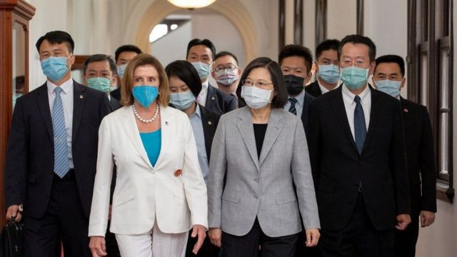
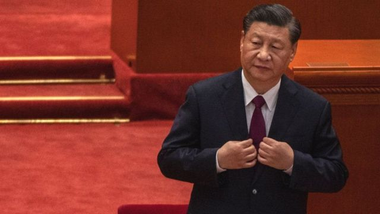

# 佩洛西访台：“皮球”踢到习近平一边　下一步会怎样？

#  【佩洛西|裴洛西】访问台湾：“皮球”踢到习近平一边 下一步会怎样？

  * 麦笛文 （Stephen McDonell） 
  * BBC 驻北京记者 

2022年8月3日

> 图像来源，  TAIWAN PRESIDENTIAL OFFICE/HANDOUT VIA REUTERS

**危机升级的危险往往在于骑虎难下。**

既然美国国会众院议长南希·佩洛西（Nancy Pelosi，又译裴洛西）已经去了台湾——这是25年来到访台湾的最高级别的美国官员——那么将来会不会有其他人效仿？

既然中国已经举行了如此大规模的实弹演习，距离台湾如此之近，为什么不再来一次呢？每当中国战机飞行到距离台岛越来越近的地方，或者更频繁地这样飞行时，新的“正常”标准就确立了。那么，如果解放军下次飞行不那么靠近，离得稍远一点，又在发出什么讯号呢？

曾几何时，北京的针对台湾的计划都涉及一个词——接触。大陆的年轻人在台湾背包旅行，台湾的企业出现在大陆各地。

然而，在习近平主席任内，两岸的敌对情绪接逐渐加重，北京对台北施加的压力也越来越大。

在北京权力高层中更主张武统的人士一定对佩洛西访台暗自欣喜；因为此举提供了一个可以藉口升级台湾周围军事演习的完美理由，为他们认为不可避免的那一天做准备。届时，台湾将被武力夺取。

或许，区域稳定面临的最大挑战是，各方在台湾问题上的公开立场都很荒谬。就像一个巨型装假游戏，越来越难持续。

中国假装台湾现在就已经是自己领土的一部分，尽管台湾自己收税，拥有自己的民选政府，拥有自己的护照和军队。

美国则假装自己没把台湾当作独立国家，尽管在向台湾出售高科技武器，偶尔还会有高级别政客到访，而且看起来也很像是一次官方访问。

显然，这种旨在维持现状的脆弱表演经不起丝毫风雨便会瓦解。

而世界面临的危险在于，北京有些人希望看到上述现状瓦解。

> 图像来源，  Getty Images
>
> 图像加注文字，习近平政府对台湾的态度更强硬

过去几十年来，中共控制的媒体在台湾问题上的舆论一直没有太大不同，但武力统一台湾这个概念在人们心目中也一直是比较遥远。

现在不同了。

与你交谈的大多数人都认为，习主席想在执政期间夺取台湾，从而为自己树立不朽的历史地位—— 一位实现祖国统一的领袖。

他比原计划远远提前对香港实施了有效的控制；这个城市在北京看来已经变得越来越麻烦。

几个月后，习主席即将开始历史性的第三个任期。他可以继续执政从某种程度上使得台海压力略有缓解。

只要他愿意，他现在就可以继续掌权，而不像毛泽东以后的那几位前任领导人那样受到最多两届任期的限制；他不必急于对台湾动用武力。

但是，局势每天都朝那个方向近一步，离和平远一步。

中国一些旨在提高民众对军事解决方案支持的文宣，表现出一次世界大战前的人们那种对此类战争真正意味着什么完全的无知与幼稚。

即使对乌克兰冲突的报导受到严格审查，看到入侵的发生肯定会让中国民众在思及让自己的国家卷入血腥冲突时脑子里亮起红灯。

但民族主义是一种强大的工具，虚幻的想像很容易压倒理智。

如果北京真的向台湾出兵，即使强大的解放军，也必须越过一个危险的海峡并进行大规模登陆作战，然后面对一个坚定不移地捍卫自由生活方式的敌人——这个敌人心目中自由生活方式比入侵者耳濡目染的武力攻台的爱国主义理由更加重要。

这样的战争可能会持续很久，使中国在很长一段时间内被国际社会唾弃，并扼杀中国经济。即使解放军获胜，占领的也将是一个拥有千百万憎恨北京威权的民众的巨大岛屿。

那将是灾难性的结果，而在中国首都北京，头脑明智的人都清楚这一点。

## 

