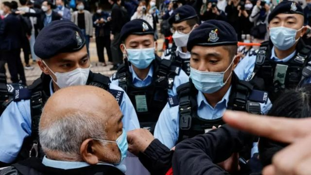

# [Sport] 香港国安法最大案件：民主派47人初选案开审 多数被告已“未审先囚”两年

#  香港国安法最大案件：民主派47人初选案开审 多数被告已“未审先囚”两年

> 图像来源，  Getty Images
>
> 图像加注文字，众被告中包括前年轻社运人士如黄之锋等从激进到温和的民主派阵营各个光谱人士

**香港这次出庭的47名被告横跨民主派阵营温和到激进的各个光谱，是中国在香港颁布《国安法》后规模最大的一次检控，大部分人两年来在未审未判的情况下一直被囚。**

香港民主派2020年发起“立法会35+初选”，47人被控“串谋颠覆国家政权”罪，周一（2月6日）正式开审，预计审期90日。

本案为高等法院案件，借西九龙裁判法院审理，被告一旦罪成可判囚终身，但案件不设陪审团，主审法官为《国安法》三名指定高院法官陈庆伟、陈仲衡及李运腾。

开审日清晨，过百人在法院大楼外排队轮候旁听，现场有大批警员戒备，警方沿途截查市民。

民主派政党“社会民主连线”三名成员到场拉起横额示威，表达“初选无罪、政治打压亦可耻”，要求当局立即释放所有政治犯，其中一人被警方以违反口罩令带走。

英国、美国、法国、德国、澳洲和欧盟等多名领事馆代表，均有到场了解审理过程。

众被告涵盖了香港民主派最激进到最温和的政治光谱，包括前香港大学法律系副教授戴耀廷，多名前立法会议员如毛孟静、林卓廷、区诺轩、杨岳桥、梁国雄等，以及年轻社运人士如黄之锋、岑敖晖等。

他们在2020年7月11至12日，即北京颁布《国安法》不足半个月后举行非官方的初选，选出代表参加同年9月6日的立法会选举，争取立法会大多数控制权，以否决政府议案甚至迫使特首辞职。当时有超過60万名选民参与初选投票。

时任特首林郑月娥同年7月31日以疫情为由，引用《紧急法》推迟选举。到了2021年1月，参与初选的民主派人士被香港警方国安处人员大搜捕。

> 图像来源，  Reuters
>
> 图像加注文字，西九龙裁判法院前的抗议者被警察围住

##  控方：《国安法》后仍继续初选

47人被控串谋旨在颠覆国家政权，组织、策划破坏特区政权机关的行为。案中有31人承认控罪，16人否认控罪。

不认罪的前立法会议员梁国雄在庭上说“对抗暴政无罪，无罪可认”，本土派人士邹家成逐字表示“不，认，罪”，前记者何桂蓝质疑早上才收到公诉书，发现控罪字眼已修改，要求控方澄清。

两名原本不认罪的两名被告改为认罪，包括前元朗区议员伍健伟及“阿布泰国生活百货”创办人林景楠。伍在庭上答辩时说：“法官阁下，我颠覆国家政权未成功，我认罪，我承认控罪。”

香港网媒《法庭线》报道，控方在庭上指，本案的串谋计划是被告同意透过非法手段，严重干扰、扰乱或破坏特区政权机关依法履行职能，透过无差别否决政府提出的财政预算或公共开支，迫使政府解散立法会，最终导致行政长官辞职；而谋划的目的，就是颠覆国家政权。

控方指，戴耀廷2019年12月10日在《苹果日报》发表题为“立会夺半 走向真普选重要一步”的文章，首次提及在立法会中取得多数控制权的想法；戴和第二被告区诺轩等人在2020年3月26日召开记者会时曾解释初选策略，指要获得足够影响力与中国共产党及政府抗衡，“拿到这一个有大杀伤力的宪制武器”，可以否决财政预算案，以迫使政府接受他们的要求，包括释放被捕抗争者、追究警队滥用武力、落实双普选等。

控方提到，《国安法》于2020年6月30日颁布，时任政制及内地事务局局长曾国衞于7月9日发声明指初选为串谋行为，但众被告继续于7月11至12日举行初选。

##  有没有公平审讯？

这是香港《国安法》生效后最大规模的案件，引起国际广泛关注，包括是否有公平审讯。

47名被告大部分人不获保释，至今已被关押超过700天，失去自由长达两年才开始审讯。少数获保释人士则须接受苛刻条件，包括言论自由受限。

本案为高等法院案件，理应设有陪审团，但律政司在2022年8月指示案件不设陪审团，由3名国安法指定法官组成审判庭审理。

律政司给出的理由是案件具有“涉外因素”、要保障陪审员及其家人的人身安全、有可能妨碍司法公义妥为执行的实际风险。当局强调有关安排是为了“确保公平审讯”，“绝无减损被告人的任何合法权益”。

根据《港区国安法》第46条，在高等法院原讼法庭就国安案件的检控程序，凡律政司长发出有关证书，可指示相关诉讼毋须在有陪审团的情况下进行审理。至今，没有一宗《国安法》案件设有陪审团。

而本案涉及的2020年立法会选举遭港府推迟后，2021年12月19日重新举行，在北京主导的“完善选举制度”下确保了“爱国者治港”，几乎没有民主派人士成功入闸参选，该次投票率在政府催谷下也只有三成，创历史新低，目前90名议员仅一人为非建制派。

