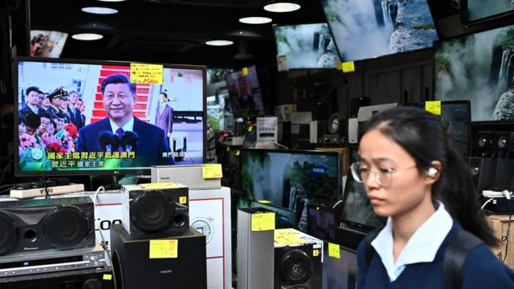
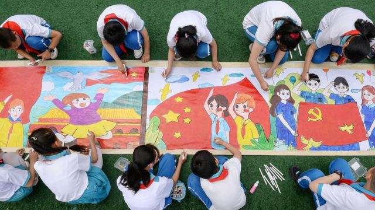
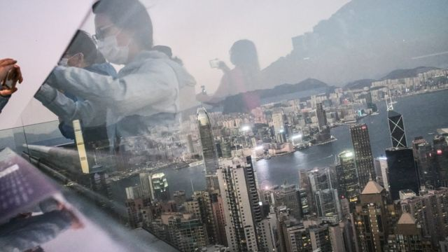

# [Sport] 香港推动电视广播节目“增国安、减英文”，外界关注其“国际化”会被削弱

#  香港推动电视广播节目“增国安、减英文”，外界关注其“国际化”会被削弱

  * 李澄欣 
  * BBC中文记者 香港报道 

> 图像来源，  Getty Images

**香港的免费电视台和电台被要求播放更多《国安法》节目并“去英文化”，引起外界关注香港是否与“国际化”渐行渐远。**

本月早些时候公布的新规定下，受影响媒体包括三家“免费电视持牌机构”无线电视（TVB）、香港电视娱乐（ViuTV）、奇妙电视（HOY TV），以及两家“声音广播持牌机构”香港商业电台和新城电台。

港府通讯事务管理局建议，上述五家机构每周须播放额外至少30分钟关于国民教育、国民身份认同和正确认识《香港国安法》的节目。此外，取消“指定播放节目”须“完全属香港本地制作”的规定，并授权通讯局可就“指定播放节目”的规定发出指示。

同一时间，港府容许持牌机构每天播出英语综合频道整体广播时间不多于45%播放非指定语言节目，并放宽有关非指定语言广告的限制。换言之，英文频道的英语节目将从以往的七八成，降至不少于55%。

##  会否打击国际声誉？

香港的法定语言为中文和英文，两者享有同等地位，而港府在1997年主权移交后推出细化的“两文三语”（biliteracy and trilingualism）政策，则是指广东话、英语和普通话。香港广播机构的中文台均用广东话，部分英文台的非英语节目有普通话、菲律宾语等。

香港浸会大学政治及国际关系学系陈家洛教授对BBC中文表示，《国安法》实施后香港媒体已经要在不清晰的红线下运作，言论自由备受打压，现在缩减英文节目比例将进一步损害香港国际声誉，“尤其在政府大力宣传香港的国际形象之际，这样做只会带来反效果”。

他认为，新措施也会影响在港居住的外籍人士，“他们有知情权，但资讯已经越来越难获取，在这里生活或做生意将变得更加不方便，成本会因此而增加。”

香港中文大学新闻与传播学院讲师梁丽娟则指出，广播语言调整反映出香港的人口重组。“免费电视是服务公众，那政府如何定义公众？如果理解香港作为多元族群的城市，而族群的组合（profile）可以转变，不再是英语为主的族群，也有其他的。现在很强调要把香港融入大湾区，增加与‘一带一路’国家的联系，例如中东国家和东盟，如果将来有阿拉伯语节目也不出奇。”

##  是否配合国策“去英文化”

> 图像来源，  Getty Images

港府此举甚至引起中国大陆网民热议，话题“香港大幅度下调英语节目比例”一度登上微博热搜榜。有网民表示“早该如此”、“做中国人说中国话”，但也有网民批评是“自毁长城”、“英语就是香港的优势，大可不必”、“去国际化，让香港变成一个内地城市对国家有什么好处？”、“估计又来一波港人移民潮”。

事实上，中国近年频频出现“去英文化”现象，北京、天津地铁站牌的英文翻译将“Station”改为汉语拼音“Zhan”；在教育方面，上海取消小学的英语考试，中国教育部门禁止中小学使用国外教科书，两会期间甚至有官员建议不再将英语列为义务教育的必修课。

时事评论员刘锐绍对BBC中文指出，中国大陆的文化语言政策影响了香港政策，会削弱香港国际化程度。“国际语言仍然以英文为主，这个语言政策是文化政策的一部分，语言的削弱一定会令这个语种的国家的重要性下降，这反映了北京对香港国际化的认知，其实是停留在一种文化战略斗争。”

社会政策及公共行政学者钟剑华也表示，北京希望香港“大陆化”，使港人失去“香港本位”意识，只以国民身分和中国塑造的意识形态去理解周围的社会，“要产生效果不是一朝一夕的，但现在他们（政府）什么都控制和垄断了，不排除会有些影响。”

香港中文大学新闻与传播学院教授李立峯日前在《端传媒》撰文质疑称，新措施表面上是让商业机构有更大空间引入外地或其他非英语的外语节目，但实际运作上最可能的结果是从中国大陆引进属“指定播放类别”的节目，播放更多普通话内容和广告。

> 图像来源，  Getty Images

##  强调广播机构的“国家责任”

这是《香港国安法》自2020年6月30日实施后，港府针对商业广播机构的最大幅度政策调整。

传播学教授李立峯撰文分析指，港府正在削弱媒体“公共服务广播”（public service broadcasting）性质，而强调其“国家责任”，过去两三年当局已按照这个原则整顿公共广播机构香港电台，并在编辑政策把“一国两制”放在“公众利益”之前。他认为，港府将此逻辑延伸至商业广播机构的条款，属预期之内。

香港中文大学新闻与传播学院讲师梁丽娟也向BBC中文表示，近年香港整个媒介格局都在改变，政府明显是要重新定义免费台的角色，强化其宣传及公众教育功能，“去推广他们所谓的公民知识”。

不过她坦言，除非当局提供指定国安影片、指定须在黄金时段播放，否则播放时段和节目形式，都还是电视台自主的商业决定，弹性空间很大。“他可以放在清晨或深宵时段，或像之前有些台会‘走精面’（钻空子），把政府规定的文教类节目拍成有商业赞助的旅游节目，变做间接广告，又或者拍成有奖问答游戏吸引观众，都是一种形式。”

至于国安节目的实际作用，学者钟剑华认为，除非香港政府封锁网络，否则有心人仍可在网上接触到不同资讯，政治宣传难以收效。

政治学者陈家洛教授也指，国安节目来了又去（come and go），本地观众都懒理，“香港人已逐渐学会了如何（在政治气氛下）不被影响，总会有比那30分钟电视时段更重要的事可以做。”

