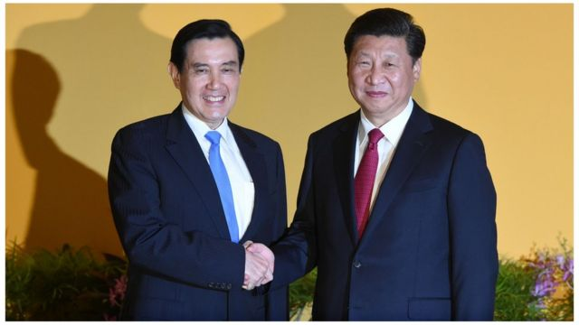
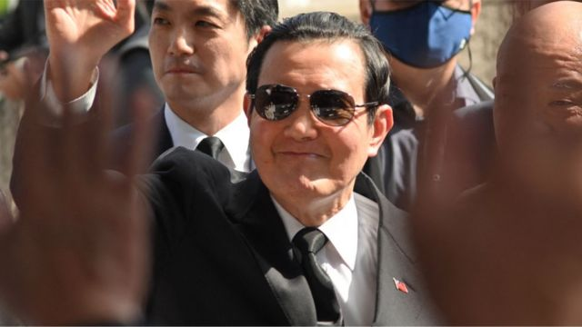
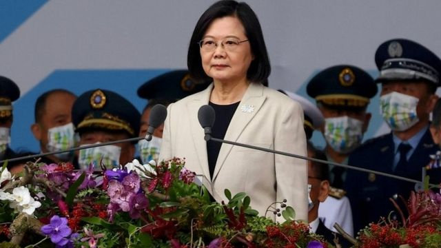

# [Sport] 74年来首次 台湾前总统马英九访问中国大陆祭祖是否有政治意味

#  74年来首次 台湾前总统马英九访问中国大陆祭祖是否有政治意味

  * 李澄欣 
  * BBC中文记者 

**台湾前总统马英九将于3月27日至4月7日赴中国大陆祭祖，为期12天的行程预计访问南京、武汉、长沙、重庆与上海，并率青年学子与大陆学生交流。**

这是自1949年两岸分治74年来，首次有台湾卸任总统踏足中国大陆，据报他不会与中国国家主席习近平会面。

马英九基金会执行长萧旭岑3月20日在记者会上说，这次行程不会到北京访问，也未安排政治性活动。当被问到是否会与中共中央政治局常委王沪宁等涉台高官会面时，萧表示到大陆各省市有官员或朋友希望会面、吃饭，都“客随主便”。

萧旭岑指，马英九今年7月将届满73岁，从事两岸工作近40年，却是中华民国唯一没去过大陆的高层政治人物，包含前总统陈水扁、现任总统蔡英文都曾去过；今年初中国大陆疫情解封，再加上中华文化讲究慎终追远，让马英九赴陆祭祖尽孝道，相信台湾人都能认同。

##  与蔡英文撞期

值得留意的是，马英九访陆行程料与蔡英文总统访美行程有所重叠。对此，萧旭岑强调马英九在农历新年前已规划访问大陆，事前不知道蔡英文出访行程，完全是巧合。

台湾大学政治学系教授左正东对BBC中文指，马英九访陆与蔡英文撞期相信纯属巧合，“因为祭祖一定是选择在清明节”。他认为撞期反而对蔡英文政府有利，呼吁正面看待，因为中国大陆对于蔡访美并与美国美国众议院议长麦卡锡会面，必定会有很大反应，马访陆刚好可以某程度上缓冲此一冲击。

##  会否有“二次马习会”？

> 图像来源，  AFP
>
> 图像加注文字，2015年11月7日，马英九与习近平在新加坡APEC峰会期间历史性会面，两人握手长达1分钟20秒，被称为“世纪之握”。

马英九祖籍湖南，1950年生於香港九龙油麻地，1952年随双亲定居台湾台北市，2008年至2016年担任台湾总统，任内力主两岸和平发展路线。

2015年11月7日，马英九与习近平在新加坡APEC峰会期间历史性会面，两人握手长达1分钟20秒，被称为“世纪之握”，话别时习近平对马说“后会有期”，外界关注两人这次会否再会。

台湾《联合报》独家报导称，马英九不希望祭祖家事成为特定政客操弄的目标，更不希望因而影响两岸关系甚至是明年台湾总统大选，因此希望此行单纯化，马办与陆方密集沟通并达成共识，不会有“二次马习会”（习马会）。

报道称，马办经过数十回合的沙盘推演与思考，认为有三个层面必须周全考量：第一是“马习二会”效应太大，牵动明年总统大选与美中台关系；第二是马英九身为国民党前主席，访问大陆必须顾虑到国民党的大局；第三是如果马英九此行带着强烈政治意涵访陆，只求个人历史定位，“二次马习会”势必会引起剧烈的政治後座力，并刺激美国，反过来打台湾牌，马并不乐见。

台湾教授左正东表示，马英九料不会与中共中央最高官员会面，但最重要的看点，是能否用其个人魅力扭转大陆民众对台湾的敌意，“疫情以来，中国大陆人民对台湾怀有敌意和误解，成为两岸关系很大的阻碍，如果可以扭转，会有长远而正面的影响”。

至于2024年总统大选的影响，左正东认为时候尚早，加上马英九刻意降低此行对国内政治议程的冲击，预料对明年选举影响不大。“就算有影响也是很间接的，如果这次访问成功创造氛围，让两岸更愿意、敢于交流，降低两岸关系的紧张，那么两岸紧张作为选举议程就比较难发挥作用。”

台湾东吴大学政治系助理教授陈方隅则认为，马此行将冲击国民党，加强其亲北京的形象，而且刚巧蔡英文要去美国，形成非常强烈的对比。“大家会想到两边一个亲美一个亲中，那边想侵略台湾你却跑过去，国民党如果要走中间路线，这是不好的影响。”

##  12天行程去哪？

> 图像来源，  AFP
>
> 图像加注文字，马英九（中）在2016年卸任总统后，根据《国家机密保护法》管制出国三年，2019年5月19日再被蔡英文政府延长管制两年，到2021年5月19日为止。

马英九在2016年卸任总统后，根据《国家机密保护法》管制出国三年，2019年5月19日再被蔡英文政府延长管制两年，到2021年5月19日为止。此後，马英九前往大陆地区（包括港澳），只要在出发前和回来後向总统府报备即可。

台湾总统府发言人林聿禅表示，总统府已收到马英九的出访申报并尊重其祭祖规画，了解安排后已洽相关单位，就马英九此行的安全等事宜给予必要协助，又指马英九在俄乌战争、台海局势敏感之际访问大陆，期盼他向对岸及世界展现符合国家利益与国民情感的作为。

马英九此行带同马英九基金会“大九学堂”成员，将前往南京、武汉、长沙、重庆、上海等城市，造访南京总统府、国父孙中山先生故居、辛亥革命武昌起义纪念馆、中央政治学校旧址、张自忠烈士陵园等，以及抗战地点如南京大屠杀纪念馆、重庆抗战遗址、四行仓库抗战纪念馆。萧旭岑说，马非常重视抗日历史，希望带学生看看战争惨烈，和平得来不易。

此外，他也将到访上海复旦大学、武汉大学、湖南大学、周南中学和岳云中学，与大陆学生交流。

随团成员有台湾前总统府秘书长曾永权、卸任总统办公室主任王光慈、政治大学东亚所名誉教授邱坤玄、政治大学法律系副教授廖元豪。马的三名胞姊、一名胞妹也会出席祭祖，但夫人周美青不会随行。

##  中国大陆反应

国台办发言人马晓光表示，大陆方面欢迎马英九赴陆祭祖、参访，并带领台湾青年学生前来交流。

马晓光称，慎终追远是中国人的传统，清明节祭拜祖先是两岸同胞共同的习俗。两岸青年加强交流交往，能够为两岸关系和平发展增添新生力量、注入青春活力。国台办愿意为马英九来访提供必要协助，祝他此行一切顺利。

《香港01》引述消息称，4月5日在陕西省黄陵县举行的清明公祭轩辕黄帝典礼，该活动以往由陕西省政府主办，今年则罕见由国台办、国务院侨办、中华全国归国华侨联合会与陕西省政府共同主办，令人猜想是否配合马英九访陆之行。

##  台湾各界反应

> 图像来源，  Reuters
>
> 图像加注文字，蔡英文在2022年“双十”谈话中特别提到，愿意与北京一道“寻求双方可接受的维持台海和平稳定的方法”。

国民党主席朱立伦表示乐见两岸交流，向马英九此行送上祝福，期望透过这种方式促使两岸更和平，相信马英九一定会坚持中华民国立场，也能够对於民众针对国民党的期待做出回应。

国民党发言人林家兴表示，国民党不断透过行动实践“亲美、友日、和陆”方针，证明以“交流取代交恶，对话代替对抗”的方式，可以有效捍卫中华民国、守护台湾民主及维护区域和平；马英九访问大陆，相信对两岸交流及了解有正向的帮助。

民进党新闻部主任张志豪表示，中共持续对台军事威吓与外交孤立，尤其才刚操作宏都拉斯与台湾邦交生变，并持续以军机舰扰台造成台海情势紧张，马前总统此时赴中，“就是拥抱绥靖主义，就是向国际社会释出台湾对中国侵略扩张势力做出让步的错误讯息”，并指台湾民众无法接受中华民国卸任元首成为中共促统下的一枚棋子。

时代力量发言人余佳蒨表示，尊重马英九祭祖自由，但马往年都是到苗栗马家庄祭祖，这次却特别选在习近平刚获连任及台湾总统大选年赴中，行程绝大多数又与祭祖无关，质疑是“祭祖政治学”。她又指，国民党在国内外思考如何对抗中国威胁之际频频组团赴中，恐对国际社会传递错误讯号，呼吁马英九避免成为“两岸一家亲”的宣传工具。

民众党主席柯文哲则在脸书发文指，依法行政就可以，不需扣帽子抹红，2012年行政院长谢长廷卸任阁揆後到福建祭祖，当时媒体吹捧说谢是“慎终追远”，“为何如今轮到马英九要去，就变成卖台统战？”。他表示，若各界对卸任元首访陆有疑虑就应修法，要相信制度而不是相信个人 。

