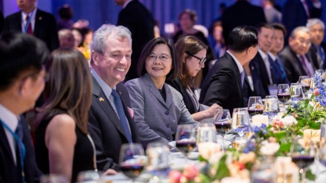
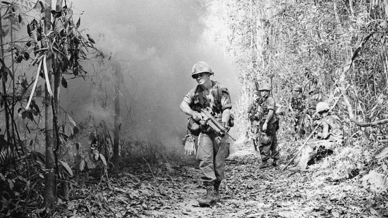

# [Sport] 马英九访中国大陆、蔡英文访美、越战50周年等本周更多重要故事

#  马英九访中国大陆、蔡英文访美、越战50周年等本周更多重要故事

> 图像来源，  Reuters

**美中台关系微妙，台湾前任总统马英九与现任总统蔡英文，几乎同期分别出访中国大陆和美国。而稍早，洪都拉斯（或译宏都拉斯）正式与台北断交，与北京建交。**

中俄关系持续备受关注，BBC中文采访专家，从习近平与普京的肢体语言，解读两国关系。而适逢越南战争50周年，学者给出美国战败的七个原因。

刚刚过去的一周，BBC中文有以下新闻内容受到读者的关注。如果你错过了，带你一一回顾。

##  1\. 马英九访问中国大陆、蔡英文过境美国

台湾前总统马英九出访中国大陆祭祖，是1949年以来台湾卸任总统首次访陆。他到访中山陵、南京大屠杀纪念馆等，并强调两岸人民同属中华民族，应追求和平，这在两岸引起不同的解读与批评。

与此同时，现任总统蔡英文展开疫情后首次出访。 为期10天的行程中，她将访问中美洲邦交国危地马拉和伯利兹，去程和回程分别过境美国纽约和洛杉矶，预计4月5日将会晤美国众议长麦卡锡（Kevin McCarthy）。

这次旅程被指是“蔡麦会”的折衷方案，美国和台湾都希望保持低调，北京会否采取强烈军事反制成为外界焦点。

##  2\. 洪都拉斯与中国正式建交

就在台湾总统蔡英文过境美国前夕，洪都拉斯宣布与台湾断绝外交关系，并与北京正式建交。

自蔡英文当选以来，已有九个国家与台湾的中华民国政府断交。这使得与台湾建交的国家进一步减少到13个。

然而， 和往常一样， 断交事件在台湾民间社会并未引起太大反响。有网民建议，台湾未来应该把外交资源全力投注在美国和日本这些对世界局势有影响的国家。

##  3\. 习普会的肢体语言透露了什么？

肢体语言专家分析，习近平在伸手与普京握手的一瞬间抢先一步，表明“尽管他是访问莫斯科的人，但他是将在双方关系中起主导作用的人”。

会谈中，两位领导人在很多议题上一拍即合，但实际上两国关系也并非去年所声称的“不设上限”。

在双方高调宣布“不设上限”后仅仅几周，中俄就遇到了双方关系的“上限”——中国没有向俄罗斯提供致命武器，尽管美国称中国至少考虑过；此外，在普京做出核威胁后，中国也不点名地批评了这一行径。

换言之，北京的态度是，两国合作需求再强烈，但利益冲突时，不好意思，中国优先。
 观察习普会的三个维度：战略利益、肢体语言与“和平使者” 

##  4\. 郑灵华：23岁的染发女生走了，网暴困境依然难解

> 图像来源，  Zheng Linghua's Weibo account
>
> 图像加注文字，郑灵华成为恶意网暴的目标。

23岁中国女学生郑灵华因为染了粉红色头发，成了网络暴力的目标，被嘲弄为“夜店女孩”和“恶魔”。她被诊断出患有抑郁症，后来她的朋友发消息说，她去世了。

像这样的网络暴力事件引起社会广泛关注，专家表示，在中国这样的集体主义文化中，那些被视为不循规蹈矩的人往往会受到严厉的惩罚。

尽管网络上的尖刻言论并不总是带有政治色彩，但当局“容忍”右翼民族主义者展开”一种特定类型的网络霸凌”。此类攻击的对象大多是那些被认为有损中国形象的人。
 中国23岁女生郑灵华离世背后的网暴事件与监管难题 

##  5\. 为何美国输掉50年前的越南战争？

> 图像来源，  Getty Images
>
> 图像加注文字，丛林给作战双方都造成了困难。

3月29日是美国最终从越南撤军的50周年，这场仗总花费为6860亿美元（换算成今天的钱则超过9500亿美元），战败原因有很多。

战术上，美军无法适应东南亚的丛林环境，但更重要的可能是心理战——美国在自己国内先输了，当时电视刚流行，美国观众看到无辜平民被杀、重伤或者虐待的影像，转而反对这场战争，并形成一场浩大的抗议运动。

##  BBC中文本周其它重要故事：

