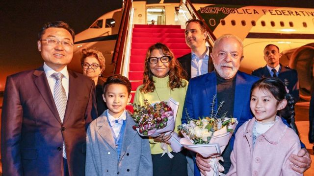
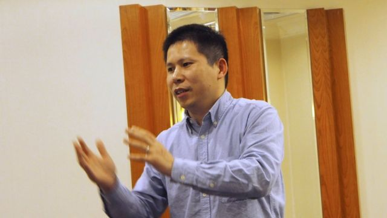
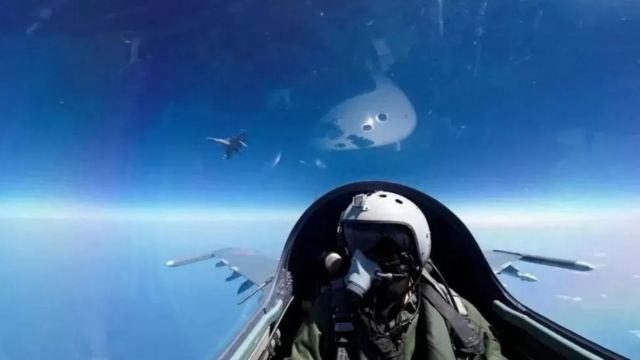
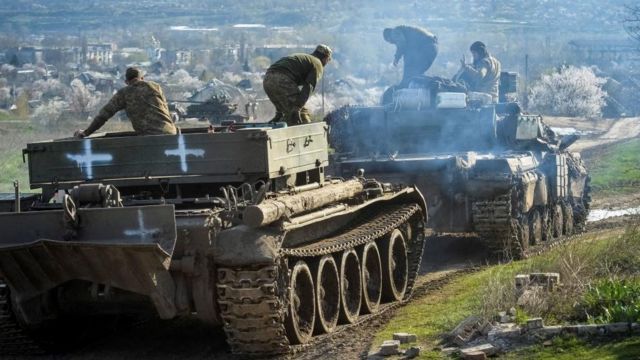
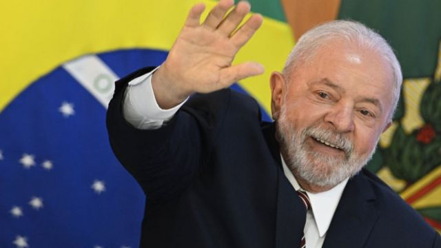
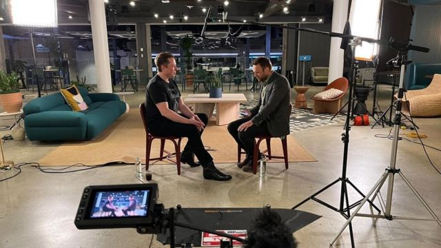

# [Sport] 解放军环台军演、美国机密文件泄露、卢拉访华及本周更多重要故事

#  解放军环台军演、美国机密文件泄露、卢拉访华及本周更多重要故事

> 图像来源，  Reuters
>
> 图像加注文字，卢拉抵达上海。

**4月的第二周，中国两名政治活动人士许志永、丁家喜因涉嫌颠覆国家政权罪成，分别被判有期徒刑14年和12年，但是中国官方未对外发布相关消息。**

在台海方面，在台湾总统蔡英文于加州会晤美国众议院议长麦卡锡（Kevin McCarthy）之后，中国解放军随即展开三天环台湾岛军演，但鲜有进行实弹射击操练。专家指“雷声大雨点小”的军演之下，反而北京近期外交手段才是看点。

最近数月，数十份美国机密文件被泄漏到网上，大量细节陆续在本周被披露。这些部分标记为"最高机密"的文件，描绘了乌克兰战争的一幅详细图景，而且还提供了一些关于中国及其盟友的信息。BBC新闻部和其他新闻机构审阅了其中一些文件，当中有一些重要的发现。

在法国总统马克龙高调访华之后，时隔12年再次担任巴西总统的卢拉亦于12至15日展开访华之旅，重点关注经贸领域的双边合作，以及和平解决乌克兰战争等方面的议题。

推特（Twitter）所有者兼首席执行官（CEO）伊隆·马斯克（Elon Musk）则在本周忽然接受BBC直播专访，在一个小时的罕见对话中分享了包括虚假信息、美国总统拜登，以及那场曲折的收购等广泛议题。

刚刚过去的一周，BBC中文网以下新闻内容受到读者的关注。如果你错过了它们，BBC中文带你一一回顾。

1\. 中国维权人士许志永、丁家喜颠覆国家政权罪成获重刑 

> 图像来源，  Reuters
>
> 图像加注文字，中国知名政治活动人士许志永

4月10日，中国政治活动人士许志永和维权律师丁家喜涉嫌颠覆国家政权案宣判， 许志永被判有期徒刑14年，丁家喜获刑12年。

维权网报道称，中国当局以颠覆国家政权罪判处许志永14年有期徒刑，剥夺政治权利8年，丁家喜因同样罪名获刑12年，剥夺政治权利3年。

丁家喜妻子罗胜春向BBC确认了相关判决，并表示律师只告诉了家属刑期，他们不被允许跟家属分享判决书。

与此同时，中国官方未有发布和宣判任何相关信息。

案件缘起2019年12月中，多位中国律师和公民运动人士在福建厦门参加一次聚会，随后中国公安在福建、山东、北京、河北、四川、浙江等地抓捕参加聚会的人士。

因预感自己亦会被捕，许志永从北京逃亡，辗转各地，最终在2020年2月15日于广州被捕。在逃亡期间，许志永就BBC中文的采访问题在一份视频答复中说，这次大范围抓捕“不是偶然，而是蓄谋已久的”。

去年6月，两人涉嫌“颠覆国家政权罪”的案件在山东省临沂市临沭县法院不公开审理。

2\. 中国环台军演被质疑是“雷声大雨点小”，自我克制背后有何政治计算？ 

> 图像来源，  Reuters

台湾总统蔡英文在加州会晤美国众议院议长麦卡锡（Kevin McCarthy）后，中国解放军展开三天环台湾岛军演，重点是实施“模拟联合火力打击”，但鲜有进行实弹射击操练。

蔡英文4月7日返抵台湾，中国解放军东部战区随即宣布在8至10日，于台湾海峡和台岛北部、南部、台岛以东海空域组织“环台岛战备警巡”和“联合利剑”演习。

有分析指， 与去年类似的环台军演相比，此次“雷声大雨点小”，反而北京近期外交手段才是看点。

台湾中华战略学会资深研究员、海军中权军舰前舰长张竞向BBC中文表示，北京在军事上只是走过场，雷声大雨点小，从规格、规模、用兵上都看得出“自我克制”。

他指，中共现在“武场”（军事威吓）已经用到顶，重心是在“文场”（外交和经济手段）。

3\. 五角大楼外泄机密文件：英美特种部队在乌克兰行动 

> 图像来源，  Reuters
>
> 图像加注文字，外泄的文件显示，乌克兰的春季攻势可能“收获不大”。

最近数月，数十份美国机密文件被泄漏到网上，大量细节陆续被披露。

其中包括英国等多个西方国家的特种部队有在乌克兰境内参与行动，证实了外界一直以来的猜想。

机密档案的翻拍图片早在2月就已经出现在通讯程式Discord上，此外还有各种时间线和数十个无从破译的军事词汇缩写。

这些部分标记为“最高机密”的文件，描绘了乌克兰战争的一幅详细图景，而且还提供了一些关于中国及其盟友的信息。

有人引述五角大楼官员称，文件是真实的。

美国政府表示，正在对泄漏的源头进行调查。

BBC新闻部和其他新闻机构审阅了其中一些文件，当中有一些重要的发现。

4\. 卢拉访华：经贸合作、乌克兰战争、一带一路是重点议题 

> 图像来源，  Getty Images

时隔12年再次担任巴西总统的卢拉于12至15日展开访华之旅，重点关注经贸领域的双边合作，以及和平解决乌克兰战争等方面的议题。

卢拉首先抵达上海，参加前总统罗塞夫（Dilma Rousseff）作为金砖国家新开发银行行长的就职典礼。随后前往北京，与中国领导人习近平会面。

“我们将巩固与中国的关系，”卢拉周一说：“我将邀请习近平来巴西进行双边会谈，了解巴西，并向他展示中国投资感兴趣的项目。”

中国是巴西最大的贸易伙伴，也是卢拉在全球地缘政治上重新建立影响力的关键。北京也将巴西视为其战略和经济计划的关键所在。

5\. 推特总裁马斯克接受BBC专访的六个要点 

推特（Twitter）所有者兼首席执行官（CEO）伊隆·马斯克（Elon Musk）在短时间内忽然接受BBC直播专访，在一个小时的对话中分享了包括虚假信息、美国总统拜登，以及那场曲折的收购等广泛议题。

他向BBC表示，运营推特是一个“颇为痛苦”且如同“过山车”的历程。

马斯克是目前世界第二富豪，同时经营着汽车公司特斯拉（Tesla）和航天火箭公司SpaceX。他在去年10月以440亿美元（354亿英镑）收购推特。

在旧金山（三藩市）的推特总部进行的访问中，他向BBC记者詹姆斯·克雷顿（James Clayton）谈到了这家社交媒体公司的大规模裁员、虚假信息以及他个人的工作习惯。

在这场罕见的访问中，他为自己经营推特的方式辩护。

但是他承认，他最终完成对推特的收购是因为当时法官即将要下令他履行收购协议。

他还在访问中确认，将会修改BBC推特帐户上的认证标签——不久前，BBC的官方推特帐户被标记为“政府资助”，现在将改为“公众资助”。

本文精选了这场访问中我们了解到的六个重点。

