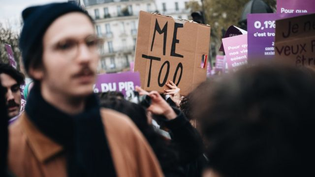
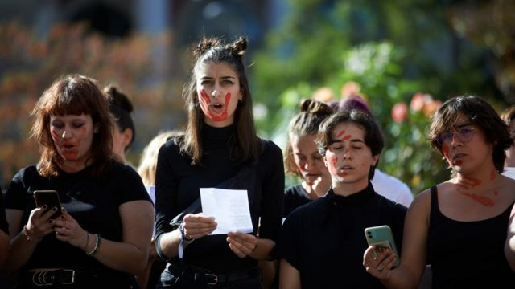
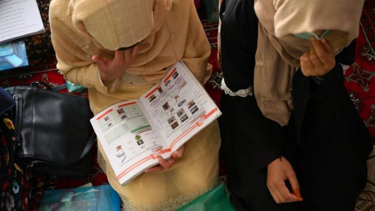

# [Sport] 联合国报告：男女平等十年来停滞不前 四分一人认为“男人殴打妻子合理”

#  联合国报告：男女平等十年来停滞不前 四分一人认为“男人殴打妻子合理”

> 图像来源，  Getty Images
>
> 图像加注文字，尽管#MeToo等社会运动近年涌现，但男女不平等的问题并未改善。

**联合国开发计划署6月12日公布最新“性别社会规范指数”（Gender Social Norms Index, GSNI），显示全球近九成人口对女性仍持有根本的偏见，25％的人认为男人殴打妻子是正当的。**

调查结果显示，全球近一半人口认为男性比女性是更好的政治领袖，只有27%认为女性享有与男性相同的权利对民主来说是必要的。

此外，46%认为男性应该拥有更多工作权利，43％认为男性更适合担任企业高管，28%认为大学教育对男性更重要，58%认为堕胎从来都不正确。

有关调查数据来自80个国家和地区，覆盖全球85%的人口。报告指出，尽管#MeToo等社会运动不断涌现，但性别偏见仍然根深蒂固，新冠疫情中更多女性失去收入来源，也导致性别不平等问题恶化。

##  受高教育男女收入差距达39%

> 图像来源，  Getty Images
>
> 图像加注文字，图为2022年法国女性上街抗议父权主义和男性施加的暴力，她们在集会上读出该年死去的女性名字。

研究人员表示，全球性别不平等的情况在过去10年间处于停滞状态，预计世界将难以达成联合国在2030年前实现性别平等的目标。

开发署人类发展报告办公室主任佩德罗-孔塞桑（Pedro Conceição）对结果表示震惊并说：“事实上，在性别社会规范（gender social norms）方面缺乏进展正在引发一场人类发展的危机：全球范围内，人类发展指数在2020年出现有记录以来首次下降，并于次年再次下降。”

最新报告指，女性的教育水平和能力比以往任何时候都要高，但在59个女性受教育程度比男性高的国家中，女性的平均收入比男性低39%。

而自1995年，担任国家元首或政府领袖的女性比例，一直停留在10％。在劳动市场，女性在管理层所占比例不到三分之一。

联合国呼吁，各国应推动相关法律和政策促进女性平等参政，并加强社会保障机制，以及打击网上针对女性的仇恨言论和虚假讯息，同时通过教育改变大众的观念。

> 图像来源，  Getty Images
>
> 图像加注文字，塔利班掌权后，阿富汗女孩被剥夺教育权。图片摄于2022年7月，一群阿富汗女学生在当地一所秘密学校读书。

##  “实现性别平等还需要300年”

3月6日，联合国秘书长古特雷斯（Antonio Guterres）在妇女地位委员会（Commission on the Status of Women）会议上警告，近几十年来在性别平等取得的进展“正在我们眼前消逝”，以目前的发展来看，“实现性别平等还需要300年”。

他指出，在塔利班政权统治下，阿富汗妇女和女孩“从公共领域中被抹去”。他不点名批评指在许多地方，女性的性权利和生育权都在倒退。

联合国妇女组织执行主任巴胡斯（Sima Bahous）也提到科技，去年能上网的男性比女性多2.59亿，使用智能手机的人当中男性比女性多出18%。她又引述调查指，全球125个国家中，四分之三的女记者曾在工作中遭到网暴，当中三成人因此而自我审查。

她直言：“数码鸿沟（digital divide）已经成为性别不平等的新型态。”

