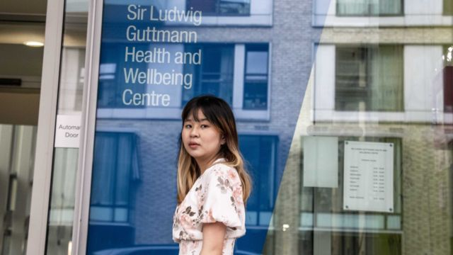
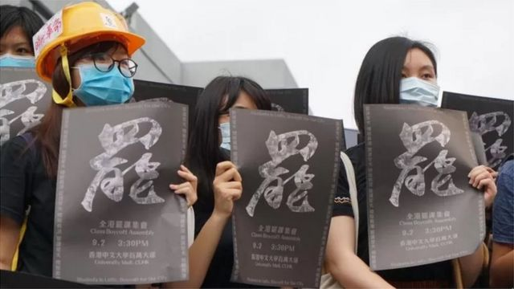

# [Sport] 香港寻求庇护者在英国面临的困境： 噩梦，无助感与生活拮据

#  香港寻求庇护者在英国面临的困境： 噩梦，无助感与生活拮据

  * 林子晴 
  * BBC中文撰稿人 

> 图像加注文字，香港学生文妮夏（Venita）

**2021年年初的一天，英国东部城市诺里奇（Norwich）天色灰暗，窗外刮起风，当时还是18岁的香港学生文妮夏（Venita）独自坐在向友人借住的房间里。**

大约三年前，当时还是香港中文大学学生的她参加了校园示威活动。因担心警方追捕， 文妮夏带上仅有的1，000英镑逃离香港，只身来到举目无亲的英国，在等待政治庇护期间， 被迫四处漂泊借宿。

她回忆道，当时绝望感再次袭上心头，突然觉得不知道自己为什么要活着， 萌起自杀的念头，求生欲最终占了上风。

孤立无援下，她拿起了电话致电撒玛利亚防止自杀会热线求助。“他（接线员）总共与我聊了十多分钟，不是说没有用，但他只是问了些很基本问题。”

> 图像来源，  BBC 中文

2019年香港“反修例”民主运动后，特别是在2020年年中，北京在香港实施《国安法》后，数以百计像文妮夏一样的年轻人，因担心自身安全，逃离香港，部分人到了英国。

他们中的大部分人或他们的父母没有英国国民（海外）护照 （British National Overseas Passport 俗称BNO护照），无法通过英国政府的BNO签证计划申请居留，不得已向当局申请政治庇护。之后的数月甚至一两年内， 很多人要独自一人承受香港留给他们的恐惧，离开香港后对家人和友人的负罪感，生活上的极度拮据，以及更多来自精神层面上的煎熬。

按英国内政部统计，2020年初至今年月底，与文妮夏一样赴英寻求庇护的港人个案，共有299宗；当中未成年者达44人。 同期，当局向港人批出仅28宗难民或人道主义保护身份，拒绝43人的申请。

在英国协助港人的非政府组织“港援”个案工作员陈先生指，申请人通常平均要等候年半至两年的时间才有结果。 至于被拒绝的申请个案，陈先生说， 根据他的观察，部分是有滥用庇护制度的之嫌。

2020年11月下旬，还是香港中文大学政治与行政学系的一名学生的文妮夏，在当年的中大毕业礼期间组织了游行，其间她和其他参与者高举了“光复香港，时代革命”、“香港独立”等横幅。校方基于《国安法》担忧报警。

两天后，见事不妙的她拖着两个行李箱和一个尼龙袋，以及仅有的1,000英镑，匆忙逃往英国。

两周后，她得知有留在香港的同伴因煽动颠覆国家政权罪被捕。 文妮夏说， 她唯有寻求政治庇护。 母亲得知她要离开后，责怪她给家里带来了麻烦。 “他们认为这是我的过错，不应该由他们去承担后果或不必要的额外开销（支持她到英国寻求避难的费用），”她说。

到达英国两周后，她得知有留在香港的同伴因 “煽动颠覆国家政权”罪被捕，文妮夏说， 她唯有寻求政治庇护。

抵英一个月，文妮夏便发现随身带的钱已花了一半，加上没有工作权利，她只能接二连三在有心人和友人处借宿，四个月内在英格兰上上下下搬了五次家。 “我变成了一个无家可归，四处流浪的人。”

抵英寻求庇护的第二年，文妮夏获得了格拉斯哥大学的奖学金，修读普通法与政治。同年年底，她的难民身份申请获批，有了工作权利，学习之余，她在英国国会兼职从事香港事务的游说工作。

生活安定许多，但她说，过去的伤痕没得到处理，当受外界刺激，她还是会出现过度反应的。而面对工作与学业，也有有压迫感。“你要装作你是一个正常人，一个知道感恩的难民，一副努力成为专业人士的样子。”

她回忆说， 到埗英国笫四个月，积蓄几乎用光，加上不方便打扰即将考试的朋友，最后迫于无奈下，她申请入住英国内政部提供的宿舍，一日三餐有了保障，但每周只有8镑经济援助，买完电话卡和厕纸就已经所剩无几。

文妮夏说， 即便到了英国后，恐惧依然缠绕着她， 多个早上，她都是从被捕的恶梦中惊醒过来。 “在梦里，会有警察来捉我，如回到中大宿舍房间里，他们捉住了我，动弹不得。”

她说，当时深感苦无出路，情绪跌至低点，脑中浮起自杀念头，“我没有活动的意欲，想把自己藏起来。 没有勇气自杀，但有这样的念头”。 最后，她尝试到网上寻找支援，找到撒玛利亚防止自杀热线。

她入住庇护宿舍后，也曾登记网上家庭医生，再尝试自我转介心理服务，但接受了“不足一分钟的电话”的初步评估后，再没有人联络过她，也没有获转介。

Skip podcast promotion and continue reading

* BBC 時事一周 Newsweek (Cantonese)   **

BBC國際台粵語節目，重溫一周國際大事，兩岸四地消息，英國境況。並備有專題環節：〈記者來鴻〉、〈英國生活點滴〉和〈華人談天下〉。

分集

End of podcast promotion

英国内政部具法定义务向无能力获得住宿或无法自理其基本生活需求的寻求庇护者提供住宿。 而这些住宿是按《庇护宿舍与支持服务合约》由外判商经营，它们分别为英国企业Clearsprings Ready Homes、 米尔斯集团（Mears）和信佳集团（Serco）。

内政部资料显示，一般来说，寻庇护者会短暂入住旅舍，然后获分长期的房屋或公寓入住，直至收到庇护申请结果。 但现时由于长期住宿供不应求，很多寻庇护者要长居酒店。 而一些住宿，包括不能煮食的酒店，会提供一日三餐。

按英国政府政策，寻求庇护者可免费使用国民保健署（NHS）辖下家庭医生的心理健康服务。 但由于寻求庇护者无身份证明文件和住址证明，登记家庭医生时或会因职员误解遭拒绝。

和文妮夏经历类似， 20岁的罗森两年前逃到英国寻求庇护，目前居住在一家类似的庇护酒店，等待审批结果。

罗森到埗英国后，同样经历了多月四处借宿、寄人篱下的生活，心理健康状况也急转直下。 他说：“我来到这里后才开始爆发，才开始懂得害怕，每当想起晚晚来袭的恶梦，就借感到不安，又想作呕。我不要回忆，不要想起 。”

2021年底，罗森入住了内政部提供、由酒店改装的庇护宿舍。 幸运地的是他在宿舍当区的家庭医生处获得注册， 得以接受抑郁、焦虑、创伤后压力症（PTSD）方面的治疗。

但他说，每当庇护宿舍职员来访或要求进入房间进行日常维修，砰砰拍门，往往把他吓得心慌，久久无法平静。

事后多次向职员反映拍门和摔门会触发病情，要求对方先打电话才上门，却遭驳斥。 他们对我说：“心理问题是胡说八道。” 其后，在律师和个案工作员协助下情况才有改善。

曾在英国寻求庇护的港人艾文说，当他住在内政部庇护宿舍时，屡屡有职员因怀疑存在违规活动或需要进行维修在无通知下闯进或搜查房间，触发他恐慌发作，严重至要到急症室求诊。

纵使宿舍职员看来仅是例行巡查工作，也会让他受到刺激，联想到之前香港的被捕的经历及恐惧。“整个人变得惊恐、擅抖、想呕，控制不了自己，很怕自己会做伤害自己的事，” 他说。

他说，像他这样的寻求庇护的人，很需要一个确保自己安全的私人空间。

艾文说，他已获难民身份，搬离宿舍，但一两周内仍会收到在寻求庇护的朋友电话，因为同样遭遇寻求帮忙。 有时他会整夜陪伴他们聊天，安抚他们的情绪，或者协助他们找其它地方暂住，脱离触发惊恐的环境。

“现实中，（宿舍外判商）完全没理会他们在精神健康上的需要，”他说。

英国内政部就报道回复BBC中文时指， 寻求庇护者一抵达英国后，就可获医疗和社会服务。 “我们有与 NHS、地方政府和外判商密切合作，确保寻求庇护者能获得他们所需的支援；而外判商有义务遵守既定标准，确保其所接待人士的安全和福祉。”

当局也指，英国一直有向真正需要保护、通过安全合法途径申通的人士提供庇护，并因此而自豪。2015年以来，英国已向近50万人提供庇护，包括来自香港、叙利亚、阿富汗和乌克兰的难民与其家人。

伦敦大学学院精神病学系教授、海伦班伯基金会名誉医学主任卡托纳（Cornelius Katona） 指，创伤后压力症（PTSD）的主要临床征状包括过度警觉、逃避和再次身历其境的症状。

他说，在庇护宿舍里，很多周边环境因素，引发PTSD症状，如经常会有人搜查、被捕或被带走。 他也见过许多患PTSD的寻求庇护者，出现惊恐发作、冒汗或心跳加速等症状，要到急症室求诊。 他说，他们的会经历一种“认为自己快要死了”的感觉，“令人极为不快，本身就是一种二度创伤。”

卡托纳另指，英国基层系统备有优良精神健康护理，但轮候时间长，经常供不应求，而“专为寻庇护者提供的服务，就更加参差不齐”。 有些会主动接触寻求寻庇护者，向他们提供服务，了解他们的精神健康需要，但能否获得这些服务就如买彩票。

卡托纳指，内政部正在尝试回应在寻庇护人士中普遍的创伤状况，让公众更加“创伤知情”（trauma- informed），但同时，当局也在推出营造“敌对环境”的庇护政策，两者“根本存在冲突，要并行非常困难”。

这两年，在英国等待内政部审批的庇护个案，愈积愈多。 截至今年3月底的官方数字显示，正等待初步决定的个案连家属达到超过17.2万人，是2021同期的2.5倍多。

卡托纳指，这部分是跟新申请增加有关，但“更大的原因是内政部审批程序延迟”，而当更多寻求庇护者的等候愈久，住宿需求便日增，更多人要入住不理想的临时住宿，如不能煮食的酒店甚或军营。

他说，寻求庇护者要在条件不佳的住宿逗留更长时间，经历更长时间的不确定，心理压力也会增加。

_为保护受访者身份， 文妮夏，罗森和艾文均为化名。_

