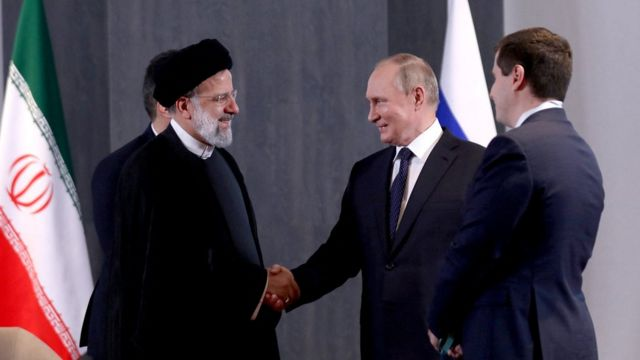

# [Sport] 分析：普京趁机利用以巴冲突的几种方式

#  分析：普京趁机利用以巴冲突的几种方式

  * 罗森伯格 (SteveRosenberg) 
  * BBC俄国事务编辑 

9 小时前

> 图像来源，  Reuters

**外界很容易把普京当成“007”电影里的大反派，坐在深山密室的巨大控制面板前，制造世界各地的混乱。**

他按下一个按钮，巴尔干半岛就会发生动乱。

他按下另一个按钮，中东就会爆炸。

很多人会这么想象，但并不准确。克里姆林宫领导人的全球影响力没那么大。

确实，俄罗斯与哈马斯有联系，也是伊朗的亲密盟友。据美国称，莫斯科和德黑兰已建立全面的军事伙伴关系。

但这不表示，莫斯科直接参与或事先知悉哈马斯对以色列的袭击。

“我们不相信俄罗斯以任何方式参与其中，”以色列驻俄大使亚历山大·本·兹维（Alexander Ben Zvi）本周对俄罗斯媒体《工商日报》（Kommersant）说。

他表示，说哈马斯的暴行与俄罗斯有关，“完全是无稽之谈”。

詹姆斯马丁防扩散研究中心（James Martin Center for Nonproliferation Studies）驻柏林的俄罗斯与中东问题专家汉娜·诺特（Hanna Notte）也说：“我没有看到任何证据，表明俄罗斯直接向哈马斯供应武器，或俄军训练哈马斯特工。”

“俄罗斯与哈马斯的关系确实由来已久，俄罗斯从未宣布哈马斯为恐怖组织，哈马斯代表团去年和今年曾访问莫斯科。”

“但我不会由此推断俄罗斯给予哈马斯广泛的军事支持。尽管我们知道俄罗斯制造的系统进入了加沙地带，很可能是通埃及的]西奈半岛并在伊朗的协助下进入的。”

换言之，普京并没有按下“中东战争”的按钮。

但他会趁机利用这个局势吗？当然会，具体方式如下。

##  转移对乌克兰的注意力

![大量以色列坦克集结在加沙边界

> 图像来源，  EPA
>
> 图像加注文字，大量以色列坦克集结在加沙边界

随着中东局勢主導国际新闻版面，莫斯科正指望以色列的戏剧性头条，会转移人们对俄乌战争的注意力。

这不仅仅是为了改变新闻周期，俄罗斯当局还希望，一些西方国家向乌克兰提供的武器转到以色列。

“我相信这场危机将直接影响（乌克兰）特别军事行动的进程。” 俄罗斯外交官康斯坦丁·加夫里洛夫（Konstantin Gavrilov）对亲克里姆林宫的媒体《消息报》说。

“乌克兰的支持者会被以色列的冲突分心。这不代表西方会抛弃乌克兰人，但军事援助的数量会减少，而且行动的进程可能会急转直下，而俄罗斯]有利。”

但这是俄罗斯一厢情愿吗？很有可能。

“我们能够也将支持以色列，就像我们支持乌克兰一样。”美国防长奥斯汀（Lloyd Austin）在北约国防部长会议上说。

尽管如此，若中东冲突长期持续，将考验美国能否在两场战争中，同时支持两个盟国。

##  俄罗斯是调停者？

俄罗斯想把自己塑造成潜在的和平缔造者，借此提升其在中东地区的地位。

它以前曾经扮演过这样的角色，与国际社会一起努力结束该地区的冲突。

普京总统的发言人德米特里·佩斯科夫（Dmitry Peskov）表示，“俄罗斯能够并将会在解决[冲突]中发挥作用”，“我们正与冲突各方保持接触”。

伊拉克总理本周访问莫斯科时，呼吁普京“宣布在该地区实现真正停火的倡议”。

![加沙难民在联合国开办的学校躲避战火

> 图像来源，  Reuters
>
> 图像加注文字，加沙难民在联合国开办的学校躲避战火

但俄罗斯要做和平缔造者？恐怕很难说服人。

毕竟，它全面入侵邻国乌克兰，过去近20个月的战争，已造成震惊世界的大规模死亡与破坏。

再者，自称“能够并将会在实现和平方面发挥作用”，并不代表冲突各方会接受你是调解人。

莫斯科长期关注中东问题，在以色列与美国建立紧密联系的同时，苏联采取了亲阿拉伯的立场。多年来，苏联官方都支持反犹太主义。

苏联解体后，俄罗斯与以色列的关系有所改善，部分原因是有过百万犹太人从前苏联加盟共和国涌入以色列。

但最近，普京领导下的俄罗斯与以色列的敌人——尤其是伊朗——越走越近，导致俄以关系紧张。

##  谴责美国

普京在这次以巴冲突中让找到机会，一如既往地再次指责美国，称“这是美国中东政策失败的一个例子”。

这是莫斯科的一贯模式，攻击所谓的“美国霸权”。

克里姆林宫将美国塑造成中东的罪魁祸首，以提高俄罗斯在该地区的地位。

> 图像来源，  Iran's Presidential Website/WANA
>
> 图像加注文字，2022年11月普京与伊朗总统莱希（Ebrahim Raisi）会面

尽管中东乱局对俄罗斯有潜在好处，但也有危险。

“谨慎调整的不稳定性，对俄罗斯最有利，” 俄罗斯与中东问题专家汉纳·诺特说。

“如果这场危机转移了人们对乌克兰的注意力——考虑到以色列在美国国内政治背景中的重要性，这种风险确实存在——那么是的，俄罗斯可能是短期受益者。”

但诺特表示，如果战争扩展范围，俄罗斯不会从中受益，其中包括向哈马斯提供武器和资金的伊朗。

“俄罗斯不希望以色列和伊朗爆发全面战争。如果发展到这地步，美国显然会强硬地站在以色列那边，我认为俄罗斯别无选择，只能进一步倒向伊朗。我不确定它是否愿意这样。”

“我认为普京仍然重视与以色列的关系。我认为俄罗斯外交不想进入选边站的地步。但这场冲突越升级，他们可能感受到的压力就越大。”

