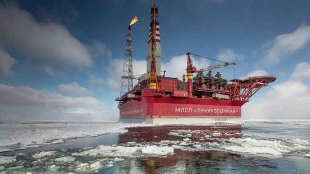
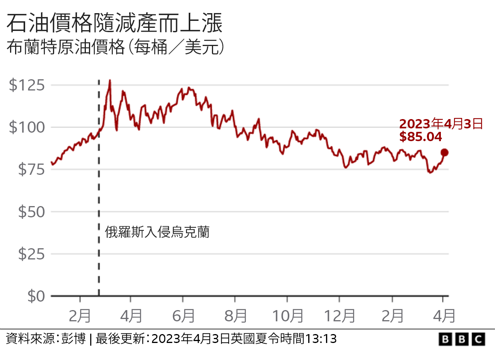
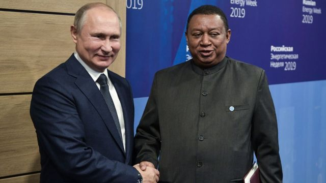

# [Business] OPEC：世界产油大国为何纷纷减产？

#  OPEC：世界产油大国为何纷纷减产？

最近更新： 2023年4月4日

> 图像来源，  Getty Images
>
> 图像加注文字，俄罗斯每天的石油产量超过1000万。桶2022年2月，俄国因入侵乌克兰遭到出口制裁，全球石油价格暴涨。

**世界多个主要石油生产国宣布减产，引发原油价格飙升。**

沙特阿拉伯、伊拉克与多个波斯湾国家联手每天减产100万桶，与他们同属OPEC+组织的俄罗斯，将每天减产50万桶的措施延长至2023年底。

美国白宫对此提出了批评。

##  欧佩克+为何减产？

在最新一轮每日减产116万桶的措施以前，组织在2022年10月曾减产每日300万桶。这马上导致国际原油价格上涨5%。

英国能源研究所的凯特·多里安（Kate Dourian）说：“此举完全让人意外，因为沙特阿拉伯曾表示，其生产配额将在今年余下时间内维持。”

“这也许是欧佩克+试图先发制人，因为世界原油需求也许没有此前预测那么旺盛。”

2020年春季，随着新冠疫情在世界各地蔓延，各国进入封锁状态，对原油需求大跌，由于缺乏买家，世界原油价格暴跌。欧佩克+成员国继而同意每天减产1000万桶，以推动价格上涨。

俄罗斯入侵乌克兰以来，原油价格在2023年3月份涨至130美元一桶高位。在此之前，油价曾跌至每桶70美元低位。

原油价格上涨恐将再次推高世界各地汽油价格，让百姓生活成本百上加斤。

对此，美国形容欧佩克+的做法“不可取”。

##  欧佩克+是什么样的组织？

欧佩克+（OPEC+）是一个由23个石油出口国组成的集团，每月在维也纳举行会议，以决定将多少原油投放到世界市场上。

该集团的核心是欧佩克（石油输出国组织；OPEC）的13个成员国，这些成员国主要是中东和非洲国家。它成立于1960年，是一个卡特尔（垄断联盟），旨在确定全球石油供应及其价格。

如今，欧佩克国家生产约30%的世界原油，当中最大的单一石油生产国是沙特阿拉伯 ，每天生产超过1000万桶。

2016年，当油价特别低时，欧佩克与10个非欧佩克产油国联手创建了欧佩克+。

其中包括俄罗斯，每天的产量也超过1000万桶。

这些国家共生产了世界上约40%的原油。

多里安说，欧佩克+定制供需以平衡市场。当石油需求下滑时，他们通过降低供应来保持高价格。

欧佩克+还可以通过向市场投放更多石油来降低价格，这是美国和英国等主要原油进口国希望它做的事情。

> 图像来源，  Getty Images
>
> 图像加注文字，俄国是欧佩克+的一个成员。图为俄国总统普京之前与病故的前任秘书长穆罕默德•巴尔金多的合影。

##  俄罗斯石油怎么了？

俄罗斯入侵乌克兰后，欧盟国家停止从海路进口一切俄罗斯石油产品，美国与英国更是彻底停止采购。

如今，俄国石油更多被卖到印度和中国，它们并未加入西方制裁莫斯科行列。

然而，七大工业国集团（G7；七国集团）透过实施每桶60美元的价格上限来压抑俄罗斯的石油出口收益。

