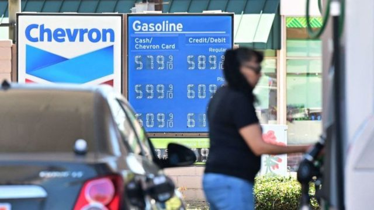

# 汽油价格下跌　美国7月份通胀率略见缓和

#  美国经济：汽油价格下跌 7月份通胀率略见缓和

  * 娜塔莉·舍尔曼（Natalie Sherman） 
  * BBC商务记者 纽约报道 

2022年8月11日

> 图像来源，  AFP
>
> 图像加注文字，此前国际能源价格飙升带动世界各地消费物价上升。

**美国上月物价继续急速上涨，但汽油价格下跌协助缓和上升步伐。**

据美国劳工部公布，反映价格上升步伐的通胀率7月份为8.5%，比6月份的9.1%有所回落。

在能源以外，许多物品的价格，包括食品杂货与住房，仍持续攀升。

价格走高让诸多家庭生活变得拮据，对经济构成显著影响。

就业岗位增长仍然强劲，但其他指标，包括消费者与商业信心指数，均受到担忧价格攀升的氛围冲击。目前物价正以1980年代初以来最快的速度攀升。

过去12个月，美国食品杂货价格同比增长13.3%，是1979年以来最大按年增长。咖啡价格环比6月份走高3.5%，推高7月份整体物价。

住房、医疗与康乐休闲价格环比6月份也告上涨，但二手汽车、航空票价与服装价格下跌抵消了影响。

汽油价格环比6月份下跌7.7%，当时零售汽油价格高达平均每加仑5美元（每升1.32美元），刷新纪录。

整体而言，最新报告中的数据优于多数分析员预期。

凯投宏观（Capital Economics）首席美国经济学家保罗·阿什沃斯（Paul Ashworth）说：“目前仍未出现（美国央行）想要看到有意义的通胀率下跌，但这是个开始。我们预期在未来几个月能看到更广泛的物价压力放缓信号。”

受多重助力带动，美国物价自去年起急速上涨，这包括政府发放新冠病毒病（COVID-19）疫情购物补助，致使消费需求强劲。

与此同时，中国多处城镇因疫情封城禁足，乌克兰战事持续与其他因素，造成商品供应滞后，其中包括了食用油与小麦等必需品。

##  通胀与工资的矛盾

> 图像加注文字，阿奎那·兰科（Aquinnah Rank）

食品价格暴涨，阿奎那·兰科（Aquinnah Rank）说，她得减少购买一些商品的昂贵品牌版本，例如麦片。同时她得减少购买非必需品，例如曲奇饼。

兰科这个夏天会到餐馆打工。汽油价格下跌能稍稍舒缓艰难局面，但这位21岁的马萨诸塞州学生担心明年5月大学毕业之后，未必能找到好的工作，赚取足够工资来应付食品杂货与租金开销。

她对BBC说：“工资涨幅不一定能跟上，这当然令人担忧。”

美国央行自3月以来多次提涨利率，试图稳定物价。

加息是控制通胀途径之一，此举让贷款成本增加，理应能鼓励大众减少借贷和消费，从而降低需求。需求本身能推动物价走高。

但由于高利率也会减少经济活动，银行得面对把经济推进长期低迷，也就是经济衰退的风险。美国商务部上月报告，全国经济在4月至6月季度收缩，是连续两季度经济增长倒退。

市场预期美国以及海外经济放慢，是最近几周石油价格下跌的部分原因，而这促成消费者燃油开销下降。

美国投行联邦爱马仕（Federated Hermes）资深经济学家西尔维亚·达安杰洛（Silvia Dall'Angelo）表示，随着央行加息步伐趋稳，持续物价高企促使消费者减少开销，她预期消费需求在未来几个月进一步降温。

她说：“这再加上能源价格趋稳，全球供应紧张逐步松绑，有望在明年（2023）让通胀率更快下降。”

但她也指出：“联邦储备局也许会从今天的通胀报告中得到安慰，但抗击高通胀的努力仍任重道远。”

