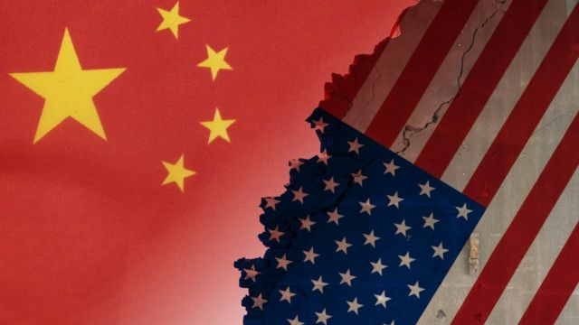
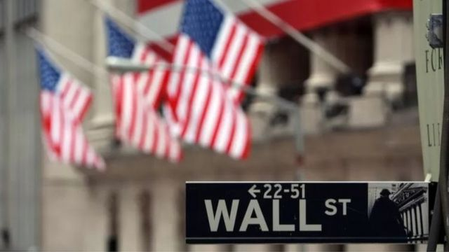
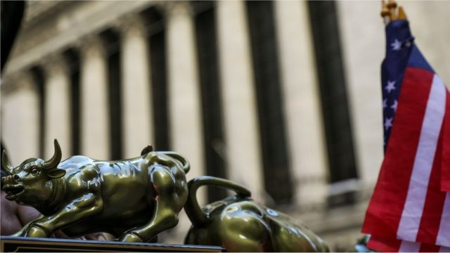

# 中美签署审计监管合作协议 你需要知道的几件事

#  中美签署审计监管合作协议 你需要知道的几件事

> 图像来源，  Yaorusheng

**中美两国26日宣布签署审计监管合作协议，该协议将允许美国监管机构对中国大陆和香港的审计机构进行检查和调查，包括检查上市公司的审计底稿。**

在两国贸易争端的背景下，此次达成协议是监管机构双边合作的重要一步。

有分析称，若该协议能落实具体执行，将有效减缓中企在美国证交所的“下市潮”。迄今约有160家中企，包括阿里巴巴、百度、京东等大公司都被列入未达到美国审计标准，落入即将在美市摘牌的预定名单。

不过，在有关如何检查的程序表述上，两边措辞有所不同，未来或继续政治博弈。

##  双方达成了什么共识

达成协议意味着，中国将允许美国会计监管机构前往中国，检查在纽约上市中企的审计底稿。

美国公众公司会计监督委员会（PCAOB）表示，预计美国检查人员将于9月中旬抵达中国。官员们警告称，他们必须迅速行动，在今年年底前完成对中国是否遵守美国法律的评估。

美国监管机构长期以来要求获得在美上市中国公司的审计底稿，但中国当局以安全问题为由，不愿让海外监管机构检查国内的会计师事务所。

> 图像来源，  Getty Images
>
> 图像加注文字，目前为止有超过200家中企在美国上市，如果这些公司的审计资料连续3年未能接受PCAOB检查，他们将有可能从2024年开始被美国证券交易所摘牌。

##  审计底稿为何重要

简单地说，审计底稿是在财务报表审计期间的总汇文件。

这些文件提供了证据，证明审计员获得了足够信息来支持他对相关财务报表的意见。审计底稿也为审计工作得到适当计划和监督提供了证据。

中国多项法律法规明确，审计底稿等档案应当存放在境内。理由是涉及到国家机密、信息安全和国家主权。

随着美中关系恶化，中国加强了对审计底稿的管控。美国监管部门也受到压力，要求中国企业达到最新的审计要求。

根据 华尔街日报  （WSJ）披露，最近几周中国监管机构告诉一些中企，只要“遵守国内有关数据安全和资讯保护的规定，政府将支持他们在美上市。”

该报导还引述知情人士称，中国监管机构也表明，将允许美国会计监管机构“不受限制地”访问中企在香港的审计底稿。

目前有超过200家中企在美国上市，如果这些公司的审计资料连续3年未能接受PCAOB检查，他们有可能从2024年开始被美国证券交易所摘牌。下市威胁近在眼前，在美上市的一些中企，包括阿里巴巴等，正考虑将香港从第二上市据点转为主要上市据点。

##  中国和美国各自强调了什么

虽然美中双方都表示达成共识，但在有关如何检查审计底稿的程序表述上，两边措辞有所不同。

PCAOB在声明中称，该机构“有权自行选择其检查和调查的公司、审计业务和潜在违规行为”，而“无需咨询中国当局，也无需中国当局提供意见。”

但是，中国证监会则表示，美方须通过中国监管部门获取审计底稿，并“在中方参与和协助下”对事务所相关人员进行问询。该机构强调“确立对等原则”。

中方声明还称，合作协议对于审计监管合作中可能涉及敏感信息的处理和使用作出了明确约定，针对个人信息等特定数据设置了专门的处理程序。

> 图像来源，  Getty Images
>
> 图像加注文字，分析称，中国正采取措施，尽量避免让中概股全面从美国退市。

##  合作协议可能带来什么影响

该协议的签署或可避免在美国《外国公司问责法案》下，很多中国公司从美国证券交易所退市。

有分析称，由于没有美国审计认证，即便在美国证交所上市，也很难有好价格。

许多中企因此在美国退市后转向欧洲，特别是在瑞士证交所发行全球存托凭证（GDR）。譬如，中国证券监管机关在今年 2 月便表示，将把互联互通存托凭证业务扩大至在瑞士、德国、深圳等地上市的公司。

根据 路透社  ，上周有5家在美国上市的中国国企表示，将“自愿”从纽约证券交易所退市。这些公司的审计工作正在接受美国证券监管机构的审查。

这5家公司是石油巨头中国石化、中国人寿、中国铝业、中国石油和上海石化。每家公司都表示他们将在8月申请从美国存托股票（ADS）退市。

##  未来如何执行是焦点

协议虽然签署了，但两国今后如何协商，具体执行该协议将成为焦点。

“可以看到中国公司的会计底稿对于是否有助增加美国监管机构的审查信心，仍有待观察”，一位在香港外资银行工作女士告诉BBC中文。她还说，香港业界对于中国能否真正放手不太有信心。

中国一位商业人士 李寿双  则发文表示，中美强调有所不同，“既是法律问题，也是政治问题，与其说是妥协，不如说是寻找共识。只希望这来之不易的成果能够得到双方很好的执行，走出眼下的困境。”

未来的关注焦点还有，中国公司从美国下市后是否在经过审查后重新上市；尚未上市的中国企业如何与美国证交所互动；以及瑞士GDR如何继续抢下中国客户等等。

