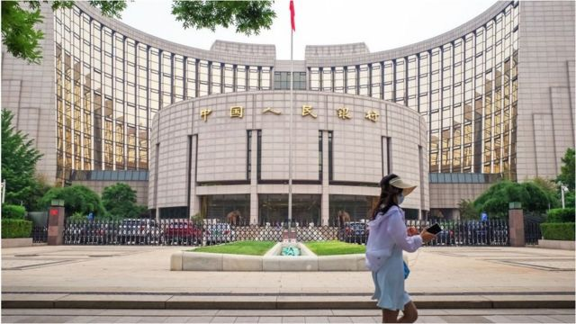
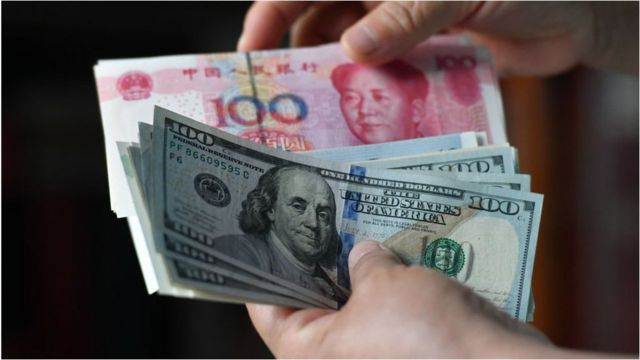
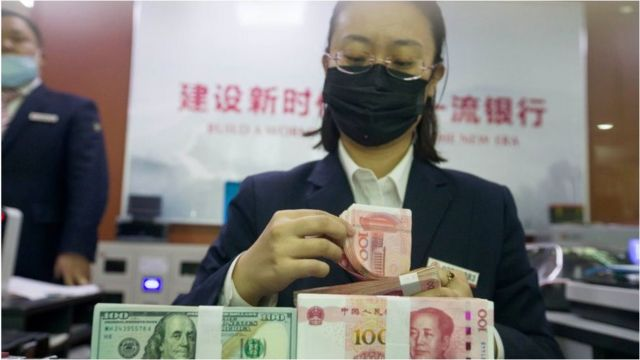

# 人民币兑美元汇率跌破7.2 贬值主要原因和最大风险在哪里

#  人民币兑美元汇率跌破7.2 贬值主要原因和最大风险在哪里

> 图像来源，  Getty Images

**9月28日，离岸美元兑人民币汇率跌破7.2，是2011年有该数据后的人民币的最低值；也是在岸美元兑人民币汇率，自2008年以来的最低值。**

近期，人民币兑美元不断贬值，9月15日，美元兑人民币汇率突破“7”这个心理关口，然而之后贬值加速，不到两周就突破了7.2。

人民币快速贬值也引来中国央行对外汇市场的干预，9月28日起，远期售汇业务的外汇风险准备金率从0上调至20%，但并未阻止当日突破7.2。

分析称，美元大幅上涨的一个重要原因是英国大规模减税政策，致使英镑暴跌。28日晚，英国央行下场救市，宣布临时购买英国长期国债。9月29日，美元兑人民币汇率回到7.15，较最低点上涨逾1000个基点。

值得一提的是，人民币兑美元有所贬值，但贬值幅度仅为同期美元指数（美元兑六个主要国际货币汇率的加权平均数）升值幅度的一半；人民币兑欧元、英镑、日元明显升值，在国际货币市场还属于相对强势的货币。

##  “保七”的心理关口

> 图像来源，  Getty Images

长期以来，人民币兑美元汇率存在“保七”的心理关口。

2008年次贷危机时，人民币大幅升值，美元兑人民币汇率从7.8一路下跌到6.8。中国央行为了稳定人民币汇率，盯住美元，使人民币汇率稳定在6.8-6.89。

2016年，人民币面临贬值压力，美元兑人民币中间价一度达6.96，中国央行动用大量外汇使汇率停在7元大关之前。

此后，市场对“保七”形成心理预期，认为央行会动用政策手段使汇率稳定低于这个数字。因为一旦突破这个关口，可能导致投资者对人民币未来贬值的预期进一步放大，使外资加速撤离，届时稳定汇率的难度将大大增加。

2019年8月5日，受当时中美贸易战影响，人民币兑美元汇率破7元关口，创逾11年新低。

当时央行官员出面淡化“破七”的意义，称这个“7”不是年龄，过去就回不来了，也不是堤坝，一旦被冲破大水就会一泻千里；“7”更像水库的水位，丰水期的时候高一些，到了枯水期的时候又会降下来，有涨有落，都是正常的。

之后人民币在之后升值，一度达到6.3。今年9月15日再次“破七”时市场反映并不强烈，但不到两周急跌到7.2，引起了更多讨论。

##  影响汇率的因素

影响汇率的一个重要因素是“供求”关系。对人民币的需求增加，其价值就会提高，也就会升值。除此之外还有其他许多因素，包括：

  **经济：** 经济强势，货币就会坚挺，因为其他国家要来投资，需要当地货币才能实现，这就会提升需求。 

  **储蓄：** 比如，中国央行加息，涨利率，人民币储蓄和投资的吸引力就会增强，因为回报率更高。这样，对人民币的需求就会增加。美元这一轮升值，就是因为美联储加息导致。 

  **国库：** 官方银行的帐目状况——或者说存了多少钱、欠了多少债——也会影响汇率。 

  **投机：** 汇率受货币投机者——根据对未来事件的期待值买卖货币的人——影响相当大。汇率的当日浮动绝大多数都取决于投机者的动作，或者他们对一个国家经济前景的信心。 

##  美元为什么会上涨

> 图像来源，  Getty Images

既然人民币贬值是因为美元大幅上涨，那么美元为何涨得这么快？因为，美联储近期为了控制通胀而多次大幅加息。

美联储加息后，意味着更高的利息回报和金融资产回报，这会导致新兴市场的国际资金，回头流入美国市场。

对于新兴经济体而言，美元流出，会使本国货币面临贬值压力，中国就是其中之一。

但贬值并非全无好处，对于制造业大国中国而言，人民币贬值就有利于中国外贸订单。因为对于其他国家而言，人民币贬值意味着中国商品变得更便宜，更有竞争力，也就能吸引更多订单。

##  贬值带来的风险

对于新兴市场国家而言，货币快速贬值隐藏着巨大风险。

比如，在1994年的美联储加息周期中，新兴市场国家货币迅速贬值，其中墨西哥尤甚，货币大幅贬值，市场恐慌情绪蔓延，大量资本从墨西哥流出，国际收支情况恶化，直接导致了墨西哥国内爆发大规模的货币危机。

2018年9月，美元走强，也带来了一波新兴市场货币贬值潮。

香港中文大学助理教授胡荣分析，深层原因是在2008年金融危机后，新兴市场国家趁着美元贬值，借债较多，远超自身的承受能力。因此当美元升值和利率上升时，他们无力偿还，导致货币和经济的崩溃。

就中国而言，人民币贬值可能激发资本外流，或者给资产泡沫带来很大压力，因此中国也不希望人民币贬值过快。

川财证券首席经济学家陈雳也撰文分析，人民币贬值会对中国经济社会造成广泛的影响——首先是外资或受到汇率波动加剧的影响流出中国资本市场，其次以人民币计价的资产贬值压力增大，也不利于中国进口产业的长期发展。

