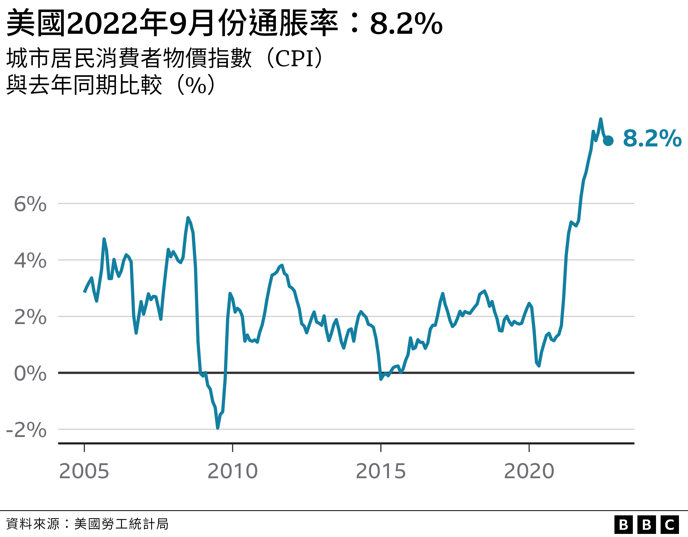

# 美国9月通胀有所回落但仍高于市场预期

#  美国通胀：9月幅度稍有回落，但仍高于市场预期

  * 娜塔莉·舍尔曼（Natalie Sherman） 
  * BBC商务记者 纽约报道 

> 图像来源，  Getty Images
>
> 图像加注文字，过去一年，美国鸡蛋价格同比上升超过30%。

**美国上月消费者物价指数超乎预期，似乎意味着世界第一大经济体抗击通货膨胀依然任重道远。**

截至2022年9月为止12个月的通胀率——即量度价格上涨指标——为8.2%，低于8月份的8.3%。

虽然数字稍有回落，但仍高于市场预测。

美国央行试图缓解有关问题的措施导致美元汇价与国际借贷成本上涨，使美国通胀率受到密切关注。

最新通胀率远高于央行的2%目标，这意味着联邦储备局有可能要继续提高利率，以图为价格飙升降温。

英国首选米顿投资者（Premier Miton Investors）首席投资官尼尔·比雷尔（Neil Birrell）说：“联储局得在下一次例会上提出回应，继续紧抓政策，直到控制通胀有点起色为止。”

“印钞票增加不确定性，对整体经济是坏消息，对消费者尤其糟糕。现在涨息机率怎么看都比之前高了。要从中找出对经济或市场的任何好处很困难。”

自6月份的9.1%之后，受惠于汽油零售价格下跌，美国通胀率持续回落。服装与二手汽车价格上月也有所收敛。

但通胀问题仍在影响美国经济的其他组成部分。粮油杂货价格在过去12个月同比上涨13%，住房与医药成本也在猛飙。

剔除食品与能源价格后的9月份通胀率为6.6%，是1982年以来最快增速。

信安资金管理（Principal Asset Management）首席全球策略师西马·沙阿（Seema Shah）说：“也许更让人忧心忡忡的不是整体数字，而是通胀的商品组合。”

“栖身之所（shelter）与医护指数上升……证明价格压力极其顽固，联储局不出手打击，难以下降。”

联邦储备局自3月至今已五度涨息，最近几个月更不寻常地选择大涨，造成金融市场波动，导致住房市场等急速放慢。

联储局寻求透过让借贷变得更昂贵来降低借贷需求，尤其像汽车与住房贷款等高价项目，来缓减价格上升推力。

但在经济活动放慢之际，联储局也有可能将经济推进衰退。随着通胀率对联储局措施展示排斥迹象，分析人士日趋认为这可能性真实存在。

随着11月国会中期选举逼近，美国总统拜登（Joe Biden）在设法游说国民，从就业岗位创造势头强劲、失业率低来看，经济活动放慢是为了从新冠疫情大流行以后的飙速增长向健康增长过度。

拜登本周接受采访时说：“我不认为会经济衰退，即便如此，也只会是稍微衰退。”

但外界对美国经济的担忧明显对民主党构成压力。

拜登总统在星期四（10月13日）的通胀数据报告发表后说：“美国人饱受生活成本压迫，这已存在了好几年，他们不需要今天的报告来告诉他们这事实。这是我为什么要选总统的关键原因之一。”

“今天的报告说明打击高价格的工作取得一些进展，纵使我们要做的事情还有许多。”

##  “今年的圣诞节不会盛大如昔”

> 图像来源，  Brooke Riske
>
> 图像加注文字，布鲁克·里斯克说，她亲眼目睹粮油杂货以至于女儿的跳舞裙子纷纷持续涨价。

布鲁克·里斯克（Brooke Riske）一家一年多前开始筹划在弗吉尼亚州（Virginia；维珍尼亚州）建设新居，但建材价格上升，借贷成本飙涨，迫使他们收缩建房规模。

这位36岁，有两位孩子的母亲说：“我们得踩刹车。我们仍然会把新居建起来，但我们得建一座比预期细小的家，还要承担比我们预期昂贵的房贷。”

生活成本上涨对他们的冲击还涉及其他方面，粮油杂货和她女儿的舞蹈服装价格等都在上涨。从事教育行业的布鲁克说，她的工资毫无寸进。

她说：“今年的圣诞节不会像从前般盛大，因为我们没那么多钱，我们都在试着聪明地应对一切未知之数。我对未来几年感到前路茫茫。我们是要迎接严峻的经济衰退了吗？”

报告公布之后，股市猛跌，但在盘中止跌回升。

许多分析盼望联储局能在下一次例会中放慢涨息步伐，同时指出航运价格走低等迹象说明通胀率或已趋向下行。

但在趋势明朗化之前，即使涨息通常会驱使资金回笼美国，推高美元汇率，分析人士仍然认为利率将继续走高。外界担忧这将波及世界，而许多国家当下已在跟本土通胀问题艰苦搏斗。

在星期三（12日）的一次演说中，曾任联储局首长的美国财长耶伦（Janet Yellen）承认这种忧虑。她称美国“在意”环球形势，但国内忧患主导政策。

她说：“做好国内的工作是我们迈步向前的开端。在美国，我们首要的经济任务是降低通胀，同时维持强有力的劳动市场。”

