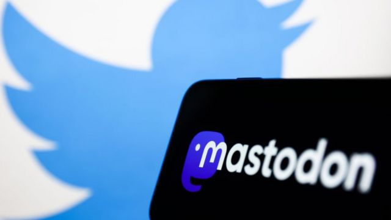
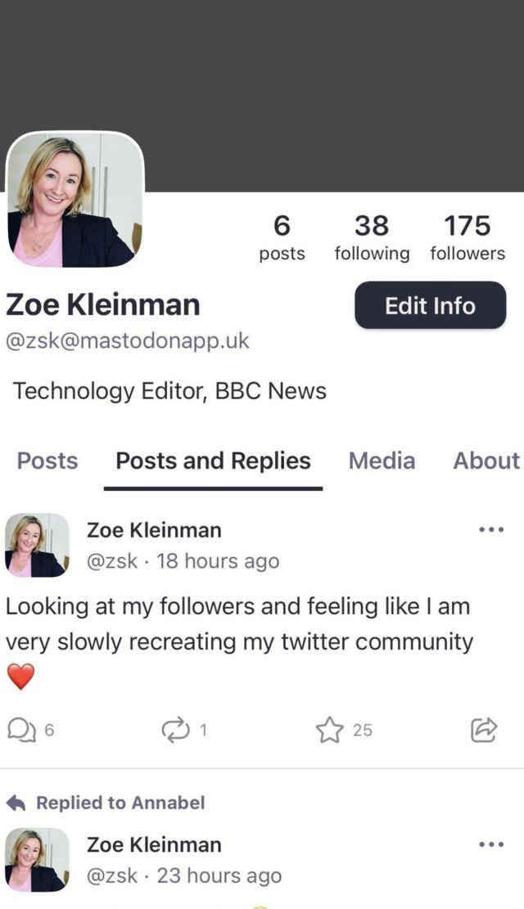

# [Business] 马斯克收购推特 新走俏的平台长毛象 Mastodon 是什么？

#  马斯克收购推特 新走俏的平台长毛象 Mastodon 是什么？

  * 佐伊·克伦曼（Zoe Kleinman） 
  * BBC科技事务记者 

6 小时前

> 图像来源，  NurPhoto

**在马斯克收购推特、推特用户开始寻找其他可替代社交平台的过程中，受益最大者之一是 Mastadon (长毛象）。**

这究竟是个怎样的平台？

据该平台自我介绍，现有用户共65.5万，其中23万是在过去一周加入的新用户。

从界面上看，长毛象与推特非常相似——用户发贴，其他人可以回复、点赞、转发，也可以互相关注。

但是在这个界面之下，实际却很不相同。

这也正是它从推特吸引众多新用户的原因，不过很多也让新注册的用户感到困惑。

作为社交平台的长毛象已有六年历史，如今的活跃程度却是前所未有的，而且在新加入者的重压下，这个平台有些疲于应对。

BBC为您梳理一个简短的指南，以便找到适合自己使用该平台的方式。

##  为什么有这么多服务器？

当你注册使用长毛象时，首先要做的是选择服务器。服务器有很多主题，按国家、城市或兴趣等等来划分：如英国、社会、技术、游戏……

你上的是哪个服务器上并不那么重要，因为你仍然可以关注所有他服务器的用户，但它确实把你放入一个起步社区，其中的使用者更有可能发布你感兴趣的东西。

一些受欢迎的社区，如社交和英国，由于需求者众多，目前运行非常缓慢。

莱恩·王尔德是长毛象英国服务器的管理人，他通过名下的超级网络（Superior Networks）公司管理英国服务器的运行。据他介绍，在过去24小时内有超过6000名新用户注册加入了这一平台，因此新用户注册不得不暂停。

他说：“我想看看这么多人加入我们究竟是怎么回事。”

“我在周五晚上10点把服务器开动起来，第二天早上醒来的时候，我不知道有1000个人会来。”

##  如何找人？

你选择的服务器会成为你用户名的一部分。例如，我使用了我目前的推特账号zsk，并选择了英国服务器，那么我的长毛象用户名为@zsk@mastodonapp.uk。这就是我的地址，你可以通过搜索找到我。

> 图像来源，  Mastodon

在同一个服务器时，你可以只用这个人的名字来搜索，但如果在不同的服务器上，找到某个人则需要他们的完整地址。

与推特不同的是，长毛象不会推荐你可能感兴趣的关注对象。

另外还可以通过标签来搜索。

##  为什么到处都设有服务器？

这是个相当复杂的问题，我来尽量说得简单些。

长毛象并不是一个完整的平台。它也不是一个实实在在的“东西”，不是由某个人或某个公司拥有。当所有这些不同的服务器连接在一起，才形成了一个集体网络，但它们由不同的人和组织拥有。

这被称为去中心化，而去中心化平台的粉丝们所喜欢的也恰恰是去中心化这一点，因为长毛象作为一个集体网络不能随心所欲地运行，不能被单个实体买或者卖。

然而，这样一来的缺点是，用户反而受制于所在服务器的运行人或组织——如果他们决定放弃运营服务器，你的账户就不复存在。不过，长毛象要求服务器所有者在决定关闭服务器时给用户三个月的通知。

顺便说一下，推特的最早创始人杰克·多尔西正在开发一个名为蓝天（BlueSky）的新网络。他曾说过他希望这个网络也是去中心化的。

##  长毛象如何审核内容？

这是一个真正的烫手山芋。目前，所有的服务器都有自己的内容审核规定，其中有些服务器的规定就是完全不加审核。一些服务器选择不链接到充满网络机器人的服务器，或者有大量仇恨内容的其他服务器。这意味着拦截这些内容服务器的使用者将看不到这样的内容。所有发帖也可以报告给服务器所有者。

如果有人发表仇恨言论或非法内容，那么服务器所有者可以删除这些内容，但这并不代表所有其他服务器上也都被删除。

如果长毛象作为社交平台继续增长，不当内容将会是一个巨大的问题。

已经有报道说，有的用户收到了大量的仇恨内容，BBC记者甚至已经看到了仇视同性恋的言论。

##  有广告吗？

没有。虽然没有广告，但也并没有阻止人们写文章宣传某个公司或产品的规定。

长毛象也不像推特那样根据你的浏览方式精心策划为你提供内容加深用户体验。

你通常会在你的关注者留言同时立刻看到他们说了些什么。

##  长毛象收费吗？

这取决于你在哪个服务器上。有些服务器要求捐款，因为他们没有报酬，但它基本上是免费的。

