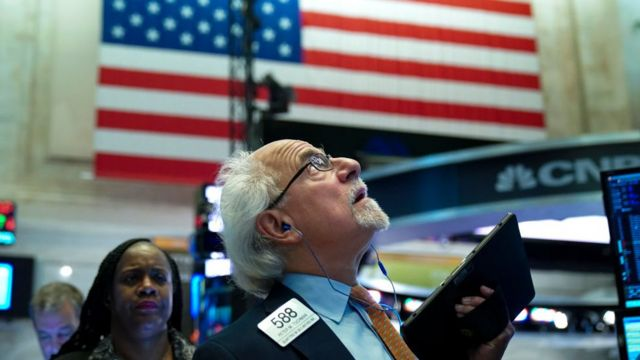
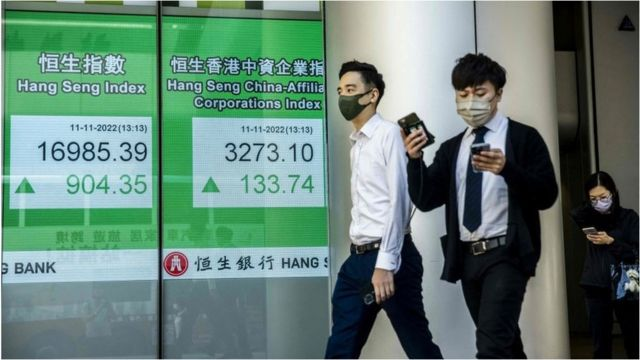
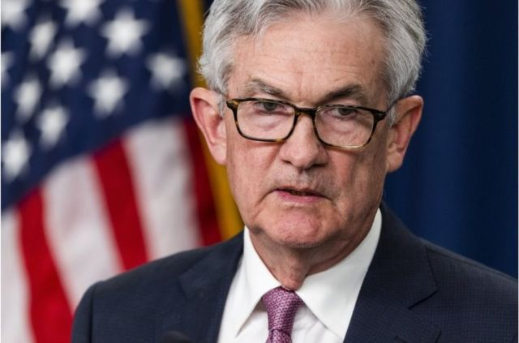
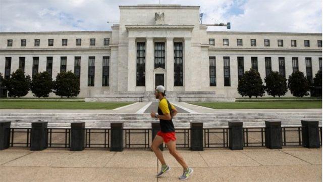

# [Business] 美国通胀终回落：美股港股接力飙涨，专家谨慎看待拐点论

#  美国通胀终回落：美股港股接力飙涨，专家谨慎看待拐点论

> 图像来源，  Getty Images

**久旱逢甘露。美国劳工部数据显示，10月美国消费者价格指数（CPI）同比涨幅为7.7%，是今年1月以来最低的单月同比涨幅，较上月的8.2%明显回落。**

今年以来美国CPI不断上涨，六月达到9.1%的最高位，是1981年11月以来的最高通胀率。

该数据公布引发连串反应：加息预期降低，股市大涨，美元贬值，包括香港在内的多个股市连带上涨。

> 图像来源，  Getty Images
>
> 图像加注文字，香港恒生指数截至中午就已上涨超过900点，全天收盘大涨7.7%。

##  “市场太火热了”

“通胀还是太高了，但有证据表明美联储对抗通胀，已经不再是躲在角落里挨打，未来加息速度会开始慢下来。”位于纽约的FWDBONDS首席经济学家鲁普基（Christopher Rupkey）表示。

“市场太火热了，人们期待已久的通胀缓和终于开始出现。”鲁普基称。

截至当日收盘，道指涨3.70%；标普500指数涨5.54%；纳指涨7.35%。

热门中概股也涨势汹汹，纳斯达克中国金龙指数涨7.55%，蔚来汽车涨11.42%，拼多多涨8.27%，阿里巴巴涨7.57%，腾讯ADR涨7.47%。

乐观的情绪随之传导到亚洲，周五收盘时香港恒生指数大涨7.7%。值得一提的是，当天下午中国宣布放宽防疫限制，减少入境隔离天数和大范围核酸检测，进一步刺激了市场的乐观程度。

> 图像来源，  EPA
>
> 图像加注文字，美联储主席鲍威尔

##  为何通胀回落会造成股市大涨？

当经济体系中钱比较多或者物资稀缺时，物价就会上涨，造成通货膨胀。

为了降低通胀，美联储就会上调联邦基金利率，该利率是美国银行和银行之间互相借钱时的利率，这一过程称为加息。

加息后，银行在给企业或个人放贷时的利率也水涨船高，此举可以减少货币供给量，降低通胀，从而给经济降温。

具体而言，美联储只要向市场抛售美元国债，就可以回收美元，当市场上流动的美元减少时，美元的融资成本就自然上升，如此就实现了加息。

而美联储回收美元，可能会减少流入股市的资金，股市也就相应下跌。

举例而言，互相联通的几个水池，就像股市、债券市场、房地产市场等等。如果从一个水池里抽掉一部分水，其他水池的水位也会相应下降。

由于通胀率高居不下，市场预期美联储将在12月加息75基点；但最新通胀数据公布后，市场预期只会加息50基点。

加息幅度没那么大了，对股市来说自然是好消息，因此各大指数大涨。

“这是一件大事，”旧金山贝克大道资管公司首席策略师李普（King Lip）说。“过去几个月，我们一直在呼唤通胀拐点，并对它没有在数据中显示出来感到难以置信的沮丧。”

今年以来，标准普尔500指数（SPX）今年迄今仍下跌了约17%，并将创下2008年以来的最大年度跌幅。

“这是第一次，它（拐点）真的已经在数据中有所显现了。”

> 图像来源，  Reuters
>
> 图像加注文字，一名慢跑者跑过美国华盛顿特区的美联储大楼。

##  战斗还未结束

但美国对抗通胀的斗争远未取得胜利，虽然10月美国CPI涨幅放缓，但是依然高于美联储目前的政策利率。

上周，美联储已经连续第四次加息75个基点，同时还表示为将通胀率降低到2%的目标，战斗还未结束，还需要进一步提高借贷成本。

前美国财政部长劳伦斯•萨默斯撰文表示，虽然目前的私人部门的住房和其他数据显示美国通胀可能在2023年消退，但这个趋势还不牢固。

他进一步表示，美联储可能需要将利率提高到6%或更高才能控制住通胀。

然而，美联储也在释放信号称，可能正在接近一个加息的拐点。

