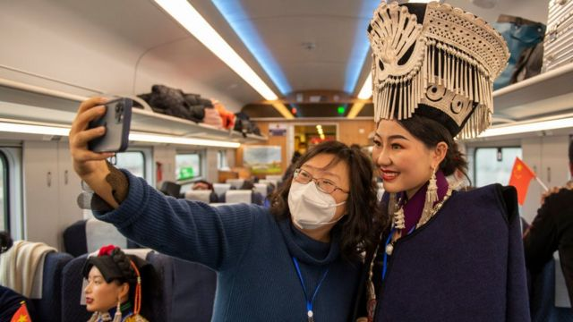
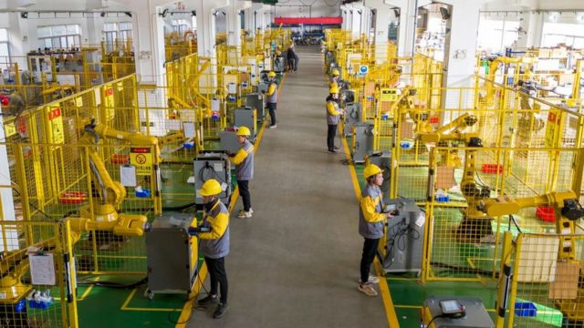
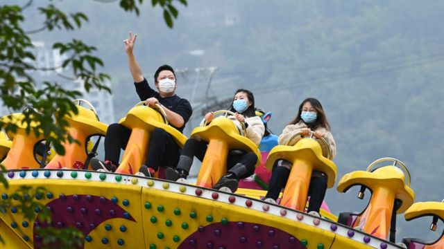

# [Business] 中国经济：12月制造业PMI降至近三年新低，分析称解困尚需时日

#  中国经济：12月制造业PMI降至近三年新低，分析称解困尚需时日

> 图像来源，  Getty Images
>
> 图像加注文字，12月26日，连接成都和昆明的新成昆铁路开通，带着口罩的乘客与穿着彝族传统服饰的女性自拍合照。消费低迷是目前中国经济面临的难题之一。

**12月31日，中国统计局公布，2022年12月制造业采购经理指数（PMI）为47.0%，该数字低于路透社预测的中值（48%）；比前一月下降1个百分点，是2020年3月以来的新低点。**

PMI被视为一个经济体的“体检表”，反映制造业的整体增长或衰退。PMI的荣枯线是50%，高于50％代表制造业在扩张发展，反之则代表衰退。

12月的PMI是封控政策放开后首个官方公布的经济数据。路透社称，激增的感染人数使制造业面临暂时的劳动力短缺和更剧烈的供应链扰动。根据路透社上周的报道，位于上海的特斯拉工厂受到上述冲击，计划缩减产能。

从具体数据看，中小企业受到的影响更大——大企业的PMI下降0.8%至48.3%，而同期中小企业分别下降1.7和0.9个百分点，46.4%和44.7%。三者都处于收缩区间。

同期公布的非制造业商务活动指数则下降更为显著，仅为41.6%，较上月下降5.1个百分点。其中，建筑业表现较好，为54.4%，处于景气区间；而服务业商务活动指数为39.4%，比前一个月下降5.7个百分点。

中国统计局服务业调查中心高级统计师赵庆河称，中国制造业采购经理指数比上月有所下降，原因是受疫情冲击等因素影响。

该机构的调查显示，56.3%的受访制造业者称12月受到疫情极大的影响，比上个月激增15.5%，不过大多数人表示预计情况会逐渐改善。

> 图像来源，  EPA
>
> 图像加注文字，工人大量感染可能影响制造业的开工率。图为12月12日江苏一家工业机器人制造企业的车间。

##  为什么要关注PMI？

采购经理指数（PMI）采用问卷调查的方式，中国官方的调查样本包括3000家制造业企业，及4000家非制造业企业。

被调查者对生产、新订单、新出口订单、在手订单等13个指标评估，可以选择对比此前一个月上升、不变或下降。最终，对不同指标进行加权计算后得到PMI指数。

因为与制造业发展趋势和GDP之间高度相关，PMI指数对经济预测的准确性被金融界和政策制定者高度认可。

此外，调查每月进行，一般在月初发布，时间上大大提前于其他经济指标，因此被看作反映经济现状的可靠先行指标。

疫情前一年，中国每个月的PMI大致在50%上下徘徊，最高为50.5%，最低为49.2%。2020年1月为50%，2月疫情来袭后骤降至35.7%。骤降的原因是受新冠疫情影响，企业大面积停工。

但从2020年3月开始，制造业PMI连续18个月处于景气区间，直到2021年9月开始继续在50%上下徘徊，今年四月上海封城后，PMI从3月的49.5%大幅下降到47.4%，其后继续在50%上下徘徊，但从今年9月开始，一路下降，以每月1个百分点的速度，下降到当前的47%。

> 图像来源，  Getty Images
>
> 图像加注文字，“放开”后，不少服务业受到冲击，但也有经济学家认为最糟糕的时候已经过去，中国经济未来将出现强劲复苏。图为12月8日重庆一个游乐场。

##  复苏之路：喜忧并存

中国防疫“放开”后，感染人数激增，影响各行业开工，同时由于担心感染，很多人居家不出，对服务业也产生打击。

一些企业甚至不愿跟随政府指引而放弃防疫限制。比如，连锁火锅品牌海底捞，还要求其员工进行核酸检测。

企业这种担心不无道理，一位北京大型商超的高管表示，“我们商场和酒店的一半以上的员工都是阳性。”这位高管说，该商场仍在营业，但不得不把剩余工作人员分成两组，分批上班。

凯投宏观（Capital Economics）高级中国经济学家朱利安·埃文斯-普里查德（Julian Evans- Pritchard）认为，中国需要相当长时间来适应与病毒共处，消费活动可能要在3到6个月后，才能恢复到“类似于正常的状态”。

“因此，中期来看，即便'清零'政策的转变将使大多数企业受益，但它并不能立即缓解（经济困境），未来几个月仍将非常具有挑战性。”

国泰君安国际的首席经济学家周浩认为，虽然制造业PMI低于预期，但要考虑到过去一个月感染激增带来的不确定性，分析师实际上很难进行合理的预测。

不过他也对表达了乐观的情绪，“总的来说，我们认为中国经济最糟糕的时期已经过去，未来将出现强劲的经济复苏。”

“中国新年前的几周对服务行业来说仍将具有挑战性，因为人们不想出去消费，怕感染，”凯投宏观首席亚洲经济学家威廉姆斯（Mark Williams说），“但是，在人们从春节假期回来的时候，前景应该是光明的——感染率将回落，很大一部分人得过新冠后，觉得自己有一定程度的免疫力。”

从外部来看，经济恢复似乎依然有障碍。 “我所知道的大多数工厂获得的来年的订单，都远远低于往年的情况。”供应链咨询公司Tidalwave Solutions的合伙人卡梅伦·约翰逊（Cameron Johnson）称其接触的很多工厂订单量只有往年的50%，有些甚至低于20%。“因此，即使中国正在开放，制造业仍将放缓，因为世界其他地区的经济正在放缓。工厂会有工人，但他们没有订单。”

