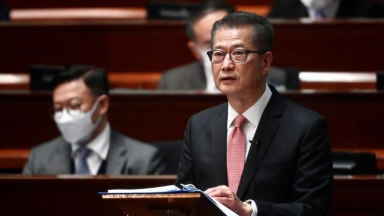
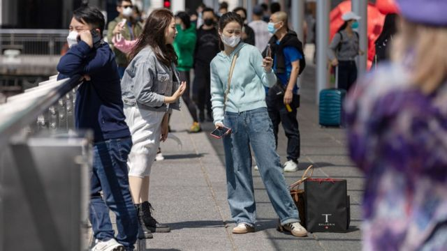
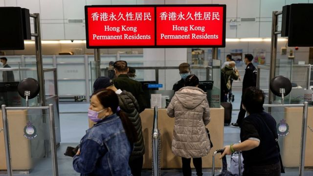
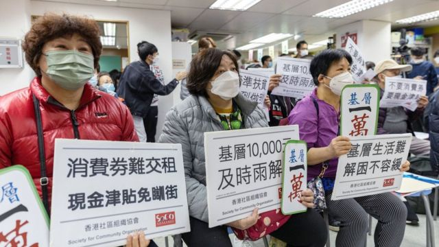

# [Business] 香港预算案2023：千亿赤字下减少“派糖”，预期经济会“强劲反弹”

#  香港预算案2023：千亿赤字下减少“派糖”，预期经济会“强劲反弹”

最近更新： 8 小时前

> 图像来源，  China News Service
>
> 图像加注文字，陈茂波在演辞中主动为赤字预算是否违反香港《基本法》的“量入为出”原则辩护。

**在香港从新冠病毒病（COVID-19）疫情走向恢复正常，而全球均在面对生活成本危机之际，“派糖纾困”措施成为李家超政府首份财政预算案的焦点，但“派糖”和减免各种费用的力度比去年有所降低。**

香港财政司司长陈茂波星期三（2月22日）在立法会发表预算案时宣布，将再次派发“消费券”，但金额比去年减半。这是新冠疫情发生后香港政府连续第四年向全体市民发放现金或消费券。减免个人入息课税等措施也被延续。

各项舒缓措施与预期收入减少叠加，预期2022年最终财政赤字为1398亿港元（178亿美元；1228亿元人民币），比原本计划的560亿港元大大超支，2023年度预计赤字则位544亿港元。

陈茂波称，香港2022年整体经济收缩3.5%，但鉴于中国大陆经济增长加快等因素，他预期香港经济将“强劲反弹”，2023年全年经济实质增长将有3.5%至5.5%，同期基本通胀率将升至2.5%。

陈茂波还指出，2022年香港房地产市场交投量大跌近40%，楼价全年下跌15.6%。他宣布维持所有压抑房产需求“辣招”措施，但将调整置业从价印花税税阶，减轻家庭首次置业负担。

预算案演辞指出，加上2023年将发行的各种债券，香港财政储备将下降至7629亿港元，相当于12个月政府开支。

> 图像来源，  Reuters
>
> 图像加注文字，2022年香港整体本地生产总值（GDP）同比下降3.5%。

不少分析人士认为，面对全球经济疲弱，以及在维持港元与美元联系汇率制度下，香港须跟上美国加息速度，香港的经济复苏仍面对着高度不确定性。

香港大学经管学院讲师阮颖娴博士向BBC中文评论说，过去三个财年的赤字总额高达3000亿港元，然而这其实源于约6000亿港元的防疫花费，因此她不认为香港目前存在结构性财政赤字，同时认为特区政府不应缩减已存在多时的“派糖”措施，也不应该加税。

阮颖娴认为3.5%至5.5%的经济增长属可达目标，但须留意地缘政治风险，例如美国对中国实施任何制裁措施会否波及香港。此外，若中国大陆加强监管任何行业，也有可能对香港经济构成冲击。

##  “派钱”与创科

陈茂波在 演辞  开首回顾2022年经济与展望2023年经济后，率先宣布各项“减轻市民经济压力”措施，包括：

  * 向合资格18岁或以上永久性居民及新来港人士每人5000港元电子消费券；合资格非永久居民——包括留学生——每人将获发2500元 
  * 以6000港元为上限，宽减2022至2023财年薪俸税和个人入息课税，涉款85亿港元 
  * 宽减2023至2024财年首两季住宅物业差饷，每户每季最多1000港元，涉款52亿港元 
  * 向申领综合社会保障援助（综援）等福利金人士额外发放半个月款项，涉款27.21亿港元 
  * 从2023至2024财年起增加子女基本免税额与子女出生课税年度额外免税额，每年税收将减少6.1亿港元 

其中，电子消费券属连续第三年派发，连同2020年每人发放1万港元现金，则是连续第四年“派钱”。

> 图像来源，  EPA
>
> 图像加注文字，陈茂波期望拨款承办国际体育比赛等活动能吸引游客归来。

不过，香港舆论注意到，消费券金额比2022年减少一半，个人税务宽减金额也比去年少。一些网民在预算案宣读完毕后不久即发表网络梗图，质疑税务宽减差额把消费券金额抵消掉。

演辞继而提出多项推动经济发展措施，且多与创新科技产业有关。这包括就建立人工智能超级计算机中心作可行性研究，加速推动第三代互联网（Web3）生态圈发展、建构国际绿色科技及金融中心。

预算案继续强调香港应“把握机遇”，参与中国国家主席习近平提倡的“一带一路”倡议与“粤港澳大湾区”政策，还预告将改革“资本投资者入境计划”投资移民措施，和引入机制便利外地公司将注册地迁至香港，以配合行政长官李家超在施政报告中提出的“抢人才”、“抢企业”措施。

阮颖娴博士对BBC中文评论说：“人才流失实在很严重，它急于填洞……找到好的企业来香港对吸引人才很重要，因为人才是跟着就业机会走，不会无缘无故来到一片沙漠。”

亚洲招聘网站JobsDB香港区运营总监李政勋（Bill Lee）在一份书面评论中说，推动吸引外地企业迁册香港，一方面可吸纳相关企业的人才来港，另一方面亦可增加就业职位，为本地人才提供更多机遇，提升香港作为人才中心的吸引力。

加拿大跨国房地产与投资顾问公司高力（Colliers）香港研究部主管李婉茵评论说：“办公室与工业用房产市场将受惠于海外企业与人才流入，但刺激住宅楼市复苏的实质措施有限，因此我们预计住房价格不会大幅反弹。”

> 图像来源，  Reuters
>
> 图像加注文字，陈茂波提出的吸引人才移居香港措施旨在配合李家超的“抢人才”措施。

##  千亿赤字与扶贫需求

陈茂波主动为接连编列赤字预算是否违反香港《基本法》第107条，要求公共财政“以量入为出为原则，力求收支平衡，避免赤字”作辩护说：“我们在经济下行时需要推出逆周期措施，稳住经济，保障市民生活，纾缓大家的压力。此消彼长下，政府财政便会出现赤字。”

“以过去香港在逆境时的财政状况作为参考，我认为目前财政储备水平是稳健的。”

在预期个人入息课税与利得税收入同比增长6.4%，土地拍卖收益增长20%，与房产买卖印花税增长27%的前提下，除了建议发行多类债券，陈茂波也提出对唯一获准经营赌博业务的香港赛马会开征“额外足球博彩税”五年，和调高烟草税每根港元六角即30%。

香港大学阮颖娴博士评论说：“加这些足球博彩、烟草税等，就多收那三几十亿，帮不了这过千亿元的赤字。”

去届特区政府去年5月曾公布，香港吸烟率在2019至2021年间下降了0.7个百分点至9.5%。阮颖娴博士对BBC中文分析说，吸烟率下跌，使增加烟草税显得不太必要。但陈茂波在演辞中称，希望加税能进一步压缩吸烟率至7.8%。

> 图像来源，  EPA
>
> 图像加注文字，一些民间组织认为消费券对贫穷户帮助不大。

而虽然阮颖娴与其他分析人士倾向认为香港并未出现结构性赤字，但也有其他专家提出警告：冠域商业及经济研究中心主任关焯照博士对法新社说，若年轻劳动力的质与量双双转差，将削弱经济增长与薪俸税收入，影响特区政府中长期收益，香港将陷入结构性赤字。

立法会内各党派纷纷对这份预算案给予正面评价，90名议员中唯一一位自称非建制派的议员狄志远则批评预算案对扶贫工作"只字不提"，并认为派消费券等并非有效扶贫方法。

在立法会内已无席位的民主党认为预算案“没甚新意、不过不失、惊喜欠奉”，党主席罗健熙欢迎继续派发消费券，但要求加码至每人1.5万港元。他还促请特区政府“让香港人感到生活自由，不论是财务上的自由还是其他表达自由”。

扶贫组织香港乐施会总裁曾迦慧也在一份书面声明中说：“香港正在踏入复常之路，但社会和经济需要多少时间才能回复，仍是未知数；即使通关，基层工友亦未能受惠。现时百物腾贵，工友生活困难。要令社会真正复常，政府应该继续增拨资源协助基层摆脱困境。”

