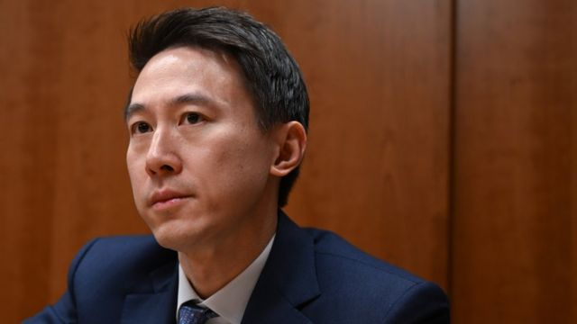
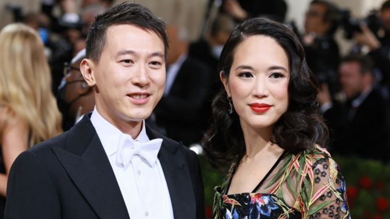
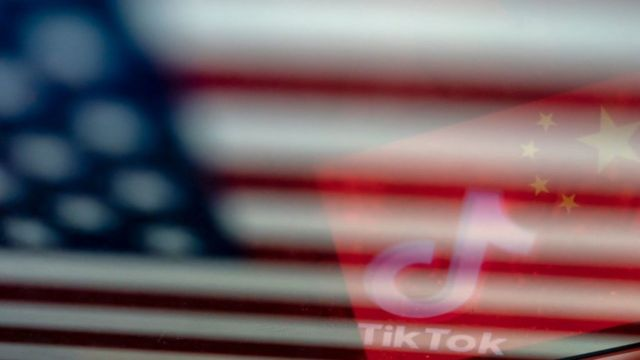

# [Business] TikTok首席执行官周受资：美国国会听证中的关键人物

#  TikTok首席执行官周受资：美国国会听证中的关键人物

  * 杨国良（Nicholas Yong） 
  * BBC记者，发自新加坡 

> 图像来源，  Getty Images
>
> 图像加注文字，TikTok首席执行官周受资预料将会面对美国国会议员的强势诘问

**在全球对于TikTok的怀疑态度越来越强，且可能导致美国对这一中国应用程序实施禁令之际，如今焦点落在了该公司神秘的首席执行官周受资（Shou Zi Chew）身上。**

这名40岁的新加坡人将于周四（3月23日）就该应用程式的数据安全和隐私保护，以及被指与北京有关联等问题，向美国众议院能源及商业委员会（US House Energy and Commerce Committee）作证。

对于他的工作方式，甚至他实际上掌握公司多少权力等等，外界都知之甚少。

首席营运官凡妮莎·帕帕斯（Vanessa Pappas）一直都是TikTok面对公众时的代表人物，而她去年9月就曾就美国流向中国的数据问题遭到国会的拷问。

去年9月，《纽约时报》发表的一篇人物报道当中引述前TikTok和字节跳动（ByteDance）的前行政高管指，周受资做决定的能力有限，而字节跳动的创始人张一鸣掌握着公司的大权。

但是现在，就在TikTok与中国政府的关联备受仔细审视之际，TikTok将周受资公开推上了前台。

去年6月，在一封致国会议员的信中，该公司强调自己是在母公司字节跳动之外自主运作，并且极力指出，周受资并非来自中国，而是“驻留在新加坡的新加坡人”。

> 图像来源，  Getty Images
>
> 图像加注文字，周受资和妻子薇薇安·高（Vivian Kao）在2022年出席美国纽约大都会艺术博物馆服装学院举办的年度慈善晚会资料照片。

在这座城邦出生并长大的他，曾就读于新加坡精英中文学校华侨中学（Hwa Chong Institution），操流利英文和普通话。他在服兵役期间曾是新加坡武装部队的军官——这是一个备受尊崇的职位。

周受资在伦敦大学学院取得经济学学士学位之后前往哈佛商学院就读，取得工商管理学硕士（MBA）学位，并在社交媒体巨头企业脸书（Facebook）尚处在初创阶段时在该公司实习。

据媒体报道，他在投资公司数码天空科技（DST）任职五年，领导一个团队。该团队后来在2013成为字节跳动的早期投资人。他也曾在高盛（Goldman Sachs）做了两年的投资银行家。

周受资之后在中国智能手机巨头公司小米担当重要角色，任首席财务官和国际业务总裁，之后在2018年带领该公司上市。

他在2021年3月跳槽至字节跳动，成为这家媒介巨头的第一任首席财务官。

仅两个月后，他就又坐上了TikTok首席执行官的位置，当时是他的前任凯文·梅尔（Kevin Mayer）在特朗普政府试图逼迫TikTok出售美国资产之际忽然辞职。

##  最重大的挑战

> 图像来源，  Getty Images
>
> 图像加注文字，自2020年以来，TikTok 高层多次试图向大众保证，中国员工无法访问非中国用户的数据。

现在，周受资面临着他的TikTok生涯当中最重大的挑战。美国国会议员要求该公司从其美国业务当中撤资，否则将面临禁令。

这一问题对于中国人来说也成为了一个矛盾点。

官媒《环球时报》于周二在一篇评论中表示，推动TikTok禁令的是“有毒的美国政治环境”，这将违反自由市场的原则。该报表示，“在美国官员和政客眼里，TikTok的中国背景是一种‘原罪’。”

面对来自两边的密切审视，周受资在最近数月似乎展开了某种形式的魅力攻势。

他在2月开设了自己的TikTok帐户“@shou.time”，展示他个人生活的点滴——这距离他成为这个平台的掌舵人已有近一年。自此，周受资的1.8万粉丝看到他出席超级碗（Super Bowl，超级杯）和NBA比赛，与比尔·穆雷（Bill Murray）等明星见面，还与歌手席亚拉（Ciara）跳了一段 “尬舞”  。

他善用媒介资源，在采访中透露他是一个高尔夫爱好者，也是喜剧演员凯文·哈特（Kevin Hart）的粉丝。他妻子是投资公司CEO薇薇安·高（Vivian Kao）。作为两个小孩的父亲，他还曾说他不允许他的孩子玩TikTok，因为他们“太年幼”。

> 图像来源，  Getty Images

近日，他在美国各大媒体上走了一圈，反复保证TikTok不会对美国利益构成威胁。

他还直接求助于美国用户。在周一的华盛顿，他通过TikTok的官方帐户发布一段 视频  ，邀请用户告诉他，他们想对美国国会议员说些什么。

该视频获得超过50万点赞。他在当中说道：“这对我们来说是一个关键时刻。这可能会将TikTok从你们1.5亿人手中夺走。”

