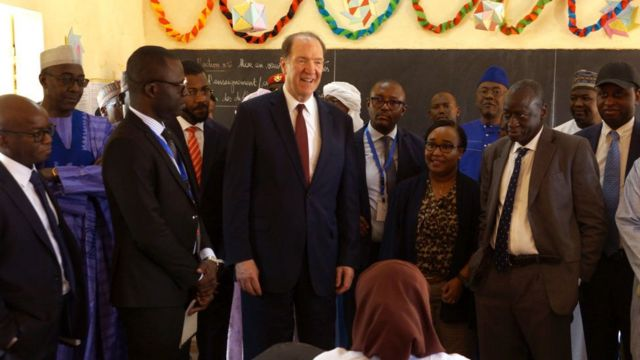
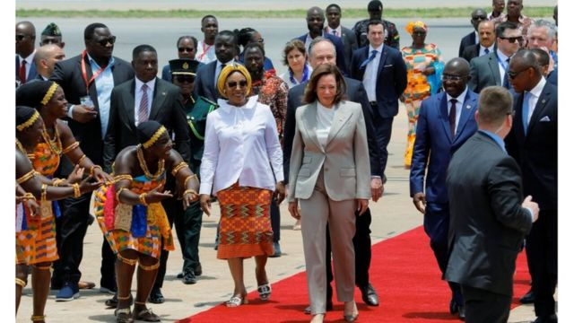

# [Business] 中国贷款给非洲：世界银行行长表担忧并呼吁“更透明”

#  中国贷款给非洲：世界银行行长表担忧并呼吁“更透明”

> 图像来源，  Anadolu / Getty
>
> 图像加注文字，世界银行行长马尔帕斯日前在尼亚美宣传以教育作为经济发展的工具。

**世界银行行长马尔帕斯（David Malpass）告诉BBC，他对中国向非洲发展中经济体提供的一些贷款感到担忧。**

他表示，这些条款和条件需要“更加透明”。

包括加纳和赞比亚在内的非洲国家，目前正在努力偿还对北京的债务。

中国表示，有关贷款是在国际规则范围内进行的。

发展中国家经常从其他国家或多边机构借贷，以资助其基础设施、教育和农业等。

借款多数以美元或欧元做单位，但去年美国和其他主要经济体急速加息，让偿还贷款变得更贵。

这对发展中经济体而言尤其困难，因为他们的本国货币相对价值下降，更难找到所需的额外资金。

马尔帕斯形容，这是一个“双重打击，它意味着（经济）增长将会放缓”。

##  美中竞争

> 图像来源，  Reuters
>
> 图像加注文字，美国副总统贺锦丽出访加纳首都阿克拉，受到副总统马哈穆杜巴乌米亚的热烈欢迎，她正寻求加强与该国的经济联系。

美国副总统贺锦丽（Kamala Harris）上周出访非洲三个国家，主要就是为了应对相关挑战，并对坦桑尼亚和加纳的财政支持作出巨大承诺。

美中两国在非洲争夺影响力，竞争日益激烈。非洲大陆拥有丰富天然资源，包括对电动车电池至关重要的金属镍。

她在加纳首都阿克拉（Accra）发言时表示，“美国想的不是我们能为非洲伙伴做什么，而是我们能与非洲伙伴一起做什么。”

贺锦丽访问坦桑尼亚一个新建的镍加工设施时说，该项目将在2026年前供应美国和其他市场，它将“有助解决气候危机，建立有弹性的全球供应链，并创造新的产业和就业机会”。

对于这种合作方式，世界银行行长马尔帕斯表示肯定，他说世界上两个最大经济体的竞争“应该对发展中国家是健康的”，因为它提供了不同选择。

“我强烈鼓励的是，他们的合同要透明。这一直是个问题；如果你写了一份合同，但说‘不要给别人看’，那就是一个减分项。所以要避免这种情况。”

他还警告说：“对于非洲的政府来说，他们不应该提供抵押品作为贷款的诱因，因为它绑住了几代人。这在中国已经发生了。”

近年来，中国已成为借钱给发展中经济体的最大贷款来源之一。基尔世界经济研究所（IfW, Kiel Institute for the World Economy）一项新研究显示，在全球范围内，中国在2016年至2021年间向22个国家提供了1850亿美元（1500亿英镑）的援助。

有说法指中国利用金融援助剥削其他国家，北京予以反驳。

外交部发言人毛宁上周在例行记者会上表示，中国“尊重有关国家意愿，从来没有强迫任何一方借款，从未对任何国家逼债，不会在贷款协议中附加任何政治条件，更不寻求任何政治私利”。

马尔帕斯指出，这些问题并非中国融资独有，但情况正在改善。

“如果你想想西方贷款的历史，有时它并不是为了（获贷款）国家的人民的全部利益。即使是世界银行的贷款，也不总是为了一个国家的最佳利益。”

“所以我们正在努力做的、每个人都应该努力做的，是提高贷款的质量。”

“其中一个方法是拆分贷款，就是如果有个投资项目，比如你在建造一列火车，就要描述这个项目和成本将是什么，然后分别安排融资。假如你把它们捆绑在一起，就很难知道，我是在火车上还是在融资上取得好的协议。”

##  粮食和能源问题

> 图像来源，  Getty Images
>
> 图像加注文字，加纳财政部长财政部长阿塔（Ken Ofori-Atta）上月前往北京，就债务偿还重组问题进行会谈。 去年12月，该国还从国际货币基金组织获得了30亿美元。

这位即将离任的世界银行行长还担心，受乌克兰战争影响，粮食、化肥和能源价格上涨，正在消耗较贫穷国家的政府预算。可幸的是，价格上涨现在开始缓解。

“眼前危机已经过去，但留下问题是，各国没有使用足够的肥料，导致土壤变得贫瘠。所以，预计明年产量将低于正常水平。”

“一个刚好维持生计的农民，她没有得到化肥，现在她的土地没有那么高的产量，那怎么为家庭和社区提供食物呢？这就是眼前的大问题。我们要做的是直接用化肥和粮食来帮助各国。”

世界银行担心上述挑战将进一步推高贫穷率。受新冠疫情影响，全球极端贫穷人口比率从8.4%升至9.3%，是有史以来首次上升，这意味着大量人每天的生活费不到1.9美元。

世界银行即将在华盛顿与国际货币基金组织（IMF）举行春季联席会议，希望筹集更多资金解决当前的难题。

“目标已经有了，”马尔帕斯说。“但需求比流入的资金量要大得多。”

