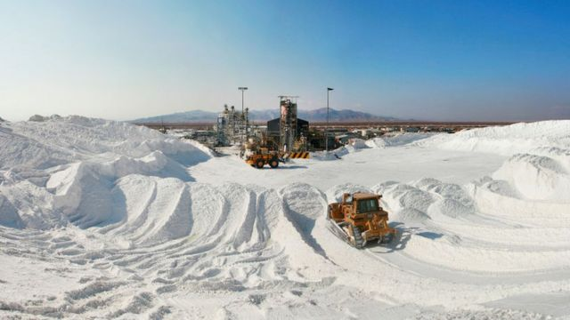
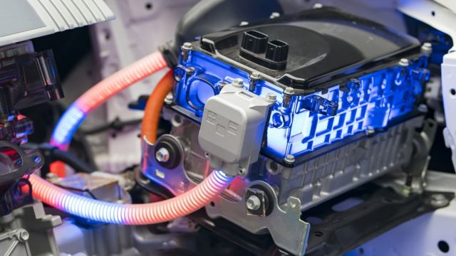
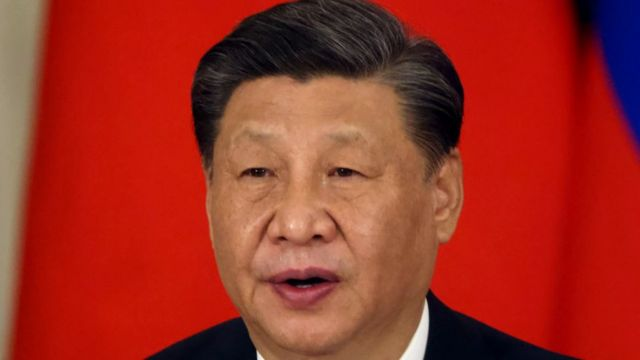
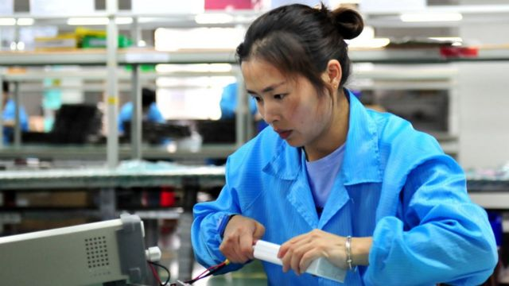
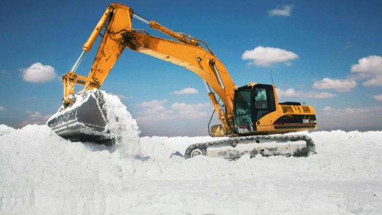
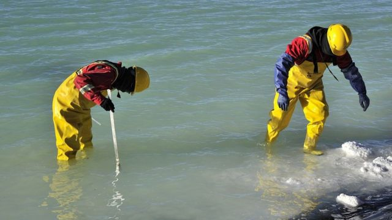
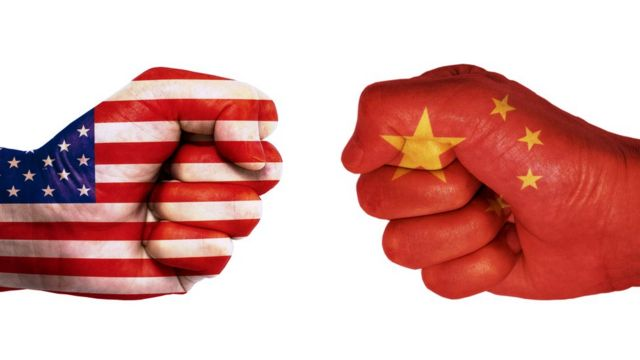

# [Business] 中国和美国在南美的锂矿之争

#  中国和美国在南美的锂矿之争

  * 塞西莉亚·巴里亚（Cecilia Barria） 
  * BBC国际部 

> 图像来源，  Getty Images
>
> 图像加注文字，锂被称为白色黄金，中国公司多年来遍寻全球，特别是在拉丁美洲，那里聚集世界上最大的锂储备。

**世界上一半以上的锂储量位于阿根廷、玻利维亚和智利，这三个国家已经引起了其他政府和投资者的兴趣。**

锂是用于制造电动汽车电池的关键金属，像中国和美国这样的国家，正在努力确保锂的供应，越来越多的参与者正在涌入这个日益扩张的市场。

“主要大国正在争夺能源转型所需的矿物，拉丁美洲是它们的主要战场。”威尔逊中心拉丁美洲项目主任本杰明·格丹（Benjamin Gedan）告诉BBC。

“美国来晚了，华盛顿显然对中国的先发优势感到担忧，”他补充说。

锂被称为白色黄金，中国公司多年来遍寻全球，特别是在拉丁美洲，那里聚集世界上最大的锂储备。

根据美国地质勘探局的数据，玻利维亚的探明储量居于首位，约为2100万吨，其次是阿根廷（1930万吨）和智利（960万吨）。

> 图像来源，  Getty Images
>
> 图像加注文字，锂在电池生产中至关重要。

而墨西哥，尽管只有170万吨（排名第九），但已经入局了北美市场，不仅因为它在地理上靠近美国和加拿大，而且那里正在成为电动汽车的生产中心（特别是特斯拉和宝马等汽车巨头最近宣布将在那里建立工厂）。

##  智利的计划

智利是仅次于澳大利亚的世界第二大锂生产国。

到目前为止，开采资源一直掌握在私人公司手中，但智利总统加布里埃尔·鲍立克（Gabriel Boric）提出的一项新计划希望改变这种商业模式，将锂的利润留在国内。

从锂等矿物中赚得的大部分利润，并不来自于开采原始资源，而是来自于在供应链的后期增值——例如，使用锂来制造车用电池。

智利总统希望建立公私合营的企业，促进技术发展，以将智利纳入这个蓬勃发展的供应链中。

但这将是一个相当困难的挑战，因为世界上不少国家都在试图从中分一杯羹。

##  “恶意行为”

美国南方司令部司令劳拉·理查森将军（Laura Richardson）3月在众议院军事委员会的一次演讲中警告说，中国“继续扩大其在拉丁美洲和加勒比地区的经济、外交、技术、信息和军事影响”。

> 图像来源，  Getty Images
>
> 图像加注文字，劳拉·理查森将军称她忧心于中国在南美的“恶意行为”

她说，“这个地区资源丰富，我担心对手的恶意行为，他们正在利用它，假装在投资，而实际上他们则在开采。”

谈到南美的“锂三角”——由阿根廷、玻利维亚和智利组成，她说，中国在锂资源的争夺上非常进取且有进攻性。

##  中国怎么说？

正如美国和其他国家一样，中国也在寻求确保自身的能源独立，中国为此准备数年盯着那些在全球贸易中奇货可居的矿物，包括锂。

> 图像来源，  Getty Images
>
> 图像加注文字，在习近平治下，中国正在大举投资南美锂矿。

中国自然资源部部长王光亚在1月初接受新华社采访时说，中国的一些重要矿产资源对外依存度很高，一旦国际形势发生变化，肯定会影响经济安全甚至国家安全。

中国政府在2016年公布的《国家矿产资源规划》中列入了24种战略矿产，其中包括铁、铜、铝、金、镍、钴、锂和稀土等金属，此外还有石油、天然气、页岩气和煤炭等传统能源资源。

该计划指出，矿产是“保障国家经济安全、国防安全和发展战略性新兴产业”的关键。

##  中国投资急剧增加

在中国公司巨额投资南美矿产的同时，南美“锂三角”的三个国家打算利用中国公司的技术和资本来促进当地的工业发展。

仅在今年前三个月，中国公司就签署了数个雄心勃勃的投资协议，遍及玻利维亚、阿根廷和智利。

> 图像来源，  Getty Images
>
> 图像加注文字，中国女工在生产线上测试锂电池产品的电源连接。

据智库大西洋理事会（Atlantic Council ）称，在玻利维亚，中国公司宁德时代、广东邦普和洛阳栾川钼业已经承诺在波托西省和奥鲁罗省的锂矿项目中投入近10亿美元。

在阿根廷，奇瑞汽车将投资约4亿美元，在罗萨里奥建设一个生产电动汽车的工厂。

而在智利，青山控股集团、瑞普能源公司、瑞浦兰均能源和麦田能源等中国企业已经承诺在安托法加斯塔市投资建设一个锂产业园，具体金额尚不清楚。

阿根廷和中国在锂矿方面的商业合作同样越来越密切，仅在2022年就宣布在萨尔塔、卡塔马卡和胡胡伊地区至少有九个投资项目。

##  巨头之间的技术和地缘政治竞争

智库大西洋理事会阿德里安娜·阿尔斯特拉美中心副主任张佩佩（Pepe Zhang ）称，“美国正在积极寻求加强其在关键矿产和绿色技术的全球供应链中的地位”。

这意味着“锂被证明是美国和中国之间技术和地缘政治竞争中一个越来越关键的领域”，他告诉BBC。

而中国已经狠狠地踩下了油门。

> 图像来源，  Getty Images

张佩佩估计，今年对于中国在南美的矿产投资来说将是一个重要的年份。

预测表明，今年已承诺的14亿美元将超过2021年和2020年的11亿美元的投资。

“仅在1月份，我们就看到三家中国公司承诺在玻利维亚投资10亿美元，”张佩佩说。

##  “国家安全”因素

由于战略原因，美国白宫也明确表示，将确保矿产供应链作为其优先事项之一。

拜登政府在去年的一份声明中说：“关键矿产是许多现代技术的基石，对我们的国家安全和经济繁荣至关重要”。

> 图像来源，  Getty Images

锂、钴和稀土等矿物，用于从计算机到家用电器的一系列产品，更是电池和电动汽车、风力涡轮机，以及太阳能电池板等技术的关键组成部分。

声明中称，全球试图在向清洁能源过渡，在未来几十年内将对这些关键矿物的需求激增400%至600%。

而且美国总统拜登还补充称，对于锂和石墨等矿物，“需求将增加得更多，最高可达4000%”。

##  华盛顿和北京之间的拉锯战

“中国有一个优势，因为北京愿意在拉丁美洲投资电池生产，”格丹认为。

> 图像来源，  Getty Images

同时，“美国主要关注的是为美国公司获取原材料，以发展（自己的）绿色技术。”

面对这种两难境地，拉美国家很可能认为中国的提议比出口其附加值极低的原材料更具吸引力。

“很显然，美国急于追赶，”这位专家说。“难怪南美发现自己陷入了华盛顿和北京之间的拉锯战”。

