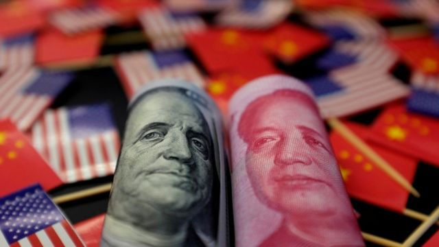
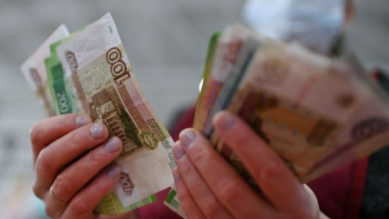
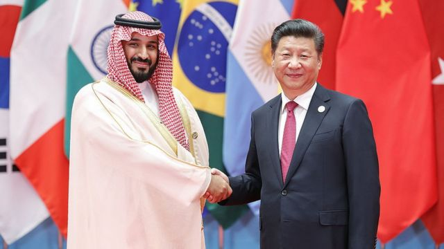

# [Business] 中国跨境交易中人民币使用率首次超过美元 离挑战“美元霸权”有多远？

#  中国跨境交易中人民币使用率首次超过美元 离挑战“美元霸权”有多远？

> 图像来源，  Reuters

**中国外汇管理局近期公布， 在今年3月的中国跨境收支中，用人民币交易的占比达到48%，用美元的占比47%，这是人民币首次在该国跨境交易中的使用率超过美元。**

2009年7月，中国政府在广州、深圳等城市开展跨境贸易人民币结算试点，标志着人民币国际化的开端。当时，人民币在中国跨境收支中占比接近于零，美元的占比则为83%。

近年来，越来越多的国家与中国达成协议，在双边贸易中用人民币进行结算。尤其是去年以来美联储大幅加息，使这一进程加速。

但从全球各国的储备货币来看，人民币份额依然较少，低于欧元、日元等，与中国的经济体量不符。

##  原因

背后的重要原因是，中国政府的推波助澜，把人民币双边结算作为重要的外交成果。

比如，3月29日，中国和巴西宣布达成新的协议——双方贸易以本国货币结算，不再使用美元作为中介。

巴西总统卢拉在随后访华时表示：“我每到晚上都会问自己，为什么这些国家都必须要以美元作为结算方式，为什么不能用自己国家的货币作为国际结算货币？这到底是谁决定的？为什么不是人民币？为什么不是巴西雷亚尔？我知道大家比较不习惯，因为大家长久以来使用美元已经成了一个习惯，但我想，21世纪我们应该可以做一点非常不一样的事情。”

再比如，4月26日，阿根廷政府宣布将使用人民币替代美元，来支付从中国进口的商品。

> 图像来源，  Reuters
>
> 图像加注文字，面对制裁，俄罗斯银行不得不绕道通过诸如中国这样的没有制裁俄罗斯的国家进行国际支付活动

还有，俄罗斯、伊朗等因为美国制裁，而被迫使用人民币结算的国家。

俄乌战争后，美国的金融制裁使俄罗斯公司无法通过国际资金清算系统（SWIFT）结算，不得不通过中国央行打造的人民币跨境支付系统（CIPS），使用人民币结算。根据俄罗斯公布的消息，人民币在俄外汇交易总量中所占份额达到近40%，而在战前，人民币只占0.32%。

还有一些国家，由于在中国的“一带一路”倡议下，与中国合作建设大量基础设施项目，这些项目的融资大多由中国提供，因此创造了大量以人民币计价的资产。比如，4月中旬，孟加拉国和俄罗斯商定同意使用人民币来支付俄罗斯在该国建设的核电站项目款项。

##  差距

不过，从全球金融体系中看人民币的国际化程度，则弱得多。

目前，人民币是第五大国际储备货币、第五大支付货币。

根据国际货币基金组织（IMF）公布的数据，截至去年底，美元在全球外汇储备中占比为58%，之后依次是欧元（20%）、日元（5.5%）、英镑（4.9%），人民币只能排到第五，占比为2.7%。

即便像巴西这样人民币占其储备货币比例达到第二多的国家，也仅有5.37%，不及美元的80.42%。

相比储备功能，在支付功能上，人民币则差不多，依然排到第五。根据SWIFT数据显示，今年2月人民币国际支付份额为2.19%，落后于美元（41%）、欧元（36%）、英镑（6.58%）、日元（2.98%）。

##  石油美元

“美元体系是当代美国全球霸权的核心，也是美国与以往帝国最大的不同，”在此前召开的第二届中美政经论坛上，吉林大学经济学院教授李晓发言表示。 他说， 这种体系下美国不通过领土控制，而是通过发达的具有广度与深度的金融市场建构了一个全球性的资源控制体系。实际上，美国一切内外政策的核心都是在维护这个美元体系的顺利运转，这是美国的核心利益。

美元之所以是世界储备货币，主要原因之一是它在二战结束以来的全球石油贸易中占主导地位。石油美元体系确保了美国在国际金融中的老大地位。

> 图像来源，  Getty Images
>
> 图像加注文字，习近平与沙特王储穆罕默德·本·萨勒曼（ Mohammed bin Salman ）在杭州G20峰会。

中国也在试图用人民币结算能源贸易。比如在与沙特的贸易中，中国是沙特能源产品的大买家，后者石油出口的27%和化学品出口的25%都流向中国；但中国从沙特进口的95%都集中在石油和化学品。

今年3月《华尔街日报》援引知情人士称，沙特正考虑对华销售石油部分用人民币替代美元结算。值得注意的是，多年来每逢美国和沙特关系遇冷，都会有类似消息放出，但都没有进一步动作。

“石油美元”关乎美国战略利益，沙特又是美国武器的最大买家，战略和安全上与美国关系极深，因此推动人民币结算，难度将非常大。

不过，今年3月28日，中国首次实现用人民币结算进口液化天然气（LNG），该笔交易是中国海油与法国道达尔能源在上海石油天然气交易中心达成的，LNG资源来自阿联酋，成交量约6.5万吨。

