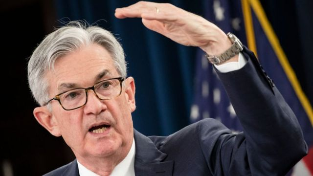
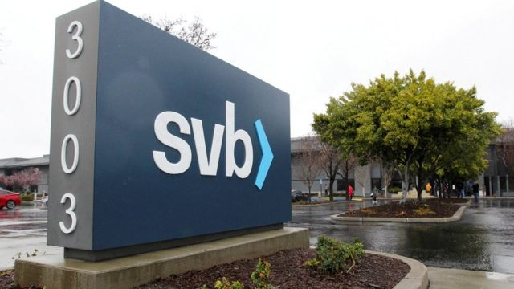

# [Business] 美联储连续第十次加息 外界预期本轮加息终点临近

#  美联储连续第十次加息 外界预期本轮加息终点临近

> 图像来源，  Getty Images
>
> 图像加注文字，美联储主席鲍威尔

**本周三，美联储宣布加息25个基点，即上升0.25%。去年3月以来，美联储终结了维持四年的零利率时代，开启加息通道，并且在超过一年的时间内连续加息，此次加息后美国联邦基金利率提高到5.00%—5.25%的区间，为2007年以来的新高。**

美联储在5月议息会议声明中删掉了上次声明中出现的一句话，“委员会预计一些额外的政策紧缩可能是合适的”。市场普遍据此预计美联储将在6月议息会议上暂停加息。

此次加息后，主要股市反应并不大，美股小幅收跌，香港、中国A股则小幅上涨。主要原因是，本次加息幅度符合市场预期，而且加息后已达到此前美联储官员给出2023年的终端利率区，因此市场预期超过一年的加息通道将告一段落。

5月1日，摩根大通宣布收购已倒闭的第一共和国银行的绝大部分资产。这是美国两个月内倒闭的第三家大型银行。市场期待美联储放慢加息，以应对银行业面临的压力。

##  为什么连续十次加息？

加息的“息”指美国联邦基金利率，简而言之，该利率是美国银行和银行之间互相借钱时的利率。

加息就是升高这一利率，那么银行在给企业或个人放贷时的利率也水涨船高，贷款的需求会相应减少，由此可以减少货币供给量，市场上流动的钱少了，就可以降低通胀，给经济降温。

反之，如果降息，银行放贷的利率就会降低，借钱成本更低，将刺激企业和个人贷款，更多钱注入经济，整体经济得到刺激，更加活跃。

美联储通过调节这一利率来达到一个目的——保持美国最大限度的就业和物价稳定。在经济疲软时降息，向市场注入更多流动性资金，刺激经济。在经济强劲时加息，减少货币供应，降低通胀，防止经济过热。

从控制通胀角度看，美国CPI增幅已从2022年6月9.1%的高点，回落至今年3月的5%。

加息和降息的周期通常很久，过去15年来经历四次调整：

  * 降息——美国在2008年金融危机中受到重创，美联储为了增加货币供应，提振经济，当时一度降息至0-0.25%。这一超低利率维持了七年。 
  * 加息——2015年底美联储开始一轮长达三年的加息通道，连续加息九次。 
  * 降息——新冠疫情爆发后，美联储在2020年3月紧急降息，一次性降至0-0.25%，利率又回到2008年底的零利率时代，并维持四年。 
  * 加息——2022年3月开始连续加息，以控制住美国40年来最严重的通货膨胀。截至目前本轮调整共连续加息十次，从最初的零利率加到目前的5-5.25%。 

各界还开始讨论，美联储会在何时开始降息？

在周三议息会议后的记者会上，美联储主席鲍威尔表示，现在降息是不合适的。他认为，通胀会下降，只是速度不会很快，下降需要时间。

“如果这个预测大体上是正确的，那么降息是不合适的，我们不会降息。”他进一步表示，如果需求进一步减弱，劳动力市场出现更多的软化迹象，才可能会考虑降息。

> 图像来源，  Reuters
>
> 图像加注文字，总部位于加州的硅谷银行在1983年成立。

##  银行业倒闭与加息

在过去两个月，美国三家大型银行连续倒闭：硅谷银行、签名银行、第一共和银行。它们的存款规模分别为1750亿美元、1100亿美元、1039亿美元。

它们面临的压力主要源于自身风控不善，但与美联储加息也不无关系。

以硅谷银行为例，新冠疫情爆发后，居家办公娱乐刺激了科技热潮，再加上美联储降息“放水”，以科技企业为客户的硅谷银行突然吸纳了数以百亿的存款，并将大部份资金投资于美国政府长期债券。

当时市场利率接近零，即使美国政府长期债券只支付数个百分点利息，银行仍有利可图。

不过，美联储为压抑通胀展开激进的加息行动，利率在过去一年间上调至4.75%。较高的借贷成本削弱了科技股势头，科技企业的估值下降，仰赖科技业的硅谷银行也受影响。

同一时间，加息环境下债券回报率下降，让持有大量长久期美债的硅谷银行亏损惨重。

“自3月初以来，（银行业）的状况已经广泛改善，美国银行系统是健全且有弹性的。”鲍威尔表示，他还称三家处于压力中心的银行，现在都得到解决，储户得到保护，

“硅谷银行的挤兑与历史上银行挤兑的速度不相符。而这现在需要以某种方式反映在监管和监督中。”鲍威尔称，需要加强对这种规模银行的监督和监管。而具体到更为细节的措施方案，鲍威尔表示，美联储负责监管的副主席巴尔（Michael Barr）将真正带头来设计这些。

> 图像来源，  EPA

##  美联储加息的影响

鉴于美元的全球影响力，美联储加息，通常意味着西方市场不得不跟进加息，比如欧盟、澳大利亚，再到香港。

5月4日，香港金管局就宣布跟随美联储加息步伐，将基本利率上调25个基点，到5.5%。

对于美国和香港等经济体的居民而言，加息带来最直接的痛感就是房贷压力的上涨。过去一年，香港楼市承受利率上涨的压力，降幅不小。

另外，中国在疫情封控放开后，经济开启复苏进程，在全球加息的大环境中，中国政府很难通过降低利率来刺激疲软的国内经济——如果中国在其他主要经济体加息之时，开始进一步放松货币政策以支撑受疫情打击的经济，那么中国将面临人民币贬值和资本外流的风险。

美联储加息后，意味着美元有更高的利息回报和金融资产回报，这会导致新兴市场的国际资金，回头流入美国市场，以追求更高的回报。

对于新兴经济体而言，美元流出，会使本国货币面临贬值压力。

