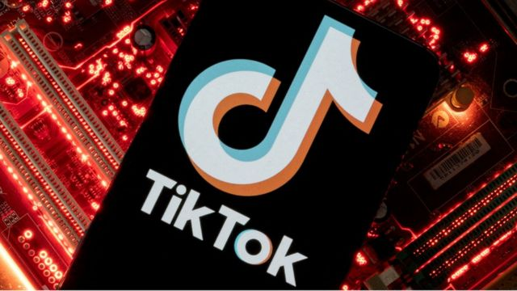

# [Business] 字节跳动前高层称中共党委调阅香港用户数据 TikTok反驳一切指控

#  字节跳动前高层称中共党委调阅香港用户数据 TikTok反驳一切指控

  * 彼得·霍斯金斯（Peter Hoskins） 
  * BBC商业事务记者 

> 图像来源，  Reuters
>
> 图像加注文字，TikTok称其拥有1.5亿美国用户。

**字节跳动（TikTok 母公司）被指控允许中国共产党（CCP）成员获取香港民权人士和示威者的用户数据。**

前字节跳动高管虞英涛（Yintao Yu，音译）在美国法庭提交的文件中声称，在Tiktok上传“与示威活动相关内容”的用户也将被该公司识别和监控。

虞英涛又说，一些中共高层官员还能够调阅美国TikTok用户的数据。字节跳动发言人否认了这些指控，称其为“毫无根据”。

这些指控出现在本周由虞英涛在旧金山高级法院提交的诉讼中。

虞英涛在文件中声称，中共在该公司内设有一个委员会，能取得“超级用户”认证，又被称为所谓“上帝认证”，可以检视“字节跳动”搜集的所有数据。

他说，这些中共党委都不是字节跳动员工，但能在该公司在北京的办公室走动。

虞英涛表示，这是公司高管都知晓的情况。他在2017年8月至2018年期间担任字节跳动在美国的工程主管。

> 图像来源，  Getty Images

他的诉讼文件说，2018年后，中共委员会成员可以使用他们的“上帝凭证”来“确定和追踪香港抗议者、民权活动家和支持抗议者”。

2014年，香港爆发了大规模抗议活动，即所谓的“雨伞运动”，人们要求有权投票选出自己的特首。此后，抗议人士开始进行了一系列较小规模的示威抗议。2019年，“反修例”运动的抗议活动达到高峰。但之后，北京催生严厉的《香港国安法》镇压，使香港公开的抗议行动几乎绝迹。

##  TikTok反驳

当BBC联系字节跳动时，一位发言人否认了指控：“我们坚决否认这份控诉，毫无根据的指控和主张。”

该公司发言人还表示，虞英涛在该公司工作不到一年，并且在此期间曾参与一个现已停用的应用程序Flipagram：“令人奇怪的是，他在Flipagram的工作于2018年7月被终止后的五年里，从未提出过这些指控。他的行为显然是为了引起媒体的关注。”

> 图像来源，  Getty Images
>
> 图像加注文字，周受资和妻子高伟晏（Vivian Kao）在2022年出席美国纽约大都会艺术博物馆服装学院举办的年度慈善晚会资料照片。

虞英涛的指控出现在TikTok在全球面临严格审查的时候。

今年3月，TikTok首席执行官周受资在美国国会听证会上接受了长达四个半小时的质询。

周受资在听证会上接受了美国民主党和共和党议员的质问，内容涉及该应用程序的数据安全和隐私问题，以及该公司与北京的关联。

TikTok的一位发言人随后表示，这些议员是在“做表面文章”。

今年5月，蒙大拿州成为第一个通过一项全面禁止这家中国所有的影音分享平台的美国州。该禁令将于2024年1月生效。该禁令使得应用商店不得提供TikTok，但不禁止已经拥有TikTok的用户继续使用TikTok。

TikTok已经起诉蒙大拿州，称禁令与美国的言论自由权利相冲突。人口刚刚超过一百万的蒙大拿州去年12月已经禁止政府设备装载TikTok。

TikTok称其拥有1.5亿美国用户。尽管用户群近年持续扩大，但十几岁和二十多岁的年轻人还是该公司最忠诚的用户。

