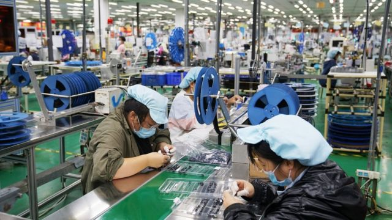
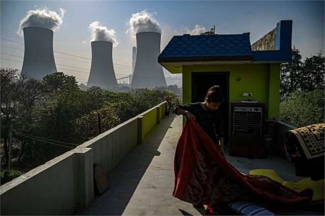

# [Business] 富士康宣布退出印度半导体晶片厂合资企业

#  富士康宣布退出印度半导体晶片厂合资企业

> 图像来源，  Getty Images
>
> 图像加注文字，富士康在中国郑州的一家工厂。成本低廉是富士康参与国际产业链合作的主要优势。

**苹果iPhone供应商，台商鸿海科技集团旗下的富士康（Foxconn）已退出与印度石油龙头威达塔（Vedanta）合作的一项195亿美元的投资项目，该项目原本计划在在印度建设一座晶片制造厂。不到一年前，这两家公司宣布计划在印度总理莫迪家乡古吉拉特邦（​​Gujarat）投资这座晶片厂。一些分析师表示，这对印度的科技产业发展是一个挫折。**

然而，一位印度政府部长表示，这对该国晶片制造的推动计划不会有任何影响。鸿海的总部位于台湾，该公司发出一份声明中表示双方都认识到该项目进展不够迅速。该公司又补充说：“我们无法顺利克服一些具有挑战性的差距，还有与该项目无关的外部问题。”

富士康本周二告诉BBC，撤资的决定是与威达塔“互相协议”下达成。鸿海退出后，威达塔已完全拥有该合资企业。此外，该公司还表示，仍将继续支持印度政府的“印度制造”（Made in India）雄心。总部位于新德里的威达塔则表示，他们已“与其他合作伙伴合作，建立印度首家（晶片）代工厂”。

##  印度半导体发展遇挫折?

然而，全球顾问公司奥尔布赖特石桥集团（Albright Stonebridge Group）的保罗·特里奥罗（Paul Triolo）告诉BBC：“富士康突然退出对印度的半导体发展来说是一个相当大的打击。”他解释称，“这次撤资的明显原因是缺乏明确的技术合作伙伴和合资企业的发展轨道。双方都缺乏开发和管理大规模半导体制造业务的丰富经验。”

然而，印度电子与信息技术部国务部长钱德拉塞卡尔（Rajeev Chandrasekhar）在推特上称富士康的决定对印度的半导体制造发展目标没有任何影响。钱德拉塞卡尔还补充说，富士康和威达塔是该国的“重要投资者”，他们将在印度分开推进他们的战略。

印度政府一直在制定支持晶片制造行业的战略。去年，印度建立了一个100亿美元的基金，以吸引更多投资者来该领域投资，期待降低印度对外国晶片制造商的依赖。莫迪于2014年启动的旗舰计划“印度制造”，目的是帮助该国转变为可与中国匹敌的全球制造中心。

近年来，还有其他几家公司宣布计划在印度建立半导体工厂。

> 图像来源，  Reuters
>
> 图像加注文字，印度一直在制定支持晶片制造行业的战略。2022年，印度建立了一个100亿美元的基金，以吸引更多投资者来该领域投资，期待降低印度对外国晶片制造商的依赖。

上个月，美国记忆体晶片巨头美光科技（Micron Technology）表示，将投资8.25亿美元在印度建立一家半导体组装和测试工厂。美光表示，该工厂在古吉拉特邦的建设将于今年开始，预计该项目将直接创造多达5千个工作，并间接给该地区带来另外1万5千个就业机会。

##  印度面临的挑战

随着印度最近超越中国成为全球人口最多的国家，印度未来的国力发展持续受到全球关注。除了美国计划加深与印度的关系，以应对来自中国力量扩张带给美国挑战以及印太区域的各种紧张冲突关系之外，随着全球对电动汽车、高阶军事武器或云端计算需要的晶片需求不断增加，印度希望抓住这个机遇，加快融入全球半导体供应链，并成为领航者之一。但许多分析指出，半导体生态圈的发展耗时耗钱及耗能，印度此刻起步，能否赶上其他领先者的脚步，仍然有许多疑问。

英特尔（Intel）前高管维诺德·达姆（Vinod Dham）现在担任印度半导体任务谘询委员会成员，他今年接受美媒Business Today访问称，印度在成为关键角色之前，仍然面临一些重要挑战。他说，譬如要盖一座成功的晶圆厂，电力不能有故障，因为一些用于制造高阶晶片的厂房，需要无故障的电力供应，选址要避开自然灾害风险特别是地震。

但是，达姆分析，在印度，基础设施尚未完全发展，清关有时需要几天甚至几周的时间，因此印度须将适用于印度以外出口的关键元件的机场，或海关设置在制造设施、装配、测试和包装设施的集群旁边。此外，达姆又强调，半导体工厂施和后端（装配、测试和包装）设施所在的厂区应该受到法律保护，还要防止罢工和认为“不必要的休假规定”，以确保印度晶片厂在竞争激烈的全球半导体产业具有竞争力：“一个先进的晶片厂可能需要五年时间才能进入全面生产，不仅需要全面的融资来按时完成工作，而且劳动力也必须全年无休地工作，以确保晶片厂能尽快投入运营。”

分析师​​凯卡（Srishti Khemka）则在美国独立智库“外交关系协会”（Council on Foreign Relations）发表研究报告称，尽管在半导体制造方面进行了巨大的投资，但缺乏电力、水和富有机动性的的官僚，让印度在现有的基础上还无法成为半导体强国。她解释，尽管印度拥有强大的人才库和政治意愿，创建一个可行的半导体生态系统很不容易，而当今晶片强权是花了数十年时间发展才走向成熟，而印度在管理“印度制造”计划和提供促进半导体制程所需基本资源方面的困难，让他对德里扩大半导体发展的努力并不乐观：“若无一个全面解决所有这些问题的坚实政策框架，印度无法实现成为全球半导体强国的使命。”

她说，水和能源是半导体生产的另外两个关键资源，而印度现有的这两个资源都不足。莫迪政府在改善地下水管理方面取得了一些进展，但有关这些措施能否以及多快取得成功尚不明朗。

达姆认为，尽管印度目前拥有数以万计的设计工程师与全球顶尖半导体公司合作，但在制造和生产由这些设计工程师设计的晶片所需的元件物理，和制程技术知识方面，印度几乎没有人才。

> 图像来源，  AFP
>
> 图像加注文字，印度四分之三的发电使用煤炭，分析担忧在提供稳定电力供应方面，印度可能还无法满足半导体产业需求。

