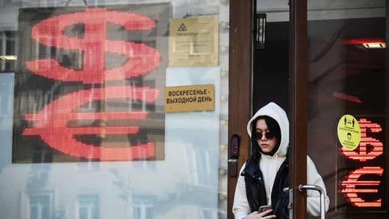
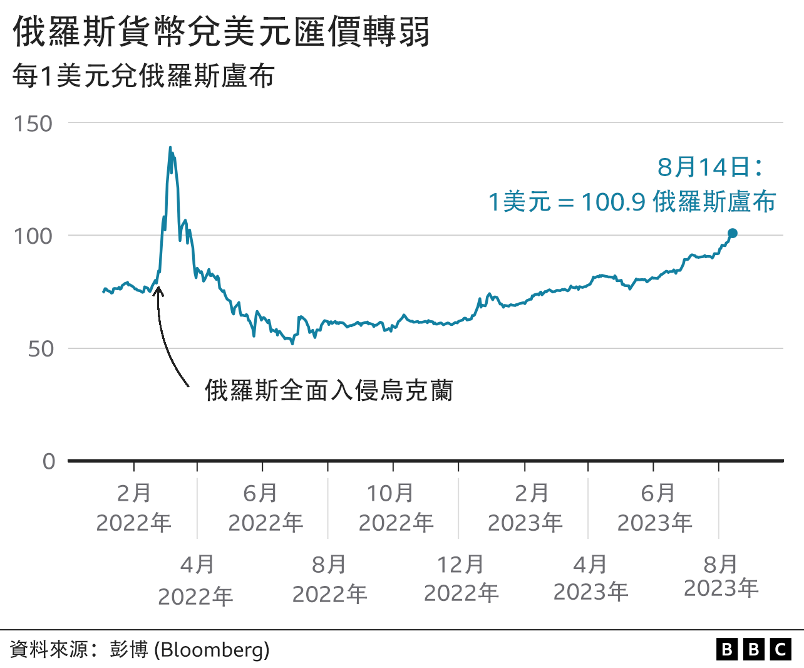
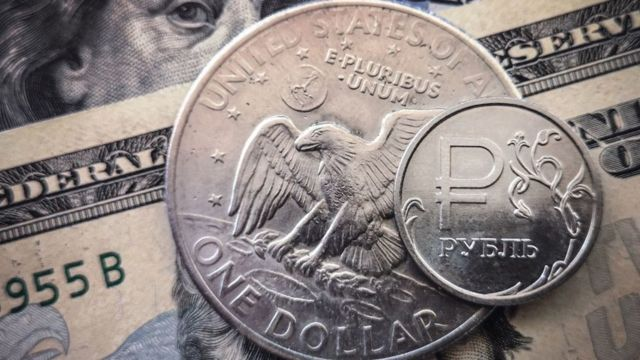

# [Business] 乌克兰战争：卢布兑美元跌破100大关 创16个月新低

#  乌克兰战争：卢布兑美元跌破100大关 创16个月新低

> 图像来源，  Getty Images

**俄罗斯货币卢布兑美元汇率贬至16个月新低，跌破1美元兑100卢布大关。**

经历周一（8月14日）的重大跌市后，市场憧憬俄罗斯央行将加息应对，卢布兑美元周二（15日）东欧早盘稍稍回升至1美元兑96.4卢布。央行随后在莫斯科周二早上宣布，将利率从8.5%涨至12%。

卢布贬值主要原因包括俄罗斯经济增长压力增大，进口增速远远高于出口，同时用于乌克兰战场的军费开支增长。

自从2022年2月发动对乌克兰的侵略战争以来，俄罗斯一直在遭受西方国家的制裁。战争爆发支出卢布汇率直线下跌，但随后因为资本管制和石油天然气出口而有所回升。

卢布币值自开战以来上下波动，但至今对美元已贬值约四分之一。

本周一早些时候，卢布兑美元汇率达到101.04:1。

俄罗斯入侵乌克兰后，央行一度将利率从9.5%提高到20%，但不久后就开始降息。

俄罗斯央行在周二涨息的声明中称，俄国“通胀压力”正在增加，但央行将通胀率在2024年压至4%的目标维持不变。

> 图像来源，  Getty Images

荷兰合作银行的简·弗莱（Jane Foley）表示，卢布今年以来“（汇率）逐渐走低”，“这一势头从去年7月就开始了”。

“卢布走弱反映出俄罗斯正在弱化的（经济）基础，”她说，俄罗斯处于预算赤字之中，依赖从中国和土耳其的进口，出口也面临压力。

AJ Bell的投资研究总监莫尔德（Russ Mould）则表示，俄罗斯的贸易以及整个经济都在遭受西方制裁的打击，“尤其是石油和天然气”。

很多原本依赖俄罗斯石油天然气的欧盟国家在乌克兰战争爆发后表态要停止从俄罗斯进口，并寻找替代供应者。

2022年12月，七国集团和欧盟领导人同意设置价格上限，以限制俄罗斯石油出口利润。这也导致了俄罗斯出口额下降。

俄罗斯关闭了向欧洲的输气管道，一度引起缺电的担忧。今年1月，俄罗斯天然气曾经最大的进口国德国宣布不再依赖俄供应的化石燃料。

“出口下跌，因此外汇流入减少，进口增加，同时即使可靠的贸易伙伴比如中国也对持有卢布心存疑虑。”莫尔德说。

他认为俄罗斯被逐出国际支付系统Swift也对该国形成了打击。

