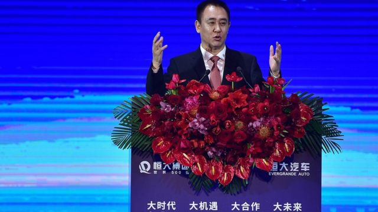
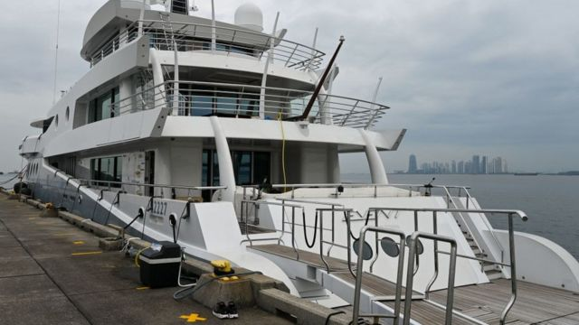

# [Business] 恒大：债务缠身的中国房地产巨头在美申请破产保护意味着什么

#  恒大：债务缠身的中国房地产巨头在美申请破产保护意味着什么

> 图像来源，  Getty Images
>
> 图像加注文字，恒大主席许家印2019年在恒大新能源汽车战略伙伴峰会上。在新能源汽车领域的急速扩张也进一步导致了恒大的资金链危机。

**中国恒大集团依据美国《破产法》第15章在纽约申请破产保护。**

彭博社引述法庭文件称，恒大周四（8月17日）提交的申请文件中提到香港和英属开曼群岛正在进行的重组程序，该公司几个月来一直在努力敲定离岸债务重组计划。

7月，恒大获得中国香港特区法院批准，将在本月对离岸债务重组计划进行表决。美国《破产法》第15章让企业在其它地区进行重组安排时，美国资产也能得到保护。

这一系列举动可能标志着该集团位于香港、英属维尔京群岛和开曼群岛的三家公司的境外重组程序将就此正式确认生效。

##  190亿美元境外债券处置

美国《华尔街日报》称，恒大在美国申请破产保护将寻求法院批准190亿美元债务重组。法院若批准这项债务重组，将使相关协议在美国具有法律约束力，并将杜绝任何可能在美国针对该计划提出的争议。中国恒大价值190亿美元的境外债券中有很多都受美国法律管辖。

在中文社交媒体上被引用作比较的是2021年初在美国申请破产保护的瑞幸咖啡。当时瑞幸咖啡因造假丑闻，被联合临时清算人申请了破产保护。

有中国网友在微博上评论称，当年，瑞幸咖啡依靠破产保护，再经过自己的努力，如今已经是另外一番模样。现在的恒大集团，重走瑞幸当年走过的路，是不是也有东山再起的机会？

恒大曾是中国最大的房地产开发商之一。该公司于2021年出现债务违约，之后该公司已就重组事宜和债权人进行了近两年的谈判。

##  中国房地产债务冲击金融市场

恒大债务规模估计高达3000亿美元，是全球债务最多的房地产开发商。

市场一直担忧恒大已处于崩盘边缘，这种崩盘会给全球金融市场造成巨大冲击。

恒大在香港上市的股票已从2022年3月起暂停交易。

根据香港上市公司“中国恒大”的披露，该公司在过去两年里累计亏损高达5819亿元人民币（约合800亿美元）。

中国另一家房地产巨头碧桂园在香港交易所公布的一份文件称，该公司今年上半年可能出现450亿至550亿元人民币（约合62亿至76亿美元）的亏损。

中国经济增长放缓后，不仅面对来自其它国家的价格上涨压力，还面对其它国家央行猛烈加息带来的冲击。

中国的进出口上月出现较大幅度下跌，全球需求减弱给中国疫情过后的经济复苏带来巨大阴影。

官方统计称，2023年7月，中国出口同比下跌14.5%，进口则下跌12.4%。

##  破产保护与破产

> 图像来源，  AFP
>
> 图像加注文字，2023年4月1日，停靠在新加坡的Event豪华游艇。据称这艘游艇由恒大老板许家印拥有。此次恒大申请破产保护，但并没有进入破产清算，因此法律上讲许家印的个人资产并未进入处置程序。

公开资料显示，普通法系下陷入困境的企业可以有两种选择：一是破产清算（Bankruptcy Liquidation）；二是破产保护（Bankruptcy Protection ）。

根据美国的《破产法》规定，宣布破产清算的公司全部业务必须立即完全停止，由破产财产托管人来“清理”（拍卖）公司资产，所得资金用来偿还公司债务，进入破产清算程序；当公司临近“山穷水尽”时，也可以申请破产保护，继续运营，迅速重组，以实现“柳暗花明”，起死回生，避免陷入破产解散的境地。

有评论指出，恒大申请破产保护，显然不是为了破产清算，而是在为最后经营下去做出努力。

中国律师刘泽枫也对媒体解释，恒大及子公司在美国纽约南区申请的是破产保护，依据的是美国破产法第十五章。 “协调是基本立场。破产保护的法律效果是诉讼集中管辖，防止各地乱诉扣押资产，以及提出重整方案，令公司起死回生。只有裁定破产清算，才是老百姓认知里的破产。”

另一位律师李海权亦表示，申请破产保护并非普通人理解的破产。进入破产程序后，可以进行破产重整、破产和解、破产清算。企业主动申请破产保护，一般还是寻求破产重整和破产和解，尽量避免进入破产清算程序。

