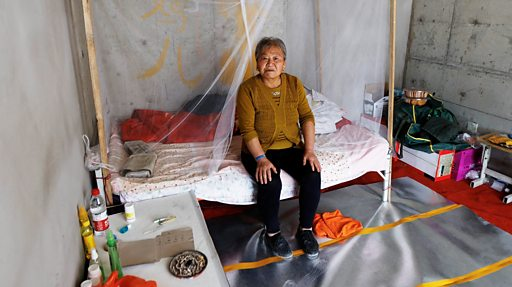

# [Business] 中国楼市危机：陕西铜川业主梦碎烂尾楼生计难顾

#  中国楼市危机：陕西铜川业主梦碎烂尾楼生计难顾

**中国楼市危机：陕西铜川业主梦碎烂尾楼生计难顾**

中国陕西省工业城市铜川的数十名业主在9月上旬集体维权，讨要公道。自2021年房地产债务危机爆发以来，开发商面临资金周转问题，不少业主住进已停工的烂尾楼，用行动抗议并向当局施压。

史先生在2015年以27.6 万元的价格购买了一套公寓。八年后，这只是一个未完工的空壳，每天晚上，他必须爬上20层楼，睡在一个没有水、暖气和电的破旧房间里。

“我几乎从不喝水、洗脸或刷牙。”史先生和几十名绝望的业主们住在铜川市的这栋楼里，要求解决“烂尾”或未完工房屋的问题。

据瑞银预测，中国房地产销售和建设将稳定在2020-21年高峰期的50-60%，部分原因是人口下降和城市化进程放缓。

