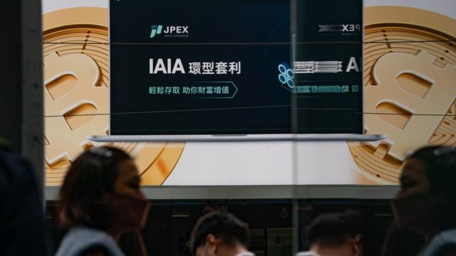
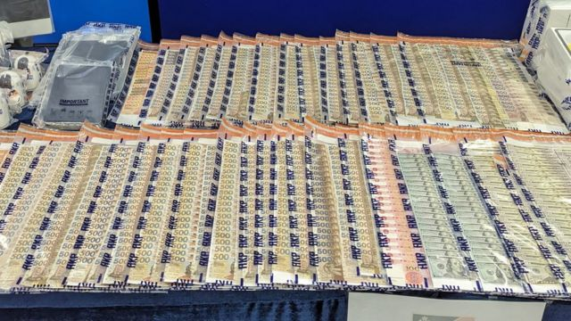
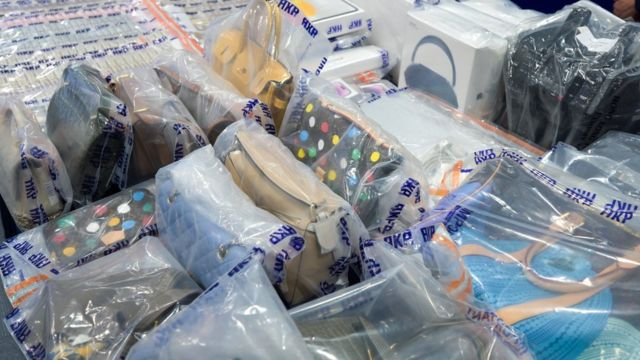
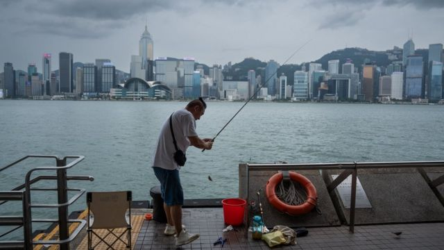

# [Business] JPEX加密币风波：香港大型网络金融诈骗案波及台湾 我们都知道什么

#  JPEX加密币风波：香港大型网络金融诈骗案波及台湾 我们都知道什么

> 图像来源，  Getty Images
>
> 图像加注文字，JPEX在香港发动了铺天盖地的户外广告宣传攻势。

**香港加密货币交易平台绿石交易所（JPEX）因有存户无法“出金”提取存款，引发证券监管部门与警察联合调查，且有波及台湾之势，引起广泛议论。**

香港执法部门表示，这起“串谋诈骗”案件有超过2000人报警声称受害，涉及金额13亿港元（1.66亿美元；11.93亿元人民币；53.15亿元新台币）。目前已被拘捕的11名犯罪嫌疑人中不乏网络红人（KOL）。一名替该交易所代言的台湾网红表示愿意配合调查。

证券监管部门公开表明JPEX并无准照，但JPEX反指香港特区政府有关部门“诽谤”，并宣称将“坚定不移地继续营运”。

数字经济评论人士对BBC中文指出，执法部门现有搜查手段恐难以阻止不法虚拟金融平台运作，既有法律法规也难以保障储户免受损失。

香港资讯科技商会荣誉会长方保侨说：“究竟它们是在哪里运营当中呢？因为那些基本上是个网站平台，有时候是很难依靠政府当局搜查等来制止它们的运作。互联网世界始终是有点不一样。”

JPEX案旋即被一些香港媒体称为“史上最大金融诈骗案”，但若将其他集资诈骗也计算在内的话，则要算1980年代，横跨香港与马来西亚等地的 佳宁集团贪污腐败及诈骗案  。香港廉政公署耗时17年调查该案，涉案金额达66亿港元。

##  JPEX事件如何爆发？警方与平台都怎么说？

JPEX在其网站介绍，该公司成立于2020年，自称是“面向全球的数字资产加密交易平台”，并宣称已取得美国、加拿大和澳大利亚的相关金融证照。网站称其“营运总部”设于阿拉伯联合酋长国最大城市迪拜（Dubai，又译杜拜），又称要在澳大利亚悉尼设立“研发总部”。

JPEX在香港大量投放实体广告，包括办公楼与购物中心外墙、巴士车身、港铁公司（MTR）车站等。一些户外大型广告上更大字标示该公司为“日本加密货币交易所”。

演艺圈与网络红人也是JPEX的重要宣传渠道。香港演员张智霖曾为JPEX拍摄电视广告，有份宣传的网红则以曾是执业大律师与保险经纪的林作，以及网络视频制作者陈怡（本名陈颖怡）最为人所知。

2022年3月，JPEX宣布拟推出联营信用卡，不久国际信用卡公司Visa公开否认与JPEX有任何合作。

2022年7月，负责金融执法工作的证券及期货事务监察委员会（证监会）将JPEX两家关联公司列入“无牌公司及可疑网站名单”，但并未采取进一步行动。同年11月， 世界数位资产行业巨头FTX公司申请破产  ，敲响全球加密货币行业警钟。

12月，中国香港特区立法会通过 《2022 年打击洗钱及恐怖分子资金筹集（修订）条例》  ，定于2023年6月1日起实施“虚拟资产交易平台发牌制度”，由证监会负责执行。 新法律规定  ，在6月1日前已在香港运营的虚拟资产交易平台可在法律实施首年内“不违反期”内继续运营，但必须申领证监会的执照，方可在“不违反期”结束后合法运营。

在同一部法律下，任何人犯下涉及虚拟资产投资的欺诈罪行，经法庭定罪，最高可被判监七年，罚款100万港元。
 5月26日  ，新监管制度即将生效之际，JPEX在香港发动一轮街头宣传活动，期间开始使用“绿石交易所”中文名称。

> 图像来源，  South China Morning Post via Getty Images
>
> 图像加注文字，因JPEX案被捕的林作曾是香港执业大律师。

7月初，知名社交平台香港连登讨论区（LIHKG）有网民宣称，一位来自中国大陆的JPEX用户试图“出金”不果，被邀请到香港办理，入境后遭伏击。中国香港警察随后证实 就此事通缉四人  。JPEX崩盘传言开始扩散。

在近乎同一时间，林作在社交媒体上宣称已“申请成为JPEX合伙人”，并在7月底举办公开讲座。 香港《明报》报道  ，林作在活动上推荐了JPEX与一些虚拟加密货币。8月，证监会不点名警告公众有虚拟资产交易平台经营手法不当。
 9月13日  ，证监会点名警告JPEX以及“向香港公众积极推广JPEX的人士和找换店”涉及至少六项可疑经营手法。翌日，JPEX宣称因应证监会声明而须调整业务，决定上调提币手续费，一些用户继而在网上张贴交易画面，称每次提款额度被限制在1000 USDT，须支付999 USDT手续费，即提取金额近乎被手续费全数抵消。

USDT即“美元泰达币”，又称“美元稳定币”。有别于寻求去中央化的虚拟货币， “稳定币”是一种与法定货币挂钩的加密货币  。其中，USDT与美元等值。

两天后， 香港金融管理局  ——香港实际上的央行——公开呼吁民众“小心声称为‘银行’或声称其产品为‘存款’的虚拟资产机构”。证监会此时宣布，JPEX事件可能涉及诈骗，已转介警察跟进。 9月17日  ，JPEX声称遭第三方锁定资金，宣布自18日凌晨“下架理财页面的所有交易”。

9月18日，香港警察商业罪案调查科采取行动，拘捕八人，其中包括林作和陈怡，又搜查了多家“加密货币找换店”。出身自警察系统的香港特区行政长官李家超 对媒体记者说  ：“这次事件反映出有欺诈成分，所以警方立即采取行动，以涉嫌欺诈拘捕了有关人士。”

警察商罪科与证监会19日联合召开记者会。证监会代表称曾发出21封警告信，要求受函者停止宣传JPEX，而这包括了首八名被捕人士，又称在13日发警告声明前，JPEX从未与证监会有任何联络；警察代表称有涉案人员标榜“天天赚钱”，以分享展示名车、奢饰品招徕，而JPEX本身发行的一款虚拟货币JPC只能在其平台交易，“根本不值钱”。

> 图像来源，  AFP
>
> 图像加注文字，中国香港警察在JPEX案抓捕行动中缴获大量现金。

> 图像来源，  China News Service
>
> 图像加注文字，被查获的还有这些名牌包包。探员称代言人透过展示奢饰品等招徕小投资者。
 JPEX当晚再发布声明  ，指控证监会“诽谤”该公司已停止平台交易运作，同时刊出一些通信纪录，称“从未联络证监会”之说不实，又宣称将“坚定不移地继续营运”。20日晚至21日凌晨间，JPEX连发多份声明， 宣称其手机应用程式与网站遭电信商“无理封锁”  。多家媒体随即引述消息人士称，是警察要求电信商封锁。
 证监会20日晚称  ，JPEX“公开其与本会法规执行部之间的机密通信”，违反香港《证券及期货条例》和《打击洗钱及恐怖分子资金筹集条例》的保密条文。相关法律规定，违反保密属刑事犯罪行为，经法庭定罪，最高可被监禁两年，并处罚款100万港元。

香港警察方面则公布，截至20日傍晚，警方共接获2086名受害人报案，涉及金额约13亿港元；因涉嫌“串谋诈骗”被捕人数增至11人，且不排除有更多人被捕。

据香港媒体称以“JPEX代言人”拍摄广告的张智霖，其经理人称广告于2022年中完成拍摄后，已书面要求JPEX在取得香港运营准照之前不能使用张智霖宣传，又称将保留追究JPEX权利。

香港媒体记者还把目光放在另一位演员兼模特庄思敏身上。她在拘捕行动发生时身处马来西亚，又曾宣称自己也是受害者。记者追问香港警察会否将她引渡回港，警方称若涉事人在港犯法，绝对会将其从外地引渡回港。庄思敏对《明报》称将交律师处理，并保留追究权利，目前未知此说法是针对执法部门还是媒体记者。

“脸书”（Facebook）上不难找到宣称是“JPEX苦主”的群组，媒体也争相追访受害人， 当中有受害者提出  “连地铁站都有广告”是让其放下戒心的原因之一。 网络评论人士冯睎乾  直斥港铁公司为“JPEX最强宣传平台”，文章获得3700多人点赞，400多人转发。

JPEX在其官网首页列出了一批“传媒”，其中便包括了港铁公司及其澳大利亚悉尼分公司MTS。

港铁公司答复BBC中文电邮查询称，港铁广告由代理公司承包，“自2022年6月起，港铁网络内再没有JPEX的广告”。

“我们留意到相关监管部门今天（19日）提到，是自去年7月起将 JPEX列入可疑名单。报道亦提及当局及后修订相关条例，将虚拟资产交易平台纳入规管，相关修订是在今年6月1日起生效。”

港铁公司是由中国香港特区政府持有控股股权的上市公司，但在“一国两制”下，港铁并不属于受中国国务院国有资产委员会监管的地方国有企业。

##  JPEX事件如何波及台湾……甚至新加坡？

> 图像来源，  Getty Images
>
> 图像加注文字，陈零九曾为JPEX担任台湾代言人。

香港警察抓捕JPEX相关人员的消息迅速传到台湾，更被一些媒体形容为一起“割韭菜”事件。但JPEX另一位已知代言人是台湾歌手陈零九，使案件与台湾多了一重直接关联。

香港证监会9月13日公开警告JPEX运营问题后，台湾加密货币资讯平台区块客透露，位于台北东区、楼高13层的亚洲区块链大楼人去楼空。另有博主贴出据称是大楼业主的公告称，大楼遭JPEX“恶意搬离”，业主企业“将与其他受害者共同向该交易所求偿”。

台湾媒体同时指出，JPEX曾在台湾举办拳赛，参加者包括香港电竞名人钟培生。钟培生曾与林作对打，事情占据娱乐新闻版面多时。

至于陈零九，他在15日晚间发布Instagram限时动态称：“知悉JPEX事件后，想帮忙了解情况，但目前已联系不上JPEX相关人士，其他细节公司正在处理中，相关单位如有调查需要，我方全力配合。”

台湾媒体与虚拟货币相关网红还同时注意到发生在新加坡的事态发展：JPEX本来参加了新加坡“Token2049”研讨会，其展览摊位在香港证监会公开警告后似乎遭到遗弃。

##  JPEX被查影响香港推进虚拟资产中心建设吗？

已由亲建制力量控制的香港立法会中，有好些议员公开批评香港证监会在JPEX事件上监管不力。证监会代表在警察联合记者会上表明，在6月1日新监管机制生效前，证监会无权采取任何行动，被议员批评属推卸责任。

本身是律师的香港立法会选举委员会界别议员江玉欢对香港媒体称，既然JPEX能在香港投放广告或透过虚拟货币找换店广泛宣传，则此类广告与找换店都该成为证监会的关注范围。她认为特区当局该厘清证监会权责，若投资生态与监管制度仍未就绪，则香港不应急于发展新的投资产品。

> 图像来源，  EPA
>
> 图像加注文字，在2022年11月的政策宣言中，香港特区政府表明希望在金融中心基础上进一步发展虚拟资产市场。

香港证监会旗下组织投资者及理财教育委员会（投委会） 在宣传新监管架构时强调  ，虚拟资产交易平台从此将要像传统金融机构一样遵守各方面的监管规定，让投资者利益得到保障，但虚拟资产属高风险产品，投资者应小心考虑自身风险承受能力和能否理解虚拟资产的特性与风险。

香港资讯科技商会荣誉会长方保侨对BBC中文说，有了新监管制度，遇事时能找出负责人的话，“追责啊，赔偿啊，都能有个着落”，“当然这不代表有监管便完全不会有事”。

但在如此高风险下，虚拟货币应否在香港存在？

方保侨说：“我觉得虚拟货币的存在价值是有的，因为始终你能看到全世界都在运行着。”

数字货币并非源于国家政府发行的传统货币。中国 起码自2019年起  已明确将争取在数字货币行业的领导地位视为国策， 但在2021年5月颁令禁止虚拟货币交易  。香港則 在2022年10月  发表《有关虚拟资产在港发展的政策宣言》，被立法会议员视为向全球展示了特区政府推动香港成为“国际虚拟资产中心”的愿景。

英国雷诺兹·波特·张伯伦律师事务所（Reynolds Porter Chamberlain; RPC）香港合伙人乔纳森·克朗普顿（Jonathan Crompton）对JPEX事件看法趋向正面。他对 英文《日经亚洲》（Nikkei Asia）  称：“这证明‘在香港受监管’这勋章还是有些内涵的。”

中国政府驻港机关控制的《大公报》 发表社评称  ：“虚拟经济是新兴事物，有一个从不成熟到成熟的发展过程。今次事件是一个插曲，也堪称一副清醒剂，不会影响香港推动金融创新的计划，但会让特区政府更加深入地了解金融创新的风险和挑战，未来还有可能遇到这样那样的问题。”

