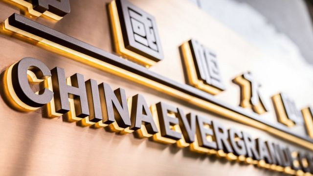
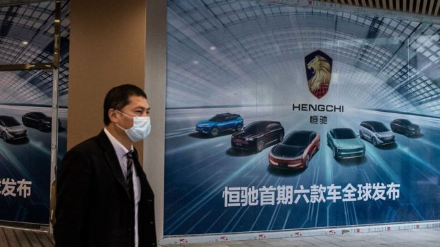
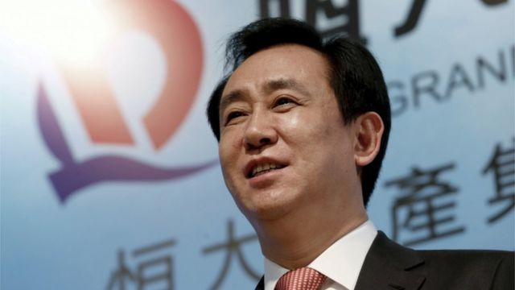
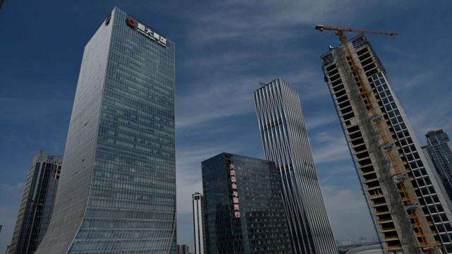
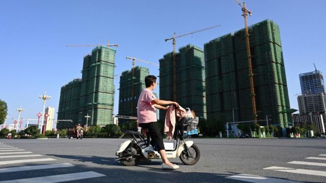

# [Business] 恒大危机：恒大復牌一度暴涨40% “回光返照”还是“利空出尽”

#  恒大危机：恒大復牌一度暴涨40% “回光返照”还是“利空出尽”

9 小时前

> 图像来源，  Getty Images
>
> 图像加注文字，9月28日晚间，中国恒大集团发布公告称，公司董事局主席许家印因涉嫌违法犯罪，已被依法采取强制措施。

**中国内地还在过国庆节假期，股市停盘，而港交所在10月3日起已开始交易。在10月2日晚，中国恒大、恒大物业在港交所公告，已向联交所申请由10月3日上午9时正起恢复买卖公司股份。**

10月3日港股开盘后，中国恒大、恒大物业强势上扬，前者一度涨超40%，后者一度涨14%。随后，两股开始震荡下跌，收盘时中国恒大涨幅仍达到28%左右，恒大物业则收盘跌3%左右。

在股市中，类似暴跌之后的暴涨，一般被认为是市场预期“利空出尽”，即当前股价之低已经充分反映所有坏消息，甚至过度反应了坏消息，那么此时入市有机会上涨，并不代表公司层面有利好消息。

此前9月28日晚间，中国恒大集团发布公告称，公司董事局主席许家印因涉嫌违法犯罪，已被依法采取强制措施。相关消息在27日已经开始发酵，当时恒大旗下的中国恒大、恒大物业和恒大汽车分别暴跌18.99%、14.49%和20%。到28日，三支股票宣布停牌。

即便经过10月3日的大幅上涨，中国恒大的市值也仅有54.14亿港币，巅峰时期恒大的市值超过4000亿元人民币。

##  恒大物业

恒大系第二家上市的公司为恒大物业，2020年底在香港上市集资了158亿港元，3个月后市值达到巅峰的2062亿港元。10月3日后，恒大物业的市值还有61.62亿港元。

值得一提的是，恒大物业的一次事件，折射出恒大集团内部的问题——2022年3月在财报审计中发现，恒大物业有134亿元存款因为为第三方提供存款质押，而被银行强制执行。而这个第三方就是其母公司恒大集团。

此后恒大物业开始内部整顿，并向第三方及恒大集团开展追偿工作，并开除了所有涉及质押担保事项的董事。但恒大集团的财务状况使恒大物业的追偿变得极为困难。而挪用资金也成为包括许家印在内的高管们可能被起诉的原因之一。

今年6月，恒大系公司公布财报，恒大物业甚至是“恒大系”三家上市公司中唯一有盈利的——2022年，实现营业收入约118.09亿元，净利润约14.79亿元。但在恒大整体2.4万亿的负债之下，实为杯水车薪。

##  恒大汽车

> 图像来源，  Getty Images
>
> 图像加注文字，恒大汽车已跌到0.56元每股，还不足巅峰时的1%。

三家恒大系上市公司中，唯一没有復牌的是恒大汽车。恒大汽车目前市值60.73亿元。

短短两年前，恒大汽车经历过暴涨，2020年6月，恒大汽车股价仅6港元，然后突然爆发，八个月后至2021年2月最高达到72.45港元每股，涨幅超过1000%，市值冲过6400亿港元，但此时恒大汽车甚至未正是开售一辆车。

而当前，恒大汽车已跌到0.56元每股，还不足巅峰时的1%。

> 图像来源，  Reuters
>
> 图像加注文字，恒大总裁许家印2016年在香港参加年度财报发布会。

在2019年的一场发布会上，许家印宣布造车的理念“买买买、合合合、圈圈圈、大大大、好好好”，计划投资450亿元，用3到5年从“没人没技术”，到“全球规模最大、实力最强的新能源汽车集团”。

彼时中文互联网就有批评称其为“盖楼式造车”、“造势大于造车”。

##  “躲过一劫”

> 图像来源，  Getty Images

随着恒大的崩盘，股价暴跌，也有网友称，中国内地的投资者“躲过一劫”——恒大曾经精心设计了借壳回归中国内地A股的计划。

2016年10月，恒大谋求通过借壳深深房A回归A股的计划浮出水面。而深深房是深圳的国资公司。

恒大为了这个计划颇费周折，不仅把总部从广州迁到深圳，而且引进了1300亿战略投资资金，并签订了对赌协议，那就是4年内要上市成功，否则要在2021年1月31日退还战略投资者资金1300亿，此外还要支付137亿分红。

最终，这个上市计划流产，恒大不仅没在中国内地上市，反而要背负更多负债，再叠加楼市大环境的巨变，“崩盘”时刻随之来临。

> 图像来源，  Getty Images

