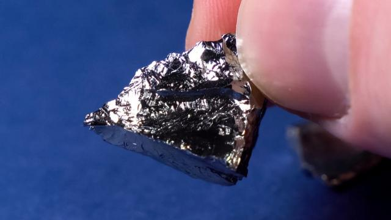

# [Business] 中国外商直接投资首次转负 外企对中国失去兴趣了吗？

#  中国外商直接投资首次转负 外企对中国失去兴趣了吗？

  * 梁艳婷 
  * BBC商务记者 

> 图像来源，  Getty Images
>
> 图像加注文字，中国国家主席习近平于本周三会见美国总统拜登。

**中国官方数据显示，外国企业从中国撤出资金的速度已快于投入资金的速度。**

中国的经济放缓、低利率以及与美国的地缘政治角力引发了人们对其经济潜力的怀疑。

本周，中国领导人习近平与美国总统拜登（Joe Biden）举行重要会晤，成为各方关注的焦点。

但闻风而动的企业似乎早已开始谨慎行事。

经济学人智库（EIU）全球贸易首席分析师尼克·马罗（Nick Marro）说：“对地缘政治风险、国内政策不确定性和增长放缓的担忧，正促使企业考虑其他市场。”

在中国第三季度，中国的外商投资出现了118亿美元（96亿英镑）的赤字，这是自1998年有记录以来的首次。

这表明，外国公司并没有将利润再投资于中国，而是将资金从中国撤走。

##  中国需要“修正”

瑞士工业机械制造商欧瑞康（Oerlikon）去年从中国撤出了2.5亿瑞士法郎（2.77亿美元）。该公司一名发言人说：“中国目前正面临着增长放缓，需要进行一些修正。”

“2022年，我们是首批公开表示预计中国经济放缓将影响我们业务的公司之一。”该发言人补充说。“因此，我们很早就开始采取行动和措施来减轻这些影响。”

中国仍然是欧瑞康的重要市场，其在该国拥有近2000名员工，在华销售额占该公司总销售额的三分之一以上。

欧瑞康指出，中国经济在未来几年仍有望实现5%左右的增长，“这是世界上增长最快的国家之一”。

自新冠疫情爆发以来，像欧瑞康这样的企业一直在应对在这个世界最大市场开展业务的挑战。当时，中国采取了新冠“清零”政策，实施了世界上最严厉的防疫封控。

这导致许多公司的供应链中断，如科技巨头苹果（Apple），其大部分iPhone手机都在中国生产。此后，苹果通过将部分生产转移到印度，推动供应链多样化。

> 图像来源，  Getty Images
>
> 图像加注文字，苹果公司已将部分iPhone生产线部署到印度。

马罗认为，随着中美之间的紧张局势加剧，美国对制造先进芯片所需的原材料和技术实施了新的出口限制，今年有更多企业开始响应多元化的号召。

“我们没有看到很多公司撤出中国。许多大型跨国公司已经在中国市场耕耘了几十年，他们不愿意放弃花了20年、30年或40年时间培育起来的市场份额。但在新投资方面，我们尤其看到了重新评估的趋势。”

##  低利率

企业也在考虑利率的影响。去年，在世界上许多国家大幅加息之际，中国却逆势降息。

包括美联储和欧洲央行在内的许多主要央行都在提高利率，以应对通货膨胀。加息意味着更高的回报，其增加了银行吸纳资金的能力，这也吸引了国际资本的回流。

与此同时，中国的政策制定者降低了借贷成本，以支持中国经济和摇摇欲坠的房地产行业。今年以来，人民币对美元和欧元贬值超过5%。

中国欧盟商会（European Union Chamber of Commerce in China）表示，企业并没有把在中国赚来的钱再投资回中国，而是把钱花掉。

其补充说：“那些在中国有多余现金和收入的企业，越来越多地将这些资金转移到海外，与在中国投资相比，它们在海外获得的投资回报更高。”

中国美国商会（American Chamber of Commerce in China）总裁何迈可（Michael Hart）指出，一些公司从中国撤出利润是它们“长期周期的一部分”，即“一旦其项目达到特定规模和盈利能力”，就会获利回吐。

“撤走利润并不一定表明企业对中国不满意，而是表明它们在中国的投资已经成熟。”

何迈可说，这是“令人鼓舞的”，因为“这意味着企业能够将其在中国的业务整合到其全球业务中”。

总部位于加拿大的航空电子公司飞朗科技集团（Firan Technology Group）过去十年里在中国的投资达到1000万加元（720万美元），但去年和2023年第一季度从中国撤走约220万加元。

“我们根本没有退出中国。我们正在中国投资和发展业务，并将多余的现金取出投资于世界其他地方。”该公司总裁兼首席执行官布拉德·伯恩（Brad Bourne）说。

> 图像来源，  Getty Images
>
> 图像加注文字，中国正在限制制造芯片所需的锗的出口。图为一块锗。

他补充说：“我们在中国有盈余现金，把它们拿回来为我们最近在美国的收购提供资金，这只是审慎的现金管理，这意味着我们的借贷减少了。”

##  未来的不确定性

分析人士表示，无论是在利率还是在中美关系方面，未来都存在很多不确定性。

恒生银行（中国）首席经济学家王丹表示，中国央行今年可能会进一步降低利率，以提振中国经济。

降息可能会给已经疲软的人民币带来更大压力。“由于货币贬值的压力，目前货币宽松的空间非常有限。”她说。

“如果下个月经济情绪好转，可以肯定地说中国会降息。但如果市场情绪没有改善，央行将很难做出决定。”她说。

经济学人智库的马罗表示，企业界对习近平与拜登的会晤持谨慎乐观态度。

“两国元首的直接会晤往往会对双边关系产生稳定作用。我们还看到，中美在过去几个月里频繁进行外交接触，这让人感觉双方都在为两国关系构筑一道底线。”他说。

“话虽如此，但事态转坏只在旦夕之间。除非企业和投资者觉得他们可以更有把握地进行投资，否则外商对华投资将继续受到拖累。”他说。

