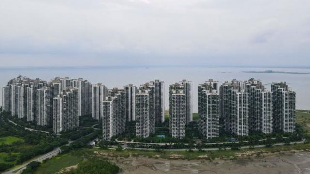
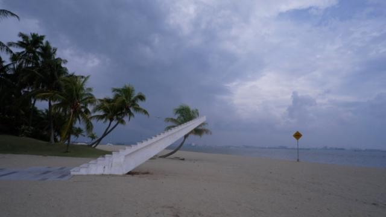
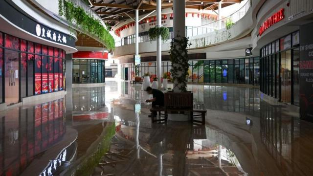

# [Business] 碧桂园森林城市：中国开发商在马来西亚建造的“鬼城”

#  碧桂园森林城市：中国开发商在马来西亚建造的“鬼城”

  * 尼克·马什（Nick Marsh） 
  * BBC亚洲商务记者 

> 图像来源，  Getty Images
>
> 图像加注文字，森林城市本应容纳一百万人，但目前仅有少数单位有人居住。

**“我设法逃离了这个地方。”纳兹米·哈纳菲亚（Nazmi Hanafiah）笑着说，略带紧张。**

一年前，这位 30 岁的IT工程师搬到了位于马来西亚南部柔佛州的“森林城市”，这是一座由中国地产商建造的庞大住宅区。他在一座俯瞰大海的塔楼里租了一套一居室的公寓。

六个月后，他受够了，不想继续生活在这个他称之为“鬼城”的地方。

“我不在乎押金，不在乎钱。我只想离开，”他说。我们约好在他以前住的那栋大楼见面。

“我一回来就起鸡皮疙瘩，”他说，“（待在）这里很孤独，只有你和你的思想。”

2016年，在“一带一路”倡议下，中国最大的房地产开发商之一碧桂园推出了耗资1000亿美元（789亿英镑）的大型项目——森林城市。

当时，中国房地产业仍在蓬勃发展。开发商们借来巨额资金，在国内外为中产阶级买家建造楼盘。

在马来西亚，碧桂园的计划是建设一个生态友好型大都市，其中包括高尔夫球场、水上公园、写字楼、酒吧和餐馆。该公司称，森林城市最终将成为近百万人的家园。

八年过去了，荒凉的森林城市提醒人们：不需要身在中国，也能感受到中国房地产危机的影响。目前，整个项目仅建成了15%，而根据最近的估计，整个开发项目的入住率仅为1%多一点。

尽管背负近2000亿美元的债务，但碧桂园告诉BBC，它对完成整个计划持“乐观态度”。

> 图像来源，  Country Garden
>
> 图像加注文字，这是碧桂园宣传资料中森林城市的样子。

##  “这里令人毛骨悚然”

Skip podcast promotion and continue reading

* BBC 時事一周 Newsweek (Cantonese)   **

BBC國際台粵語節目，重溫一周國際大事，兩岸四地消息，英國境況。並備有專題環節：〈記者來鴻〉、〈英國生活點滴〉和〈華人談天下〉。

分集

End of podcast promotion

森林城市被称为“全人类的梦想天堂”。但实际上，它直接瞄准了中国国内市场，为有抱负的人提供在海外拥有第二居所的机会。

这些房产可以作为投资，出租给纳兹米这样的马来西亚本地人，也可以用作度假屋。

实际上，森林城市与世隔绝的位置——建在填海而成的岛屿上，远离最近的大城市柔佛州新山市——让潜在的租户望而却步，并在当地赢得了“鬼城”的绰号。

“老实说，这里让人毛骨悚然，”纳兹米说，“我对这个地方抱有很高的期望，但这是一次糟糕的经历。这里简直无事可做。”

森林城市确实散发着一种奇怪的气氛——感觉就像一个废弃的度假胜地。

在荒芜的海滩上，有个破旧的儿童游乐场、一辆生锈的老爷车，还有一个白色的混凝土制成的“不知通向何处的楼梯”。水边有告示牌，警告人们不要游泳，因为这里有鳄鱼。

在专门建造的购物中心里，许多商店和餐馆都已关门，有些单位还只是空置的建筑工地。有一种超现实的感觉，一辆空荡荡的儿童火车在商场里无休止地绕圈，同时用中文循环播放歌曲，“头、肩膀、膝盖和脚趾”。

隔壁的碧桂园展厅里，有个巨大的城市模型，展示建成后的森林城市的模样。销售摊位前坐着几位看上去百无聊赖的员工，他们头顶的牌子上写着：森林城市。幸福永无止境。

到目前为止，这里最大的吸引力是该地区的免税地位。在海滩上，你会发现成堆的废弃酒瓶和成群结队的酒客，他们是这里人类活动的主体。

夜幕降临时，森林城市变得漆黑一片。高耸入云的巨型公寓楼里有数百间公寓，但亮着灯的不超过六盏。很难相信这里真的有人居住。

安妮-考尔（Joanne Kaur）是我遇到的为数不多的居民之一，她说：“这个地方阴森森的。即使在白天，当你走出家门，走廊也是漆黑一片。”

她和丈夫住在其中一座塔楼的第 28 层，整层楼只有他们两个人。和纳兹米一样，他们也是租房者，也计划尽快离开。

她说：“我为那些真正在这里投资买房的人感到遗憾。如果你在谷歌上搜索‘森林城市’，你看到的就不是今天这个样子了。”

她还说：“它呈现的应该是向人们承诺的项目，但事实并非如此。”

与在森林城市购买了住房的中国人交谈并非易事。BBC设法间接联系到了几位业主，但他们不愿发表评论，甚至不愿匿名置评。

不过，社交媒体提供了一些传闻证据。一位来自辽宁省的购房者在一篇赞扬该楼盘的帖子下说：“太误导人了。现在的森林城市是一座鬼城。根本没有人。这里远离城市，生活设施不完善，没有车寸步难行。”

其它评论则询问如何才能退还房款，其中一条评论说： “我这套（房）的价格下降了这么多，我都无语了。”

> 图像加注文字，荒芜的海滩上矗立着一座楼梯。

##  销售困境

中国各地都感受到了这种挫折感，房地产市场一片混乱。

经过开发商多年疯狂借贷之后，政府担心泡沫正在形成，并在 2021 年实施了严格的限制措施。“房子是用来住的，不是用来炒的”是中国领导人习近平的口头禅。

由于这些措施，大公司已经没有现金来完成大型项目。

10月，碧桂园被迫放弃了在澳大利亚的两个项目，分别出售了墨尔本和悉尼的未完工项目。

本地政治因素也导致了森林城市的目前局面。2018年，马来西亚时任总理马哈蒂尔（Mahathir Mohamad）以反对“为外国人建造的城市”为由，限制中国买家的签证。

也有分析人士质疑，在一个政治经济环境不稳定的国家建设超大型开发项目是否明智。马来西亚现政府支持该项目，但对潜在买家来说，这种支持能持续多久以及支持的程度如何，都是未知数。

其它问题，如新冠疫情旅行限制和对中国公民海外消费的控制，尤其阻碍了碧桂园等巨头在海外的项目。

“我认为他们可能有点操之过急，”KGV国际房地产咨询公司的Tan Wee Tiam说，“在启动这样一个雄心勃勃的项目之前，最重要的一点就是确保有足够现金流。”

本周，全球负债最多的房地产公司恒大在香港一家法院面临清算听证会。最终，随着法官第七次延期聆讯，这家中国公司获得了六周的缓冲期，以便与债权人达成还款计划。

碧桂园坚称中国房地产市场目前的状况只是“噪音”，其马来西亚业务“照常运营”。

碧桂园还表示，将森林城市纳入马来西亚与邻国新加坡之间的新经济特区的计划表明，该项目是“安全和稳定的”。

但是，如果无法获得现金，很难想象森林城市这样的项目如何能够完工，也很难想象它将如何吸引人们尽快入住。目前，中国建造的房产似乎陷入了销售困境。

REDD Intelligence Asia的伊芙琳·达努布拉塔(EvelineDanubrata)说：“这是一个先有鸡还是先有蛋的问题。”开发商通常依靠预售来筹集建设资金。

“但如果买家不确定最终能否拿到公寓钥匙，他们就不会把钱投进去。”

> 图像来源，  Getty Images
>
> 图像加注文字，购物中心内的大部分商店和餐厅都已关闭。

##  雄心与现实

说到中国的房地产危机，森林城市是雄心与现实的典型案例。也许是外部因素造成了目前的局面，但事实证明，在荒郊野外建造数以万计的公寓，并不足以说服人们去那里居住。

归根结底，森林城市以及中国各地数百个项目的命运取决于中国政府。上个月，有报道称，碧桂园已被列入将获得中国政府财政支持的开发商初步名单，但支持程度尚不明确。

不过，像纳兹米这样的人不太可能再回来了：“下次我肯定会更加谨慎地选择，”他说，“但我很高兴离开了这个地方——现在我重新有了自己的生活。”

