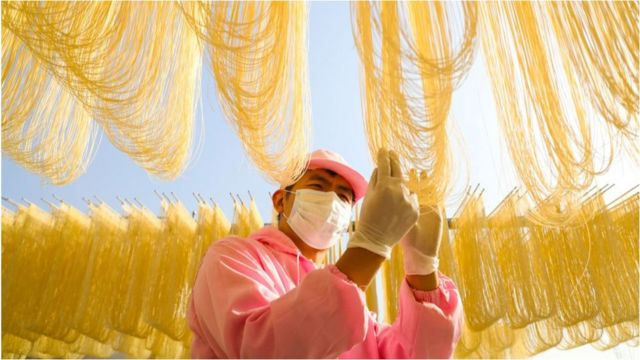
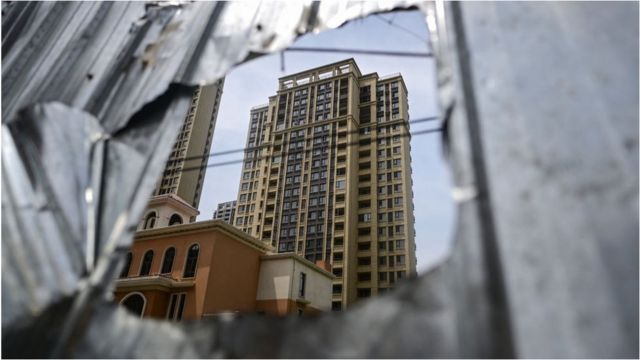

# [Business] 中国河南等省爆出GDP增速“改降为升” “数据注水”的背后原因

#  中国河南等省爆出GDP增速“改降为升” “数据注水”的背后原因

> 图像来源，  Getty Image
>
> 图像加注文字，河南是中国的农业大省，已故总理李克强曾在主政该省时定下发展食品加工业的策略。

**1月24日，中国河南省政府秘书长、省政府新闻发言人朱鸣介绍，根据地区生产总值统一核算结果，2023年，河南全省地区生产总值（GDP）59132.39亿元，同比增长4.1%。**

但是如果翻看河南2022年的官方数据，发现是61345.1亿元，那么2023年河南的GDP实际上比2022年减少了2200多亿元，经济增长应该为-3.6%，刚刚发布的数据却是4.1%。

官方的说法是，“2023年以来，河南着力提升数据质量，加大统计数据核查力度，实事求是修正历史同期数据。经最终核实，2022年，河南省生产总值现价总量为58220.13亿元，按不变价格计算，比上年增长2.4%。”

这意味着，河南将2022年的GDP数据向下“修正”了3100多亿元，这相当于全省18个市中排名第八的驻马店市一年的GDP。

##  四省数据“注水”？

> 图像来源，  Getty Image
>
> 图像加注文字，河南郑州一场招聘会上的人潮。

河南不是特例，但是唯一一个把负增长“修正”成正增长的省份，据不完全统计，各地至少还有三个省份的增长来自于“修正”上一年的经济数据——

福建省，2023年的GDP为54355.10亿元，按照其2022年公布的数据53109.85亿元计算，同比增长2.3%，但该省把2022年数据向下“修正”了1095亿之后，刚刚公布的增速就变成4.5%。

江西省，2023年的GDP为32200.1亿元，按照2022年公布的数据32074.7亿元计算，同比增长仅为0.4%，但该省把2022年数据向下“修正”了1142亿元后，增速变为4.1%。

湖南省，公布的2023年GDP为50012.85亿元，按照其2022年公布的数据48670.4亿元，同比增2.76%，但该省把2022年数据向下“修正”了811亿元后，增速就变为4.5%。

一位熟悉统计工作的体制内人士在匿名前提下向BBC中文透露，这种行为虽然对地方领导来说，可能确实使表面的增速变高了，但不见得是他们主动作为的结果，而更大程度上源于去年两场活动——“统计造假专项治理行动”和“专项统计督察行动”。

前者贯穿2023年全年，5月前是中国各省自查阶段。河南省新郑市披露的工作是，重点核实2022年以来入库单位行业划分是否正确、申报材料特别是税务材料是否真实、是否达到规模（限额）以上标准等，检查新增固定资产投资项目是否真实存在、是否重复报送、是否虚增规模、是否违规打捆等。

到8月份，中国国家统计局派督察组到六省进行督察，其中就有河南，督察的结果是，“河南一些反馈问题边整改、边发生，举一反三不够，落实统计造假专项治理行动要求不够彻底，追责问责进展缓慢”。

上述人士认为，这两个行动下，使这几个省不得不“核减”2022年的数据。

中国媒体援引一位国家统计局工作人员称，“尽管各级官员深知数据造假的危害，但面对来自上级考核、地区竞争和自身升迁等压力和冲动，最终还是层层分解指标、人人摊派任务，数据造假已到了非常严重的地步。”

##  统计造假“违纪”

> 图像来源，  Getty Image
>
> 图像加注文字，新郑市的一个烂尾楼盘。

2022年，河南经济确实屡遭打击——

7月，河南多家村镇银行“暴雷”，储户因无法取款而发动抗议集会，数以百计的村镇银行储户与警方对峙，最终河南政府不得不自掏腰包“垫资”，平息事端；

2022年10至11月郑州长时间封城以及被国务院通报批评过度防疫；以及对富士康的严苛防疫造成工人大规模抗议事件等；

遍布全国的烂尾楼问题，河南也也是重灾区。

所以河南公布2022年GDP时，数据比疫情没有那么严重的2021年还增长了3.1%，超出外界预期。该省发改委还宣布，一举站上了“6万亿台阶”，扭转了自2020年以来增速连续两年低于全国平均值的局面。但数据“核减”后，这两点都已不再是事实。

上述人士向BBC中文表示，一般而言，每年各地GDP都会有一些“水分”，最直接的体现就是，各省的GDP加总后比全国GDP超出几万亿，这个数字也在每年变小。当然一个原因是各地存在对一些项目或企业进行重复统计的情况。

但很重要的原因是，各省的GDP由省级统计局核算，而全国GDP还有国家统计局直属调查队，该机构一般每省都有，甚至还有300多个市级调查队，以及800多个县级调查队，归属中央直接管辖，并设有农调队、城调队和企调。该机构对中央负责，下辖两万人的规模。“说白了，就是中央不想被地方蒙在鼓里。”

> 图像来源，  Reuters
>
> 图像加注文字，就在河南发布GDP数据的两天前，中国国家统计局网站发布了"统计造假"被纳入《中国共产党纪律处分条例》处分。

2017年到2018年，中国掀起一阵各个省份曝光“经济数据注水”的热潮，首个公开认错的辽宁省在数据造假上，虚报GDP达到23%，此后内蒙古、天津、吉林等都承认造假，而内蒙古“核减”掉了2016年全部工业增加值的40%。

“那一轮数据造假很严重，主要是刚刚换届，新地方领导上来，看着上一任的假数据很为难，继续累积下去，自己的工作不好做，而且GDP造假伴随着财政账目造假，已经快难以为继了，所以开始主动‘挤水分’。”

上述人士表示，不同的是，此次河南把2022年的经济数据下修了3100多亿元，但这些都发生在河南现任省委书记楼阳生任内。

楼阳生在2021年6月调任主政河南，完整经历了2022年，所以挤出来的也是他任内的“水分”。

就在河南发布GDP数据的两天前，中国国家统计局网站发布了“统计造假”被纳入《中国共产党纪律处分条例》处分，发言人还表示，统计造假是统计领域最大的腐败，严重违反统计法，严重影响统计数据质量，“干扰甚至误导宏观决策，违背党的实事求是思想路线和求真务实工作作风，损害党和政府公信力”。

今年1月初，四川省统计局原党组书记、局长范毅严重违纪违法问题被立案审查调查。

“在这样的氛围下，我想哪个省都不想暴露自己数据里的‘水分’。”上述人士表示。

