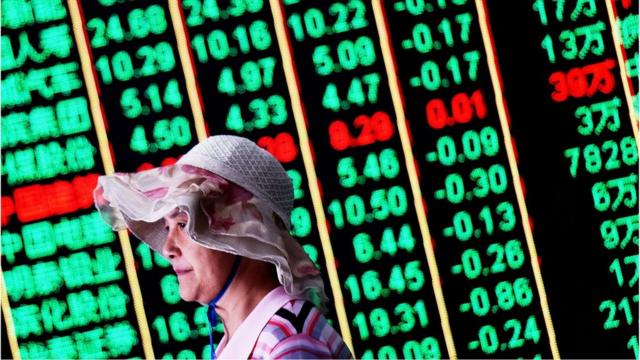
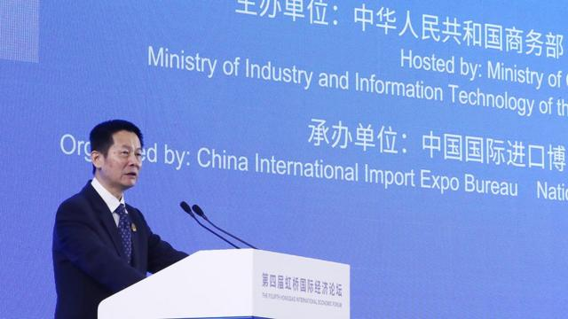

# [Business] 中国证监会“限制卖出” 的短期效应与长期后果

#  中国证监会“限制卖出” 的短期效应与长期后果

9 小时前

> 图像来源，  Getty Images

**2024年春节前后，中国股市上演了一场“拉锯战”，市场行情在连续大跌和连续大涨之间切换，并引发证监会换帅等事件。**

年后爆出中国证监会限制机构在开盘和收盘半小时内净卖出，引起轩然大波。BBC中文采访一位从业者，分析其中利害，以及对中国股市未来的影响。

##  春节前：“散户的哭墙”与“券商屠夫”

春节前不到10天，中国股市的情节起伏，让受访从业者感叹“惊心动魄”。

2月2日，上证指数一度下跌击穿2700点关口，至近四年来的最低点，那个星期上证指数累计下跌6.19%，过去10年，沪指仅有18周的周跌幅超过5%，6.19%是五年来最大周跌幅。

2月3日周末休市，中国股民情绪低迷，他们选择到美国大使馆的官方微博下通过点赞和评论来发泄情绪，有评论称该微博的评论区，“已成中国散户股民的哭墙”。

2月4日为星期日，中国证监会召开党委会议提出，要深入排查违法违规线索，依法严厉打击操纵市场、恶意做空、内幕交易、欺诈发行等重大违法行为。

2月5日行情更为惊险，开盘沪指即迅速下挫3.5%，其后证监会不断发声，称对操纵市场恶意做空的行为“零容忍”，让让胆敢违法操纵、恶意做空者“倾家荡产、牢底坐穿”，再加上国家队基金入市，使沪指跌幅收窄，最终收跌1%。

2月6日，中央汇金投资公司和证监会联合出手救市，前者加大对A股的增持规模，结束“六连跌”，主要股指全线大涨，创两年来最大单日涨幅。

> 图像来源，  China News Service
>
> 图像加注文字，吴清在证监会任职多年，后任上海任副书记，经历了疫情，然后再回来执掌证监会。

不过，2月7日，新华社消息，任命吴清为中国证监会党委书记，免去易会满的党委书记职务，吴清在任上海市委副书记前在证监会任职多年，2005年处置31家违规证券公司，被称为“券商屠夫”。

2月8日是春节前最后一个交易日，“券商屠夫”上任第一天，分别对申万宏源证券和平安证券进行处罚；隔日又处罚招商证券63名从业人员，其中一人涉嫌内幕交易移送司法机关，同日还对上海思尔芯上市欺诈发行进行处罚。

##  春节后：“限制卖出”与“量化”魔鬼

2月19日是春节后第一个交易日，沪指涨近1.6％，收复2900点大关；沪深300指数也小幅上扬1.2％，实现“四连涨”。

2月20日周二，吴清治下的证监会又拉开一场大幕——公开谴责量化巨头“灵均投资”，并对其做出买卖股票限制。起因是监测到该机构在19日集中下单卖出13亿元股票，造成指数在短时间快速下挫。

“量化，既不是天使，也不是魔鬼，所有的罪只是放大了市场波动。”一位管理量化私募基金的D先生（按照受访者要求匿名）向BBC中文表示，量化其实就是发现市场波动的一些规律，用算法的形式去自动地、严格地执行策略，以获得超额受益，在特定的点位可能会触发计算机高频、大量的交易。

> 图像来源，  Getty Images
>
> 图像加注文字，龙年首个交易日中国两大股指上涨。春节长假之前，中国股市遭遇了连续暴跌，此后政府出手救市，导致最后几个交易日股指有所反弹。

2月21日，彭博社引述知情人士称，中国证监会已限制包括券商自营部门在内的主要金融机构，在早盘开盘和下午收盘半小时内净卖出股票。一时间股市监管层“限制卖出”的舆论反弹甚嚣尘上。

中国证监会回应称，近日，沪深证券交易所依规对个别机构的异常交易行为采取了监管措施，是履行交易监管职责的举措，不是限制卖出。股市有涨有跌是规律，有买有卖是常态；监管部门对于正常的市场交易不干预，依法保障投资者公平自由交易的权利，对于扰乱市场交易秩序等违法违规行为，坚决依法依规予以打击。

D先生也确认了“收盘前的不准卖出的电话”，他表示接到过类似电话，而且已经“持续挺久了”。

D先生认为，这一措施背后目的无非是想稳定市场情绪，在整体缺乏信心的时候，如果量化机构在开盘或收盘集中卖出，会带着散户的情绪低迷。反之，绑住量化机构的手脚后，国家队就可以更有效地在这两个时间段可以入市支撑股价。

> 图像来源，  Getty Images
>
> 图像加注文字，机器算法将确认市场机会，然后比任何人为操作都快地出手交易。

“而且做量化的机构，交易策略差不多，所以在某个点位，可能大家都启动卖出，引发多米诺效应，出现闪崩。”D先生表示，“在A股还有个特点，就是做量化的资金总量不大，但交易量极大，因此对市场的影响也大。”D先生表示，不过量化在国外已经是非常普遍，估计标普超过一半的股票都是量化交易。

位于伦敦的金融实操公司Amplify Trading负责人皮埃尔·柯伦（Piers Curran）解释，算法交易会设置在特定情况下做出特定反应。

他表示，“有人可能设置止损的标准，达到这一标准就会出售资产以防止更多损失。”

“因此，如果道琼斯指数下跌5％，可能会触发机器算法出售股票，然而如果大量机器算法同时触及止损线，那将产生更大跌幅，进而触发更多止损交易。”

> 图像来源，  Getty Images
>
> 图像加注文字，2021年7月末，中国颁布“双减”新政策，一批教培机构直接倒闭收场。

##  后期影响

未来，可能还有更多针对量化交易的监管措施出台。据《中国证券报》报道，证监会市场监管一司相关人士称，下阶段出台的量化交易监管系列举措，将“成熟一项、推出一项”，并充分加强跟市场各类投资者沟通交流，把握好工作节奏和力度，促进量化交易规范健康发展，维护市场稳定运行。

D先生澄清，有些非财经类媒体说“禁止做空”是一种误读，其实是限制“卖出”，更准确的形容是“限制在短时间内卖出”，因为要是没法卖出，那么就没有交易，也就没有市场可言了。

但这种“限制在短时间内卖出”对于一般机构可能影响不大，他们的策略更长期，但对于量化机构而言，会非常难过，这意味着无法严格执行交易策略，有时候影响是灾难性的。

D先生举例，如果市场下跌，但是一家机构加了杠杆，在特定点位卖出时还能止损，卖不出去就爆仓，颗粒无收。这样的事情已经在发生，一刀切式地限制，跟几年前对教培、房地产行业的打压差不多。

“前前后后几个月下来，可能我们一半同行（量化私募基金）要死掉。”D先生希望，在监管上，与其在这种限制交易的技术性手段上下功夫，不如建立更好的机制提高上市公司质量，提高投资回报，股市才会真正起来。

海外资金似乎也对中国股市的现状不满。中国央行数据显示，2023年，境外机构和个人持有境内股票2.8万亿元人民币，同比下降13%，较2021年末的高点下降近30%。

这些国际基金从中国撤资的同时，将目光投向日本和印度作为替代，到了今年1月，境外投资者又抛售了145亿人民币的中国股票。

