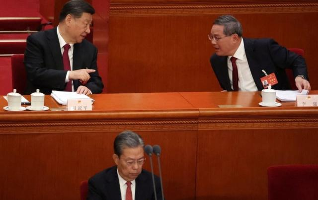
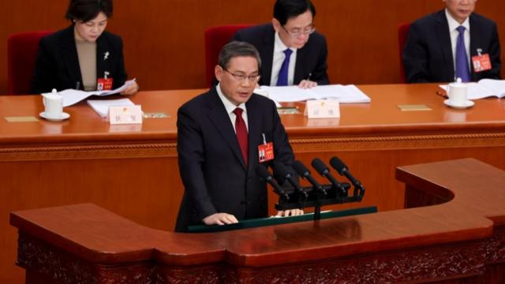
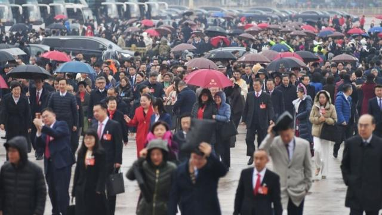
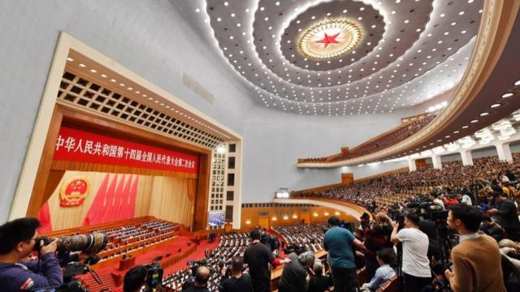
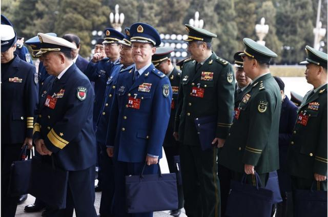
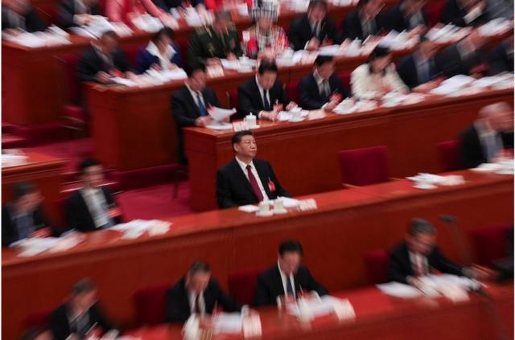

# [Business] 中国两会2024：GDP增速目标仍维持5% 实际军费增长超千亿

#  中国两会2024：GDP增速目标仍维持5% 分析称实现该目标更具挑战性

  * 陈岩 
  * BBC中文记者 

> 图像来源，  ANDRES MARTINEZ CASARES/EPA-EFE/REX/Shutterstock
>
> 图像加注文字，中国人大十四届二中全会开幕式上，中国国家主席习近平（后左）与国务院总理李强（后右）讲话，前面是全国人大常委会委员长赵乐际。

**3月5日上午，中国全国人民代表大会在北京拉开帷幕，中国国务院总理李强作任内第一份政府工作报告。**

会前新闻发布会透露，今年不再举行总理记者招待会，延续30年的“两会”传统告一段落。

根据政府工作报告，以及当天提交给人大的政府预算案，广受关注的国内生产总值（GDP）增速目标、军费增速、赤字率，都与去年持平：

  * 今年的国内生产总值（GDP）增速目标定在5％左右，与去年一致； 
  * 军费同比增长7.2%，超过GDP增速，实际军费增长超千亿，但与去年持平； 
  * 赤字率3%，依然与去年持平，同时宣布今年计划发行1万亿元人民币特别国债。 

##  GDP目标5%左右

> 图像来源，  Getty Image
>
> 图像加注文字，李强作其任内第一份政府工作报告。

3月5日，中国国务院总理李强作政府工作报告时表示，2024年发展主要预期目标是：

  * 国内生产总值增长5%左右； 
  * 城镇新增就业1200万人以上，城镇调查失业率5.5%左右； 
  * 居民消费价格涨幅3%左右； 
  * 居民收入增长和经济增长同步； 
  * 国际收支保持基本平衡； 
  * 粮食产量1.3万亿斤以上； 
  * 单位国内生产总值能耗降低2.5%左右，生态环境质量持续改善。 

5%的增长目标与市场预期一致，不过就业目标稍有变化，去年的目标是“1200万人左右”，今年是“1200万人以上”。

多年来就业都是中国总理们关注的指标，前总理李克强曾表示，“之所以要稳增长，说到底就是为了保就业”，他还进一步解释，世纪初GDP每增长1个百分点会拉动100万人就业，后来产业结构调整，尤其是服务业发展后，GDP增长1个百分点，能够拉动130万、甚至150万人就业。

按照当前目标测算，GDP每增长1个百分点，需要拉动240万就业才能实现上述两个目标。

> 图像来源，  Getty Image
>
> 图像加注文字，人大代表向人民大会堂走去。

虽然GDP增长5%目标与去年所订下的目标一致，但实现难度更高。

因为考虑到2022年中国仅实现3%的经济增长，而2023年的经济增长5%目标是在上一年较低基数上计算，因此当时有观点认为，该目标较为保守，最终2023全年实现5.2%的增长。

而2024年增长5%则是在2023年较高的基数上计算，实现难度增大。

##  分析：实现5%目标更具挑战性

ING银行大中华区首席经济师宋林表示，GDP增长目标再次定为5%左右并不令人意外，因为降低目标会进一步削弱信心。

尽管如此，要在2024年再次实现5%的增长，“将是一条更具挑战性的道路”，宋林进一步解释称，因为基数效应的支持作用会减弱，而且许多抗击疫情时的经济措施的提振作用也会逐渐减弱。而且在2024年，房地产可能仍将拖累经济。

> 图像来源，  Getty Image
>
> 图像加注文字，2023年是人民代表大会换届，为第十四届人大，2023年3月召开第一次会议，今年3月为第二次会议，直至2027年3月第五次会议后任满。

如果按照消费、出口、投资的“三驾马车”来看，宋林在分析中分别指出：

  * 虽然消费是2023年经济增长的主要驱动力，但消费者信心疲软和财富效应的负面影响将使消费在2024年难以再次拉动经济增长。在这些不利因素的影响下，消费模式将从炫耀性消费转向更加物有所值的消费，这使得我们更加看好今年“吃喝玩乐”的主题。餐饮、娱乐、旅行和旅游行业今年可能会继续表现出色。 
  * 贸易也不太可能成为增长的主要动力，全球贸易增长预计仍将低于历史平均水平。此外，贸易保护主义有可能进一步抬头，这可能会影响近期表现出色的新能源汽车出口。 
  * 因此，如果中国要实现其5%左右的GDP增长目标，可能需要看到来自投资方面的更多支持。自2019年以来，政府投资一直超过私人投资，我们预计这一趋势将持续下去，直到情绪出现有意义的转变。随着公共投资可能成为今年更重要的驱动力，“两会”的特别国债发行目标和1万亿元人民币的长期中央国债发行将发出一个积极信号，即政府主导的支出将有助于填补缺口。另一个值得注意的问题是，与过去相比，投资具有高乘数效应领域的空间较小，即房地产和交通基础设施（铁路、公路、机场）。财政刺激的乘数效应可能会降低。 

因此，宋林认为，情绪触底回升将是可持续复苏的主要催化剂。虽然在政府工作报告中看到了一些积极的信号，但恢复信心的道路可能还需要一些时间，而且这个过程可能是不平衡的。随后几周和几个月的政策出台将在很大程度上决定今年能否触底反弹。

##  赤字率与军费增速

> 图像来源，  WU HAO/EPA-EFE/REX/Shutterstock
>
> 图像加注文字，周一参加中国政协十四届全会第二次会议的军方代表抵达人民大会堂的照片（3月4日）。

这两个指标都与去年持平。

不过虽然军费增速都维持不变7.2%，但实际军费增长仍超千亿——中国去年军费预算为1万5537亿元人民币，今年为1万6655.4亿元人民币，比去年增加了1118.4亿元。

长期以来，中国极少把财政赤字率设定在高于3%的水平，因此市场有约定俗成的“赤字率不破3”的说法。

疫情来袭后，2020年中国大幅扩大赤字到3.7%，突破常规，以应对疫情。2021年下降到3.1%，2022年进一步下调至2.8%左右。

2023年疫情限制全面放开，政府把赤字率提高到3%，以支持经济复苏，然而，经济复苏并不如意。去年四季度增发国债1万亿元，将实际赤字率提高到3.8％左右。

今年赤字率依然确定为3%，为4万亿元左右，虽然从疫情的特殊时期回归，但还处在疫情前赤字率的最高水平。而且今年还计划先发行1万亿元超长期特别国债，意味着实际赤字率更高。

这与此前经济学家和分析师预测的“2024年中国将会加强财政支出以提振经济”相吻合。
  * 

##  再无“总理记者会”

> 图像来源，  Reuters

今年两会另一重大变动为不再举行总理记者会。

新任中国全国人大新闻发言人娄勤俭3月4日在北京说：“今年十四届全国人大二次会议闭幕后，不举行总理记者会。如无特殊情况，本届全国人大后几年也不再举行总理记者会。”

在微博上，“十四届全国人大二次会议闭幕后不举行总理记者会”一度成为热话标签，但从BBC记者团队所见，该标签不久便遭屏蔽。

1991年，时任中国总理李鹏首次出席全国“两会”闭幕后举行的记者会。1993年起，“两会”总理记者会开始成为常态。

对于中国的政治肌体而言，“记者会”多少有些异物感，容易产生排异反应。高级领导人极少在国内举行记者会，因此“两会”后的中国总理记者会，几乎汇集了中外媒体一整年的好奇心和注意力。

尽管记者会上的提问被普遍认为是已预设好的，但答问者时常会有超出预料的言论，在一定程度上也塑造了时任总理的形象。

比如朱镕基，从副总理到总理，他主导中国十年的经济改革，面对的社会复杂度和改革难度极高。1998年的记者会上，凤凰台吴小莉提问，“外界称你是‘经济沙皇’，你喜欢这个称呼吗？”朱镕基说，“我不喜欢这个称呼。”他接着说，“但不管前面是地雷阵还是万丈深渊，我都将一往无前，义无反顾，鞠躬尽瘁，死而后已。”这种情绪化的表达在中共官员中并不多见。

温家宝在记者会上语气缓慢，并且喜欢引经据典，鲜见出格的表达。直到他卸任前最后一次记者会，却对于格外敏感的“政治体制改革”进行了罕见的表态——“我深知，解决这些问题，不仅要进行经济体制改革，而且要进行政治体制改革，特别是党和国家领导制度的改革......现在改革到了攻坚阶段，没有政治体制改革的成功，经济体制改革不可能进行到底，已经取得的成果还有可能得而复失，社会上新产生的问题，也不能从根本上得到解决，文化大革命这样的历史悲剧还有可能重新发生。”

到了李克强时代，他风格一变，语速快而轻松，喜欢用“金句”——比如，“用减政府权力的‘痛’来换得企业、群众办事的‘爽’”。李克强的经济学功底有时透露出对中国经济的独特理解。比如在2020年的记者会上，李克强说，“6亿中低收入及以下人群，他们平均每个月的收入也就1000元左右”，引发热议。

2023年3月13日，李强首次作为中国总理会见中外媒体记者，这将成为他本届任内——至2028年全国“两会”闭幕为止——唯一一次记者会。没有留下“金句”，或许是风格使然，也可能是新总理刻意为之。

