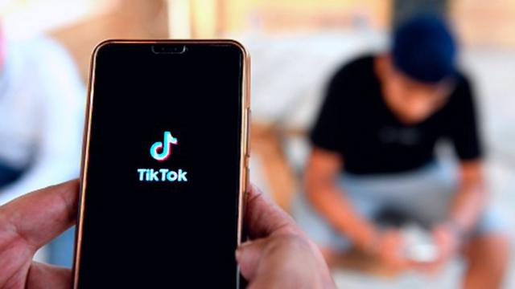
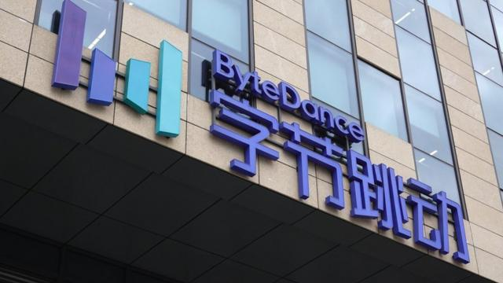

# [Business] TikTok美国面临下架 它是否对西方国家构成真正威胁？

#  TikTok美国面临下架 它是否对西方国家构成真正威胁？

  * 乔·提迪（Joe Tidy） 
  * BBC网络事务记者 

> 图像来源，  AFP

**中国就美国国会通过的一项法案进行了反击，该法案最终可能导致TikTok在美国被禁。**

相关法案也是美国多年以来对于中国公司开发的应用程序TikTok安全问题担忧的最新举措。

此前，许多西方国家的官员和政客都已被禁止在他们工作的手机上下载和安装TikTok。

所以，TikTok引发的最主要的网络安全担忧是什么？该公司又是如何回应的呢？

##  1.TikTok收集了“过量”的数据

**TikTok表示该应用程序收集的数据** **“** **符合行业惯例** **”** **。**

批评人士经常引用澳大利亚网络公司Internet 2.0的研究人员于2022年7月发布的一份 网络安全报告  作为证据，来批评TikTok收集了过多的数据。

该公司的研究员研究了TikTok的源代码并报告称其“收集了过量的数据”。分析人士表示，TikTok会收集位置、正在使用的具体设备以及上面有哪些其它应用程序等细节。

然而， Citizen Lab类似的测试  则认为，“TikTok会收集与其它热门的社交媒体平台相似的数据，以追踪用户行为。”

同样， 佐治亚理工学院去年的一份报告  指出：“关键的事实是，其他大多数社交媒体以及手机软件在做相同的事情（指收集用户数据）。”

##  2.TikTok可能被中国政府利用来监视用户

**TikTok表示，公司完全独立且** **“从未** **向中国政府提供过用户数据** **。** **即使被要求也不会”** **。**

即使隐私专家对此感到不满，但是大多数人都接受，提供大量隐私数据是我们与社交媒体之间达成的协议。

作为免费提供服务的交换条件，它们收集我们的信息，并利用这些信息在它们的平台上销售广告，或者将我们的数据卖给试图在其他网络平台上向我们推送广告的公司。

批评人士与TikTok之间的问题在于，TikTok是美国主流软件中最独特的，因为它由总部位于北京的科技巨头字节跳动拥有。Facebook，Instagram，Snapchat和Youtube这些平台收集相似的用户数据，但是它们都是由美国本土公司掌握的。

> 图像来源，  Getty Images
>
> 图像加注文字，字节跳动拥有TikTok和它的姐妹应用抖音。

多年来，美国立法者和世界上大多数国家一样，一直认为这些平台收集的数据不会被用于可能危及国家安全的负面用途。

特朗普在2020年发布的行政命令中称，TikTok的数据收集可能会让中国“追踪联邦雇员和承包商的位置，建立用于勒索的个人信息档案，并进行商业间谍活动”。

到目前为止，已有证据只能表明这是一种理论上的风险——但2017年中国通过的一项模棱两可的法条加剧了人们的担忧。

中国国家情报法第七条显示，任何组织和公民都应当依法“支持、协助和配合”国家情报工作。

这条法律经常被怀疑者引用，不只针对于TikTok，也针对于其它中国公司。

然而，佐治亚理工学院的研究人员认为这句话是断章取义的，并指出该法律还包括保护用户和私营公司权利的条款。

自2020年起，TikTok高层一再试图让人们放心，保证中国员工无法接触到非中国用户的数据。

但在2022年，字节跳动承认，其驻北京的几名员工确实访问了至少两名位于美国和英国的记者的数据，以跟踪他们的位置，并检查他们是否与涉嫌向媒体泄露信息的TikTok员工会面。

TikTok的发言人表示访问了这些数据的员工已经被公司解雇。

该公司坚称，用户数据从未存储在中国。公司正在德克萨斯和欧洲建造数据中心用以储存美国及欧盟公民的数据。

在欧盟，TikTok远比其它社交媒体公司做的更多。它建立了独立数据安全中心用以监管他们欧洲站点的所有用户数据。TikTok表示，“欧洲用户的数据在一个特别设计的环境中得到保护，只有经过严格独立监督和核查的批准员工才能访问。”

##  3.TikTok可能被用作“洗脑”工具

**TikTok对此援引其社区准则辩称，** **“** **禁止可能对我们的社区或更广泛的公众造成伤害的错误信息，包括参与** **协同性造假** **行为。** **”**

2022年11月，美国联邦调查局局长克里斯托弗·雷（Christopher Wray）告诉美国立法者：“中国政府可以……控制推荐算法，进而影响（软件）运行。”这种说法被重复了许多次。

TikTok的姐妹应用抖音(仅在中国可用)受到严格审查，据报道，它的设计目的是鼓励教育和有益身心健康的内容在年轻用户群中传播。这一事实进一步加剧了这些担忧。

在中国，所有社交网络都受到严格审查，大批网络警察会删除批评政府或引发政治动荡的内容。

> 图像来源，  Getty Images
>
> 图像加注文字，TikTok和抖音使用相同的格式和基础代码。

在TikTok崛起之初，这款应用出现了一些备受瞩目的审查案例：一名美国用户的账户因讨论北京对待新疆穆斯林的方式而被封号。在公众强烈反对后，TikTok道歉并恢复了该账户。

从那以后，除了所有平台都必须应对的那种有争议的审核决定外，几乎没有审查的案例。

Citizen Lab的研究人员曾进行过一组TikTok的比较实验。结果表明，TikTok并没有实施与抖音相同的政治审查。

研究人员在2021年表示：“该平台没有实施明显的审查。”

佐治亚理工学院的分析人员也搜索过台湾独立和有关中国主席习近平的笑话，并得出结论：“所有这些类别的视频都可以很容易地在TikTok上找到。它们很多都很受欢迎，并被广泛分享。”

##  理论风险

那么，总体上看，这是一种理论上的恐惧和风险。

批评人士认为，TikTok是一个“特洛伊木马”——尽管它看起来无害，但在冲突时期，它可能被证明是一个强大的武器。

该应用已经在2020年被印度禁止。同年，印度对数十个中国软件颁布禁令。

但美国对TikTok的禁令可能会对该平台产生巨大影响，因为美国的盟友通常会跟从此类决定。

这一点在美国成功地领导并阻止中国通讯巨头华为部署5G基础设施的呼吁时表现得十分明显——同样是基于理论风险。

当然，值得注意的是，这些风险是单向的。中国不必担心美国的应用程序，因为中国公民多年来一直被封锁。

