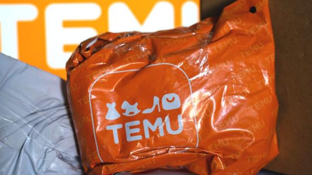
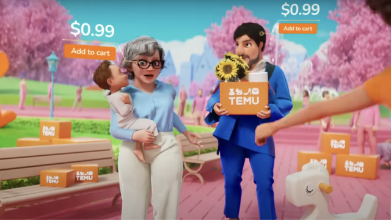
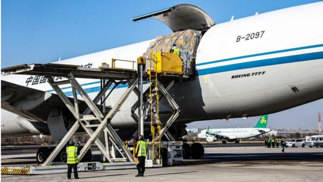
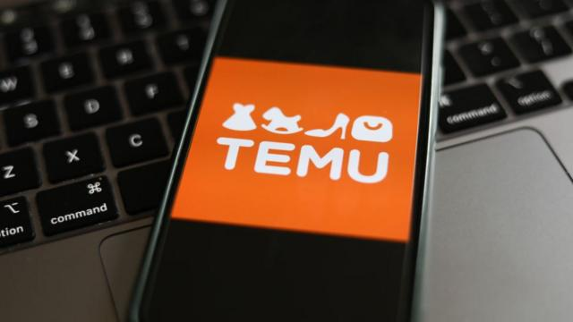

# [Business] 来自中国的电商平台Temu如何颠覆美国的网购世界

#  来自中国的电商平台Temu如何颠覆美国的网购世界

  * 萨姆·格鲁特（Sam Gruet） 
  * BBC商业和科技事务记者 

> 图像来源，  Getty Images
>
> 图像加注文字，今年有创纪录的1.23亿美国人收看了超级碗（Super Bowl）比赛。

**在这场全美最盛大的体育赛事中，除了精彩的中场表演和镜头多次切换到泰勒·斯威夫特（Taylor Swift）之外，很多人还看到了中国电商平台Temu的六个30秒广告。**

这家购物巨头受到了英美政界人士的批评——美国政府的一项调查称，Temu上销售的产品是用强迫劳动生产的，存在“极高的风险”。

Temu则表示，该平台“严格禁止”所有商家使用强迫劳动、刑罚劳动或童工制造的商品。

该电商平台销售从服装到电子产品和家具在内的所有商品，于2022年首次在美国推出，随后在英国和世界其他地区推出。

根据市场分析机构SimilarWeb收集的数据，从那以后，该电商平台一直在全球应用程序下载排行榜上名列前茅，每月有近1.52亿美国人使用它。

零售分析师尼尔·桑德斯（Neil Saunders）说，它是“打了兴奋剂的亚马逊（Amazon）”。凭借“像亿万富翁一样购物”的口号，它已在全球49个国家掀起购物旋风。

> 图像来源，  Temu
>
> 图像加注文字，SimilarWeb的数据显示，Temu在2023年的广告支出接近17亿美元。

一个标准的30秒超级碗广告成本约为700万美元（550万英镑），在今年的比赛中，Temu有六个这样的广告。

Skip podcast promotion and continue reading

* BBC 時事一周 Newsweek (Cantonese)   **

BBC國際台粵語節目，重溫一周國際大事，兩岸四地消息，英國境況。並備有專題環節：〈記者來鴻〉、〈英國生活點滴〉和〈華人談天下〉。

分集

End of podcast promotion

“对于一个很短的广告来说，这是一笔不小的开支。”桑德斯说。

“但有很多人看到了这个广告，我们知道在这个广告之后，Temu的下载量激增。”桑德斯说。

SimilarWeb的数据显示，美国超级碗比赛当天，该平台的全球个人访问量比上周日增加了近四分之一，有820万人浏览了该网站和应用程序。同期，亚马逊（Amazon）和易贝（Ebay）的访问量分别下降了5%和2%。

“他们还在微营销上花了很多钱，说服网红通过TikTok和YouTube等社交渠道推广产品，并建议在该平台上购买东西。”桑德斯说。

SimilarWeb的电子商务专家伊内斯·杜兰德（Ines Durand）认为，这些网红通常只拥有不到一万名粉丝。

“微网红拥有强大的社区，因此他们的背书意味着对这些产品的强烈信任。”她解释说。

中国市场研究集团（China Market Research Group）创始人雷小山（Shaun Rein）认为，Temu由中国巨头“拼多多”拥有，而拼多多是“中国电子商务的怪物”。

“在整个中国，每个人都在拼多多上购物，从扬声器、T恤衫到袜子。”他说。

该公司一直在与竞争对手阿里巴巴争夺美股市值最大的中概股榜首之位。拼多多目前的市值略低于1500亿美元（1170亿英镑）。

在让中国消费者欲罢不能后，拼多多借助Temu向海外扩张，并采用了确保其之前成功的相同模式。据居住在上海的雷小山说，这家公司已经成为自豪感和爱国主义的重要来源。

“他们为中国公司能够击败亚马逊等美国电子商务巨头而感到自豪。”他补充说。

快速浏览一下Temu的应用程序或网站，你会看到从钢头运动鞋到帮助老年人和孕妇穿袜子的设备等各种产品。雷小山解释说，这是一个制成品的大杂烩，几乎全部在中国的工厂生产。

“Temu使用的是一个惊人的系统，它依赖于大规模的数据收集。”伊内斯·杜兰德说。

“他们收集有关消费趋势、搜索和点击次数最多的产品的数据，并将这些数据提供给各个制造商。”

杜兰德说，亚马逊以高价向制造商出售这些数据，而Temu则免费向生产商提供。生产商可以利用这些信息以相对少量的产品“试探市场”。

杜兰德称，该平台还经常使用人工智能（AI）生成的图片来跟上最新的趋势，因此在售的产品可能还不存在。然后通过航空进行运输。

“这意味着产品无需储存。一旦用飞机运送，就不需要再去仓库，而是直接送到客户手中。”杜兰德说。

> 图像来源，  Getty Images
>
> 图像加注文字，Temu从中国的工厂直接发货给客户。

美国国会的一份报告显示，在通过被称为“最低免税限额”的运输漏洞进入美国的商品中，有三分之一的包裹来自Temu及其竞争对手“Shein”（希音）。

包括英国和美国在内的许多国家都设有不需要缴纳关税和进行正式报关的最低限额，旨在帮助民众方便接收商品。

因此，由于Temu的产品直接从工厂车间发货，省去了中间商，基本上可以免税。

不过，全球货运公司“独特物流”（Unique Logistics）的首席运营官米奇·迪亚兹（Mickey Diaz）认为，当局可能将出台更多监管措施，以堵住运输漏洞。

“英国已经开始对Temu进行严格审查，包括出售原本不允许进入英国的武器，这些武器正是由于这些漏洞而进口的。”她解释说。

Temu的供应链也受到了批评，英国和美国的政界人士指责这家电子商务巨头允许经强迫劳动生产的商品在其网站上销售。

去年，英国外交事务特别委员会主席、议员艾丽西亚·卡恩斯（Alicia Kearns）告诉BBC，她希望对该网络市场进行更严格的审查，以确保“消费者不会在无意中助长对维吾尔族的种族灭绝”。

Temu表示，它“严格禁止”所有商家使用强迫劳动、刑罚劳动或童工制造的商品。

> 图像来源，  Getty Images
>
> 图像加注文字，Temu是拼多多控股的子公司。它在应用商店的应用详情页显示意为“Team Up，Price Down”（即买的人越多，价格越低）。

Temu告诉BBC，任何与其合作的商家都必须“遵守所有监管标准和合规要求”。

“Temu的商家、供应商和其他第三方必须按时向员工和承包商支付工资，并遵守当地所有适用的工资和工时法律。”

“我们的现行标准和做法与其他受消费者信赖的大型电商平台没有区别，这方面的指控是完全没有根据的。”该公司的发言人补充说。

尽管存在争议，但分析人士预计Temu将进一步扩张。

零售业分析师尼尔·桑德斯预测说：“我们可能会看到一些团队开始进一步完善其产品，也许会推出一些价格稍高的产品。”

雷小山认为，Temu的战略重点将放在抢占更大的市场份额上。

“未来两三年，他们的战略只是要提高品牌知名度和市场份额。他们不在乎利润。”

“这正是拼多多在中国推广初期时做的事。他们给出了令人难以置信的低价优惠，只是为抢占市场份额。”

