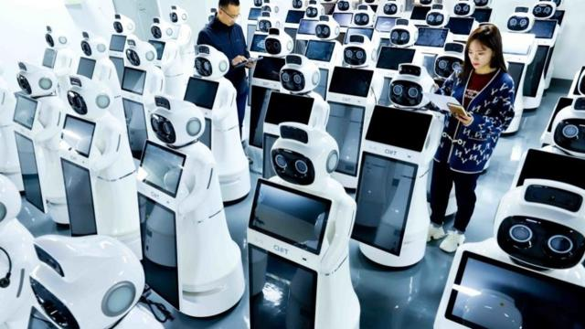
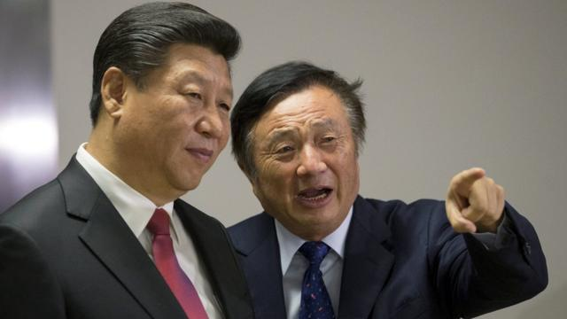

# [Business] 习近平的新词“新质生产力”：这是“新瓶装旧酒”还是新方向

#  习近平的新词“新质生产力”：这是“新瓶装旧酒”还是新方向

> 图像来源，  Getty Image
>
> 图像加注文字，2022年全球服务机器人销售额预计达到217亿美元，年增长率26.2%达到过去四年的增长峰值。 其中，中国市场规模为65亿美元，占比超过1/4。 在过去一年，服务机器人企业的数量增长至10.5万家，七年间增长超15倍。

**“新质生产力”第一次由中国国家主席习近平提出后，经过官媒的推波助澜，成为中国当前的热门词汇。**

在经济增长放缓的当下，这个新词汇只是“新瓶装旧酒”，还是能帮助中国经济谋求更新的发展动力？

##  怎么来的？

去年9月，习近平在在黑龙江省考察调研期间的一个座谈会上 首次提到“新质生产力”  。

他当时表示，积极培育新能源、新材料、先进制造、电子信息等战略性新兴产业，积极培育未来产业，加快形成新质生产力，增强发展新动能。

此后，在中央经济工作会议，以及中共中央政治局第十一次集体学习，都提到“新质生产力”，但未引起舆论的广泛关注。

直到今年3月份“两会”，政府工作报告中，“加快发展新质生产力”成为今年十大任务之首，而后习近平参加江苏代表团审议时再次提及。

由此这个词在中国官方媒体的助推下，引起广泛关注和讨论。新华社的英文版网站，还将 新质生产力翻译为“New quality productive forces”，并纳入“习词典”（Xictionary）  。

> 图像来源，  Reuters
>
> 图像加注文字，习近平在2015年访问英国时，任正非陪同参观里华为在伦敦的办公室（资料照片）。

##  官媒助推

与中共此前的造概念的过程类似，一般是领导人提出概念后，各个官媒一拥而上，对新概念进行阐释和宣传，比如“双循环”、“共同富裕”以及更早的“供给侧改革”。

此次也不例外。去年9月首次提出后，新华社发文阐释称，从经济学角度看，新质生产力代表一种生产力的跃迁。它是科技创新在其中发挥主导作用的生产力，高效能、高质量，区别于依靠大量资源投入、高度消耗资源能源的生产力发展方式，是摆脱了传统增长路径、符合高质量发展要求的生产力。

今年2月，《人民日报》也发文称，新质生产力以全要素生产率大幅提升为核心标志，发展新质生产力必须加强科技创新特别是原创性、颠覆性科技创新，加快实现高水平科技自立自强。

甚至位于香港的官媒《大公报》也发文称，“发展新质生产力，香港有条件当排头兵”。

但很快，也有声音来泼冷水，中国的《经济日报》发文警告，“发展新质生产力要防止一哄而上”，倘若忽视产业发展规律，盲目跟风追热，只会欲速则不达，导致新的重复建设、产能过剩等问题，对地方经济社会发展产生消极影响。

> 图像来源，  Getty Image
>
> 图像加注文字，一个男孩在体验VR（虚拟现实）技术。

##  外界反应

“发展新质生产力并不是要大家都要去投光伏和新能源汽车”，瑞银亚洲经济研究主管、首席中国经济学家汪涛表示，这可能是对新质生产力的误解，以为全部去发展新兴产业，但实际上这里包括传统行业的升级，包含任何能提高全要素生产力的行业，所以从全要素生产力的角度来说，它其实是资源的更优配置，包括劳动、资本、土地、原料、科技人才。

汪涛举例，汽车并不是一个新的行业，但是汽车行业的创新，也可以使这个行业有极大发展，总体来说就是强调了对各个行业的数字化、改造升级，这些行业也有很多投资和发展的空间，

对于当前的中国而言，困难较大。ING银行大中华区首席经济师宋林向BBC中文表示，从大的方面来看，中国经济增长奇迹背后的旧有增长引擎，包括全球化、城市化、工业化、人口红利和债务推动型增长，都在不同程度地减弱。

“因此，必须寻找新的增长动力，这也是两会关注的重点领域。绿色经济、数字经济和创新是长期的战略方向。”

宋林同时指出其中的局限性，但新的增长动力，还无法填补旧经济增长放缓的空白。与房地产和基础设施投资等旧经济驱动力不同，新经济发展的成果往往集中在少数人手中，而旧经济驱动力的特点是供应链长、养活的人多。

> 图像来源，  Getty Image
>
> 图像加注文字，一位记者在报道习近平的著作。

##  生产力与制度变迁

值得一提的是，国家信息中心高级经济师于凤霞近期在一篇关于新质生产力的文章中深入阐述，“新质生产力的出现，不仅意味着生产力、社会经济层面的变迁，还意味着生产关系、社会制度层面的深刻变革。”

她进一步阐释称：

  * 一方面，技术之所以能够引发生产力变革，在于它对生产要素与劳动过程的改造，并构建起新的生产方式； 
  * 另一方面，社会生产关系和社会制度也会反作用于生产力的发展，与生产力发展水平相适应的生产关系和社会制度，可以成为技术创新应用和社会生产力水平快速提升的“加速器”； 
  * 反之，则可能成为新技术应用和生产力发展的“桎梏”。技术创新与社会制度变革之间也会相互影响、相互作用，推动社会不断向前发展。 

中国前总理温家宝在其任内最后一次记者会上也有类似阐述，他当时称，“我深知，解决这些问题，不仅要进行经济体制改革，而且要进行政治体制改革，特别是党和国家领导制度的改革......现在改革到了攻坚阶段，没有政治体制改革的成功，经济体制改革不可能进行到底，已经取得的成果还有可能得而复失，社会上新产生的问题，也不能从根本上得到解决，文化大革命这样的历史悲剧还有可能重新发生。”

这些铺垫，使外界对迟迟未见踪影的三中全会，更受瞩目。

按照中共党章，全会每年至少召开一次。中国在改革开放后，逐渐形成政治传统，每次党代会后要进行七次中央委员会全体会议，每次全会也有不同的任务。其中，历届“三中全会”往往聚焦经济问题，重大经济改革措施经常在此时出台，因此较受关注。

但三中全会迟迟未开，有声音认为，可能是在对秦刚、李尚福等前高官等的处理上需要更多时间；也有声音认为，是在酝酿更为大幅的改革方案，“新质生产力”即为其中之一。

