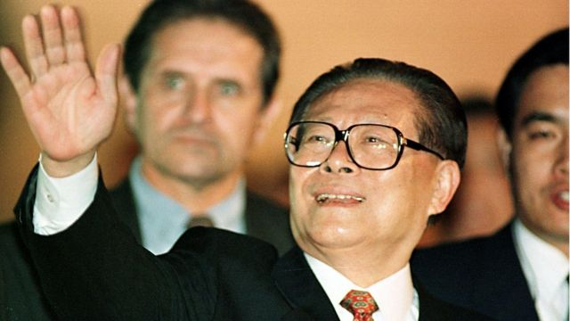
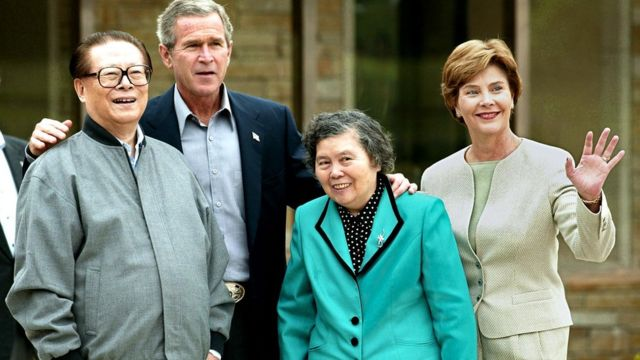
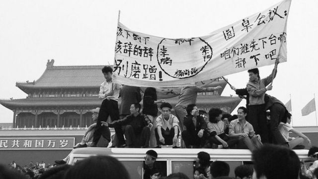
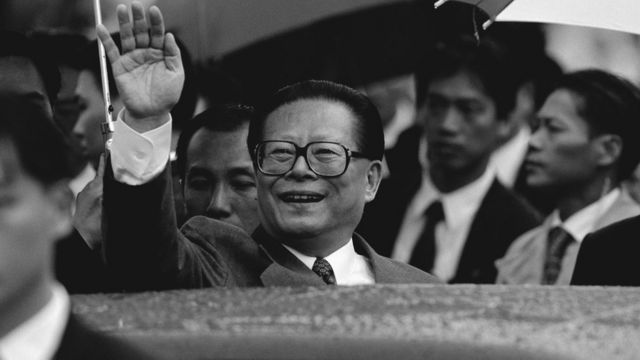
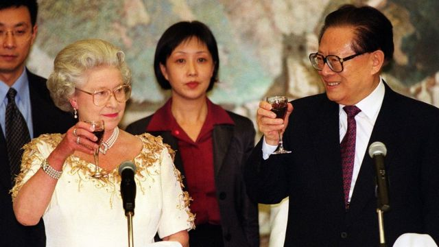
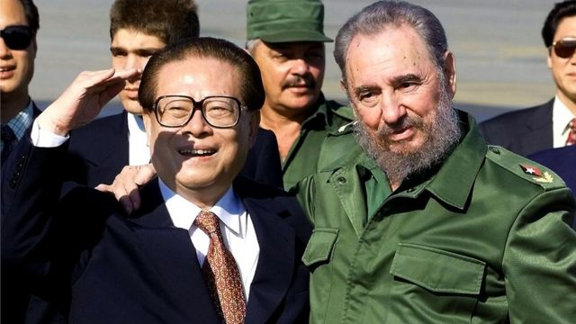
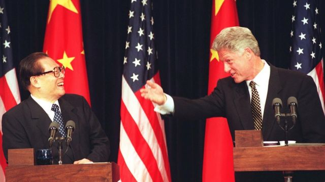
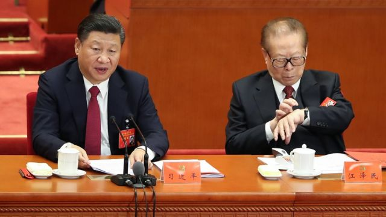

# [Chinese] 江泽民逝世：站上中国权力最高峰的红色工程师，享年96岁

#  江泽民逝世：站上中国权力最高峰的红色工程师，享年96岁

> 图像来源，  Getty Images

**中国前国家主席江泽民因患白血病合并多个内脏器官功能衰竭，抢救无效，2022年11月30日12时13分在上海去世，享年96岁。**

中国官方媒体新华社在11月30日公布了江泽民去世的消息。自不再担任公职以来，他的健康状况一直是公众关注的焦点，屡屡有关于他病重、病危甚至去世的消息传出，而他每一次公开露面时的状态也会被媒体及公众仔细审视。

在10月举行的中共第二十次全国代表大会，江泽民并没有如过往数届般露面，当时已再度引起外界关注他的健康状况。

他生前是除习近平外当今中国最重要的政治人物。1989年邓小平以他来代替“六四”事件中被迫下台的中共总书记赵紫阳之后，在他治下中共不断加强对权力的控制，而工程师出身的他也逐渐拥有了左右中国政局的能力。即便他在2004年已卸下官职，但影响力仍绝对不容小觑。

虽然每位中国领袖都有自己的风格，但江泽民绝对是其中独特的一人。他个性十足，掌握英语、俄语等多门语言，乐于炫耀自己的音乐造诣，也不介意偶尔袒露“真性情”。他曾在访问美国时自信唱起京剧、弹奏吉他，与知名美国记者用英文“谈笑风生”，也曾勃然面斥香港记者“太天真”。

作为中国领导人，他指导中国走过了一系列具有历史意义的重大变化。在位期间中国从一个落后的国家转变为世界上经济增长速度最快的国家，同西方的关系也大为改善。

他推动中美关系走出“天安门”镇压后的低潮，带领中国加入世界贸易组织，深化市场改革，开启了“中国速度”的经济腾飞，见证了香港与澳门的主权自西方国家移交至中共政府。

江泽民主要是一位改良者，而非改革者，他的主要目标是通过一系列的经济改革确保中国共产党未来的前途。他的批评者认为，他只注重经济发展，忽视政治改革，且过于注重个人形象。在他任内，他加强了中共政权对军队的控制，铁腕镇压法轮功，对台湾立场强硬。

江泽民最近一次在公众前亮相是在 2019年10月中共建政70周年阅兵仪式上  ，当时他看上去已经有些虚弱。当天在两人的搀扶下与习近平、胡锦涛一同缓缓走到天安门城楼二层的前排就位。在数十分钟的活动过程中，他大都戴着墨镜，坐在为他专门设置的椅子上，与从楼下走过的受阅部队及游行群众几乎没有互动。当抬着他的大幅肖像及象征他政治思想的“三个代表”标语方阵走过时，他也未做任何反应。

这距离他登上中共第三代领导集体的核心位置正好30年。1989年夏天，中共派出军队镇压在天安门广场聚集的请愿学生，力主政治改良的时任中共总书记赵紫阳因反对邓小平的指示被迫下台，而当时担任上海市委书记的江泽民则被邓小平选中，一跃成为中国共产党名义上的最高领导人。

之后的三十年间，他从一个不被外界看好的过渡总书记，一步步逐渐掌握了军事、政治、人事等各项权力，成为邓小平逝世后中国最有权力的人。

> 图像来源，  Getty Images
>
> 图像加注文字，江泽民夫妇与美国前总统小布什夫妇。

##  从工程师到权力之巅

1926年，江泽民出生于中华民国政府管制下的江苏扬州。13岁时，他的叔父、中共地下党员江上青遭逢意外去世，膝下无子，江泽民的父亲将他过继给江上青遗孀吴月卿。无独有偶，1946年，在国民党与共产党在中国大陆交战之际，就读于上海交通大学电机工程系的江泽民也选择加入中国共产党。

参加工作后的初期，江泽民有很长一段时间在国外生活，曾在莫斯科的一所汽车制造厂受训，以及在罗马尼亚从事外交工作。在受到江泽民认可的传记《他改变了中国——江泽民传》中，作者罗伯特·劳伦斯·库恩称，江泽民的国际视野在这一时期开始形成。

在他接任中共中央最高职位之前，他从未有过处理全国事务的经历。上世纪80年代，江泽民成为中国电子工业部长，随后升任中共上海市委书记。无论是担任技术官僚还是主政上海期间，江泽民的工作均未引起过太多注意，他自己也没有显露更多在政治野心。在《江泽民传》中，江泽民好友沈永年透露江曾计划退休后回到母校上海交大担任教授职位，回归学界。

而推动他进入权力中心的，是中共历史上的重要转折点——“六四”事件。正当在北京的中国领导人为如何处理学生示威者占领天安门广场而商讨对策之际，江泽民已经在上海平息了类似的抗议。

> 图像来源，  NEW CENTURY PRESS HONG KONG
>
> 图像加注文字，正当在北京的中国领导人为如何处理学生示威者占领天安门广场而商讨对策之际，江泽民已经在上海平息了类似的抗议。

他关闭了一家他认为会煽动抗议的报纸，并且在对学生发表讲话时用英文背诵（美国前总统）林肯的葛底斯堡演说（又译盖茨堡演说），令学生们感到惊讶。这种在不动用武力的情况下平息示威的处理手法，给当时的中国最高领导人邓小平留下了深刻印象。

“六四”镇压后，邓小平处在中共内部的派系争斗中，最终，他选择同强硬派站在一起，清洗了自由派，并任命江泽民为党的总书记，事实上确定了他的接班人地位。

“苟利国家生死以，岂因祸福避趋之，”据称，江泽民在接受这项改变他一生的人事安排时，说下了这样的话。

> 图像来源，  Getty Images

上任伊始，外界对他的政治生涯前景并不看好。上海的一些人把他称为“花瓶”，花架子太多，没实际内容。许多人认为他仅仅是一个过渡性人物。

还有一些中国问题观察家对他评头品足，出言刻薄。他的大眼镜、执拗的性格、以及把裤子几乎提到胸前的独特装束，都成为关注的焦点。许多人试图把他描绘成一个呆板的官僚。

但是江泽民证明，他们都错了。

##  重视经济改革

担任中共中央总书记后，中共党内派系斗争仍未停止。以中共元老陈云为首的保守派主张走计划经济路线，与支持进行市场经济改革的邓小平之间一直就中国以后改革开放与经济建设的路线存在分歧。“局外人”江泽民在两派之间摇摆不定，甚至一度趋于保守。

他全面改革宣传机器，向全国人民传递出自己的信息，那就是，争取更大民主的运动将不会得到容忍。

邓小平此时担心改革的步子放缓甚至停滞，开始对江泽民的执政方式表示疑虑。1992年，邓小平南巡中一边参观一边表态，走到珠海召开了一个由两位军委副主席参加的军事会议，会议上，邓没谈军事，反而强调“谁不改革，谁就下台”，向江泽民施压。

感受到这股压力的江泽民决定全面支持新的经济改革政策。此后在中国，中央控制的社会主义计划经济不复存在，中国开始实施在政府严格控制下的市场经济改革。

> 图像来源，  Getty Images
>
> 图像加注文字，江泽民与英国女王伊丽莎白二世。

中国政治学者吴强认为，从江泽民政治生涯的记录来看，他有明显的“投机主义者”的色彩。他认为，江泽民作为一名技术官僚出身的领导人，并不是中共元老所认为的“自己人”，因此只是在为政权做“守门人”。

1993年，江泽民正式就任中国国家主席，成为集中共中央总书记、国家主席和中央军委主席三项最高职务于一身中国领导人。

到1997年2月邓小平去世时，江泽民已有足够的时间站稳脚跟，并且在许多重要的岗位上安插了来自上海的亲信，其中包括日后成为中国政府总理的朱镕基与最高官至国家副主席的曾庆红等人，从而拥有更多政策决定权与主导权。

在江泽民担任上海市委书记时，朱镕基曾担任上海市长。二人在位时期，经济改革成为江泽民时代中国最大的成就之一。中国经济几乎所有领域都推行改革——改革国企、放松汇率管制、放开房地产市场、实施分税制、加入世贸组织。中国整体上往市场经济的方向迈了一大步，也由此开启了中国历史上发展速度最高的二十年。

> 图像来源，  Getty Images
>
> 图像加注文字，江泽民与朱镕基

##  政治遗产薄弱

在坐稳中国最高领导人的位置后，江泽民也开始塑造自己的威信与权威，试图追随毛泽东与邓小平的步伐，建立个人崇拜，确保他在党内的地位不会受到他人的挑战与冲击。

“六四”之后，一些保守派元老在军队内保有重要影响力。江泽民毫无军方背景，但伴随这些元老逐渐退出历史舞台，他慢慢掌握了对军队的控制。他还提出，禁止部队人员经商。

> 图像来源，  Getty Images
>
> 图像加注文字，1989年夏天，中共派出军队镇压在天安门广场聚集的请愿学生。

他曾强调，“党对军队的绝对领导是我军永远不变的军魂，要毫不动摇地坚持党领导人民军队的根本原则和制度”。

与他的前任一样，他也试图在意识形态领域提炼出自己的理论思想，作为自己的政治遗产。他进一步发展共产党的理论，提出“三个代表”思想，即“中国共产党要始终代表中国先进社会生产力的发展要求，始终代表中国先进文化的前进方向，始终代表中国最广大人民的根本利益”。这在之后写入《中国共产党章程》和《中华人民共和国宪法》。

吴强认为，江泽民的“三个代表”思想没有摆脱他技术官僚的局限性，没有从理论层面上有突破性的升华提高，作为政治遗产显得十分薄弱。

与此同时，他也以铁腕镇压国内异议人士，打压法轮功组织。对台湾持强硬立场，导致第三次台海危机爆发。批评者也认为，他无意推动中国的政治体制改革，使得中共不断走向专制。

其中，打击法轮功给他的人权记录留下了极有争议的记录。法轮功为李洪志提出的一种气功修炼法，于上世纪90年代中后期在中国迅速兴起，吸引了数千万人加入该组织，也逐渐引起中共注意。1996年，中共宣传机器《光明日报》称法轮功为“封建迷信”，引发中国各地法轮功学员不满，他们开始不时针对批评法轮功的机构开始示威抗议。1999年4月，一万名法轮功成员在北京中南海前举行和平示威，抗议当局拘捕他们几名领袖。自此，中国开始大规模镇压法轮功活动，将法轮功定性为邪教。官方媒体也将法轮功组织描述为宣扬谬见、误导群众及危害社会稳定的组织。但法轮功成员坚称，他们是个奉公守法的和平组织，通过静坐和练习气功强身健体。

法轮功成员众多，且深入中国社会不同阶层，无疑会给十年前刚经历过“天安门”事件的中共政权感受到威胁。而对法轮功的取缔也十分全面，涉及中国各个角落。自1999年至2000年的一年间，有数百万学员受禁令影响退出组织，超过3万名法轮功学员遭逮捕。中国当局对法轮功的打压一直持续到今天。

> 图像来源，  Getty Images
>
> 图像加注文字，江泽民与卡斯特罗

##  打开外交局面

江泽民在确保自己国内的稳定地位之后，试图提升中国在国际上的形象，且十分乐于利用自己的知识与背景吸引国际社会的注意。

“六四”后，中国面临以美国为首的西方世界的制裁与封锁，但修复中美关系对于中国改革开放至关重要。

他曾多次提到对美关系的原则，即“增加信任、减少麻烦、发展合作、不搞对抗”，并于在任期间多次访问美国，促使中国加入世界贸易组织，深化了中国融入世界经济的进程。

> 图像来源，  Getty Images
>
> 图像加注文字，在他的一系列出访中，他凭借强烈的个人风格给人们留下深刻的印象。图为江泽民与美国前总统克林顿共同出席记者会。

江泽民时期，中美关系虽也经历几次惊险摩擦，但总能平静收场。

1995年，时任台湾总统李登辉访问美国，成为台美断交17年以来首位访美的台湾最高层官员。作为回应，当年解放军于台湾海峡连续数月进行军事演习，发射导弹，引发台海危机，在美国指派两艘航空母舰通过台湾海峡后，局势稳定下来。

1999年，在以美国为首的北约组织轰炸南联盟的行动中，五颗GPS制导炸弹击中了中国大使馆，导致三人死亡，至少20人受伤，中国北京、上海等主要城市随后爆发针对美国的大规模示威，当时正值中国准备加入世贸组织之际，江泽民对这种爱国示威表示支持，但要求各级干部注意避免出现过激行为，使得局面没有失控。最终没有美国人在抗议活动中死亡，双方的赔偿协议使北京得以暂时搁置此事。

在他的一系列出访中，他凭借强烈的个人风格给人们留下深刻的印象。比如在1996年对菲律宾进行国事访问时，在菲律宾总统拉莫斯的游艇上，两位领导人共同演唱了猫王的歌曲《温柔地爱着我》，还伴随音乐翩翩起舞。

他曾在访问美国时自信唱起京剧、弹奏吉他，与采访过邓小平的美国记者华莱士用英文“谈笑风生”。

他也曾罕有地公开发怒。2000年，香港有线电视女记者张宝华在记者会上就行政长官董建华连任问题，问江泽民“中央是否钦点”了，江生气地斥责了张宝华。指责过程中，江自称“作为一名长者”，“有必要告诉你们一点人生的经验”，指责香港记者毕竟“too young（太年轻）”，问来问去的问题都“too simple, sometimes naive（太简单，有时天真）”。

张宝华向BBC中文回忆，看到他表情的一刻，已经知道他是“真的生气了”。而她认为，从这一点可以看出，江泽民是一个“真性情”的领导人。“领导人一般来说他们面对镜头要有很端庄的样子，但是他很真性情，就是你发脾气的时候是什么样子那个时候就是什么样子。”

“比起几代领导人，江泽民的个人色彩特别强，一来是因为他自己的性格，另外一方面是他真的掌权。如果你掌权，说句话都大声一点，” 张宝华称。

> 图像来源，  Getty Images
>
> 图像加注文字，在习近平时代，年迈的江泽民愈加低调。图为2017年在中共“十九大”上，江泽民在习近平发表长篇讲话时看表。

##  在习近平时代受网络追捧

从2002年开始，江泽民开始将权力移交给继任者胡锦涛。他先是把中共总书记的职位交给胡锦涛，随后胡锦涛在2003年接任国家主席。
 2004年9月  ，江泽民交出他的最后一个重要职位，也就是掌管军队的中央军事委员会主席职位。

从此他全面退出核心政治舞台，很少公开露面，但外界普遍认为，即便在胡锦涛时代江泽民仍是幕后操控中国政局的绝对人物。

在习近平时代，伴随习近平的铁腕与集权手段不断加强，年迈的江泽民也愈加低调。但在网络世界上，他却成为一个新的文化现象的象征——“膜蛤文化”。他的粗边方片大眼睛、腰带提到肚脐以上、以及大肚腩的外貌特点曾被批评者嘲讽为“蛤蟆”，但在中国年轻人中间，却引发“膜蛤”现象。这群年轻人自称“蛤粉”或“魔法师”，他们喜欢转发江泽民的经典语录，以及使用他的表情包。

年约30岁的“魔法师”小曾在江泽民在位时年纪尚小，对作为领导人的他没有太多记忆，但他向BBC中文表示，他之所以会对江泽民感兴趣并不是因为对江泽民的喜爱，而是出于对中国现状的叛逆。“中国后面的领导人形象比较太正了，不苟言笑的。再加上中国后面的文化氛围趋向更加保守，以前那个文化开放比较的时代已经不再了”。

他认为，江泽民去世后，这种网络文化并不会消失。“在中国很长一段时间，暂时不会出现第二个网红领导人了。他就像特朗普一样，是一个流量明星。但是中国不会再有这种政治人物了。”

