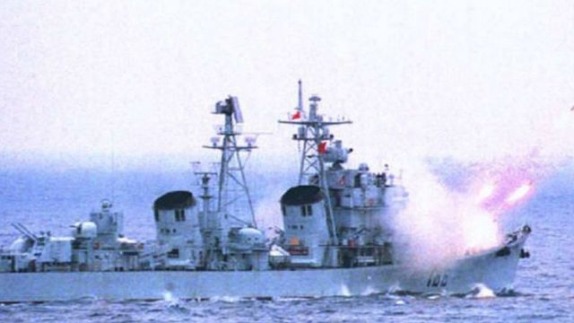
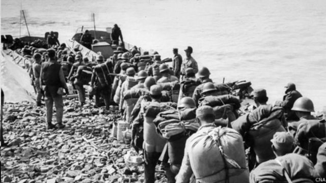
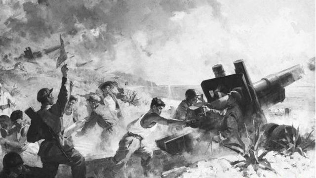
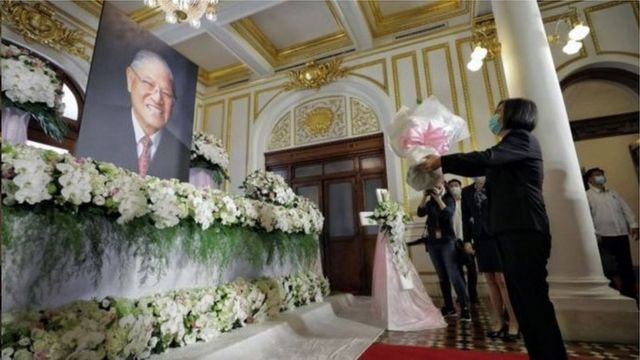

# 中美台关系：回顾历史上的三次台海危机

#  台湾海峡历次危机回顾：从一江山岛战役、金门炮战到飞弹危机 看中美台三角关系演绎

2020年8月26日

最近更新： 2022年8月4日

> 图像来源，  Getty Images
>
> 图像加注文字，1996年台湾总统大选后中国驱逐舰在南海军事演习中发射导弹

**美国众议长佩洛西（裴洛西）访问台湾之后，中国宣布，环绕台湾展开为期四天的实弹演习。**

两岸、美中关系再度紧张，已有观察人士提出“第四次台海危机”的说法。BBC中文梳理历史上三次台湾海峡危机的起因、过程、背景及其对美中台三角关系的影响。

1940年代中末期，中国爆发第二次国共内战，大陆亦称解放战争。

这次战争成为中国现代史上的一个重大转折点。1949年，国民党败退台北，中共在北京建立政权。从此，台湾海峡成为一道鸿沟，两岸形成政治分立与军事对峙。

延续半个多世纪，分立与对峙迄今依然没有结束。

国共双方从未签署停战、和平协议。理论上讲，大陆与台湾仍然处于战争状态。过去几十年，台湾海峡曾多次燃起硝烟，最严重时，两岸兵戎相见。若台湾的坚定盟友、超级大国美国介入，海峡战火有可能延烧为全面战争。

这就是通常所说的“台湾海峡危机”（简称台海危机）。一般认为，国共战争结束后，曾发生过三次台海危机。

##  第一次台海危机

**时间：** 1954年9月3日至1955年5月

**战事：** 九三炮战、一江山岛战役和大陈岛撤退

1954年9月3日下午，中国人民解放军数百门火炮向大小金门岛的国民党军阵地和停泊在金门港内的舰艇发动强大轰炸。九三炮战一直持续到9月22日。这是1949年后中国第一次“炮击金门”，引发第一起台海危机。

一江山位于台州列岛上下大陈岛以北，1955年1月18日，中国人民解放军发动攻势，经过激战，在19日拿下这座小岛。一江山被攻陷之后，蒋介石终于决定放弃台州列岛，但坚持将大陈岛的居民全部转移到台湾。1955年2月，在美国第七舰队的支援下，大陈岛军民撤退，当时蒋介石还派遣蒋经国多次前往大陈岛与居民沟通，并且和大陈军民一起撤离。

3天后，解放军控制了整个台州列岛。

> 图像来源，  CNA
>
> 图像加注文字，国民政府撤出大陈岛

**背景** **：** 国共内战大规模战事结束后，双方隔着海峡继续厉兵秣马，中国要“解放台湾”、台湾要“光复神州”，海峡战事看似一触即发。但是，1950年朝鲜战争的爆发改变了局面。

当时，美国派遣第七舰队进入台湾海峡，防止朝鲜半岛的冲突向南发展。第七舰队的露面激怒了中共，中共将准备进攻台湾的军队转调朝鲜战场，海峡战事推迟，直到朝鲜战争结束、第七舰队撤离。

之后，美国政府开始着力加固与台湾中华民国政府的盟友关系。1954年牵头创建东南亚公约组织，旨在推动地区团结、遏制所谓的共产主义威胁。此外，美国还开始公开探讨和蒋介石政府签订共同防御条约。中共将此视为对国家安全的极大威胁。为巩固在台湾海峡的战略地位，1954年9月对金门发动炮击，此后夺回对一江山岛、大陈岛的控制。

**影响：** 这次战事规模虽然不大，但是却给中美台关系带来深远影响。它间接促成了1954年12月美国和台湾签订《共同防御条约》，美台军事同盟从此成形。对台湾来说，失去台湾列岛，国军无异于丢掉了“反攻大陆”的跳板。对中国来说，另外一个巨大的影响是，危机中面临美国核威慑，推动中国领导人下定决心，发展自己的核武器。

##  第二次台海危机

**时间：** 1958年8月23日至1959年1月7日

**战事：** “八二三炮战”，大陆称为“炮击金门”。

金门，这个与福建厦门隔海相望的小岛，曾经被台湾军队视为“反攻大陆的跳板”、抵抗解放军的“海上长城”。1958年8月23日，中国解放军各式火炮日夜不停的开火，金门岛遭受军事战争史上最密集的炮轰，单单150平方公里的金门岛，就受到47万发炮弹轰击。金门成为中华民国现有领土中唯一受到共产党军队猛烈攻击的地方。

炮战初期，解放军集中打击岛上军事目标，后期重点封锁海运线，围困金门。直到10月5日，中共国防部长彭德怀发表《告台湾同胞书》，表示基于“人道立场”不再炮击金门。此后，解放军开始对金门“单打双不打”，意即单数日打飞弹，双数日停止。直到1979年大陆与美国建交，时任中共国防部长徐向前才宣布正式停止对金门炮击。

> 图像来源，  Xinhua
>
> 图像加注文字，《炮击金门》是在大陆广泛流传的一幅油画

**背景** **：** 美国同台湾签署了《共同防御条约》，但条约的规定是协防台澎，金马（金门、马祖）不包括在内。对于金马，美国国会决定授权美国总统临时作决定。一种观点是，中国想借“炮击金门”向国际社会、特别是向美国表明中国人民解放台湾的立场和决心，同时测试美国协防台湾外岛的意向。中国史学界广泛认可的一种说法是，炮击金门不求杀伤和占领，政治意义高于军事意义。

“八二三炮战”发生后，美国没有直接参战，但是第七舰队协助台湾军队突破封锁，美国支持的大口径巨炮也起到了了扭转战况效果。美国空军还从关岛和日本向金门运送军用和民用物资解围。

**影响：** 金门炮战既没有让蒋介石趁机反攻大陆，也没有使毛泽东顺势解放台湾，一个原因是美国不希望战火扩大。这是国共双方陆海空军迄今最后一次兵戎相见，对两岸关系的走向、中美台三角互动有着决定性影响。此后，台海形势由军事对抗转为冷战性对峙，国共对抗的主要战场转移到国际政治舞台。

中国说，金门炮战后，海峡两岸领导人在一个中国的共同基础上都调整了政策；台湾军队未从金门撤出，挫败了美国“划峡而治”的阴谋。台湾流传的一种观点是，“八二三炮战”后，武力反攻大陆几无可能，台湾政府转而积极促进对自由民主的追求。从这种意义上看，“八二三炮战”是一场重要的“台湾保卫战”，此后台海进入长期和平，维持两岸分治，台湾才得以享受今日的民主与自由。

##  第三次台海危机

**时间：** 1995年到1996年

**战事：** 又称台湾海峡导弹危机、台湾海峡飞弹危机。“战事”共分两波。

1995年，李登辉以台湾总统身份首次访美，北京方面做出强烈反应，在台湾海峡和台湾周围试射导弹、实弹演习，这是第一波。1996年3月台湾大选前，中国解放军再次试射导弹、演习，威慑台湾，这是第二波。彼时，美国派遣“独立号”航空母舰战斗群去台湾东北海域，随即又从波斯湾调遣“尼米兹号”航空母舰战斗群开往台湾东部海域。

台湾海峡战云密布、狼烟四起，军事冲突大有一触即发之势。万幸的是，这次危机并未衍生兵戎相见。

**背景：** 1995年美国首次允许李登辉到访，李登辉成为台美断交17年以来首位访美的台湾最高层官员。他在母校康奈尔大学发表“中华民国在台湾”的重要讲话。中国的反应是“是可忍、孰不可忍”。为了防堵李登辉将台湾脱离中国的企图，当年7月，解放军开始在台湾海峡进行军事演习。

接下来，美国派遣两艘航母战斗群前往台湾海峡周遭，40艘军舰集结周围海域。这是越战后美国在亚洲规模最大的海军部署。时任美国国务卿克里斯托弗（Warren Minor Christopher）称，这些战舰会“在需要的时候提供帮助”。

> 图像来源，  EPA
>
> 图像加注文字，李登辉过世当日，美国国务卿蓬佩奥发表声明，称“在他12年的执政期间，李的大胆改革发挥了关键作用，将台湾转型成为我们今天所看到的民主灯塔。他巩固了美国与台湾之间的深远友谊”。

**影响：** 这次台海危机或许推动华盛顿意识到它所面临的“为别人打仗”的风险。为安抚中国政府，时任总统克林顿1998年访华期间在上海承诺“三不”：美国“不支持台湾独立、不支持一中一台、不支持台湾加入主权国家组成的国际组织”，美中台关系再次发生变化。

20多年过后的今天，有学者认为，1995年李登辉访美引发的“台海危机”导致新的美中台三角关系成型。李登辉以台湾在亚洲完成民主化的成绩单，将台湾重新推进国际外交舞台。

华府智库威尔逊中心（Wilson Centre）国际学者马里德（Richard McGregor）认为，台海飞弹危机之后，北京加深对美国的疑虑，认为若两岸发生军事冲突，美国会为了台湾出兵。

亦有分析认为，在台湾海峡与美国航母战舰群的会面，也让北京意识到军力落后美国太多。因此，中共军事战略开始转向，军事武器科技发展、特别是空军以及航母的建造加速。

回顾20多年前美中台关系，观察人士指出，在李登辉执政下，台湾的外交基调确定，以“中华民国在台湾”影响台湾日后总统的两岸政策。特别是现任总统蔡英文，曾经是当年（1999年）李登辉发表“两国论”、也就是台湾与中国是“特殊的国与国关系”的起草人之一。蔡英文重申的“维持现状”主张，被评论者认为承接李登辉的外交核心政策。

_本文2020年8月发表于BBC中文网_

