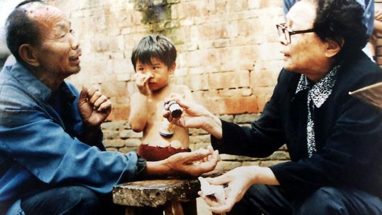
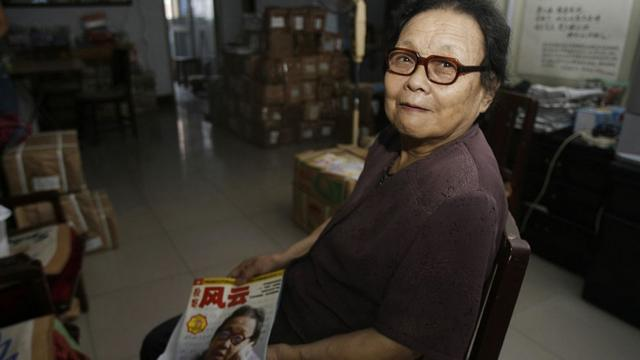
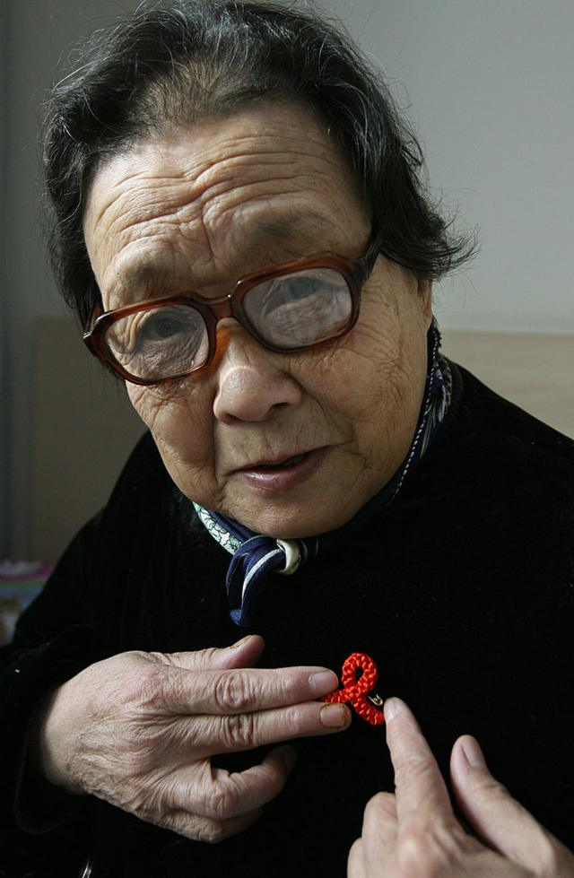
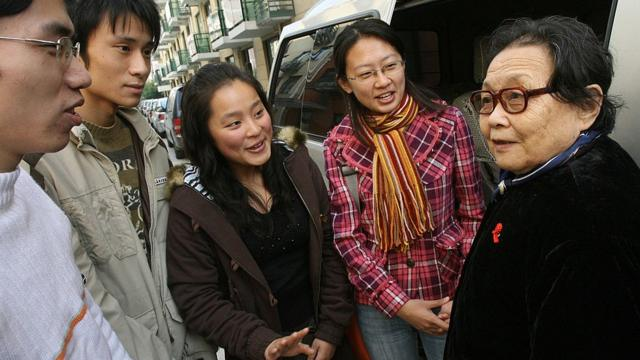
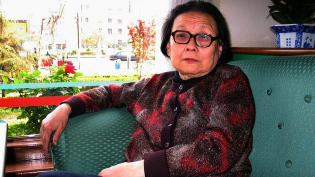

# [Chinese] 高耀洁逝世：中国“民间防艾滋病第一人” 为保存疫情资料流亡异乡

#  高耀洁逝世：中国“民间防艾滋病第一人” 为保存疫情资料流亡异乡

> 图像来源，  Getty Images
>
> 图像加注文字，2006年8月2日，高耀洁在位于河南郑州的家中。

**流亡美国的中国著名异议人士高耀洁医生，于当地时间12月10日在纽约的家中逝世，享年95岁。她因揭发90年代中国河南卖血和“血浆经济”导致艾滋病（爱滋病）蔓延，而被誉为“中国民间防艾滋病第一人”。**

高耀洁的友人向BBC证实了她的死讯，并表示她“在家中自然离世”。《纽约时报》也报道，高耀洁在纽约曼哈顿上城的家中逝世。

上世纪九十年代，本是退休妇产科医生的高耀洁在一次会诊时遇到艾滋病病例，继而发现了河南存在因输血感染艾滋病的现象。从此她自发走上艾滋病防治与救助工作，力图推动当局重视中国艾滋病蔓延的真实情况。

她的揭露使得河南“血浆经济”给当地农民带来的悲剧公之于众，令“艾滋村”的情况为中外更多人知晓。这给她带来了国际社会的褒奖和中国官方一定程度上的肯定，但也招致了地方当局的报复。

由于在河南的工作屡屡受阻且人身自由多次遭到干扰。2009年，为保护和记录她所了解的中国艾滋病疫情及病人资料，她以82岁高龄出走美国，此后一直孤身定居纽约。

高耀洁曾于2013年在BBC“巾帼百名”（100 Women）系列报道中表示，自己选择在“风烛残年”的年纪只身出走，只是为把艾滋病疫情的资料留下来，传给后人。

##  发现源头

根据其回忆录《高洁的灵魂》描述，高耀洁第一次接触到艾滋病患者是在1996年。那一年4月7日，本是河南中医学院退休教授的她受邀在一座医院会诊时遇到了一名症状罕见的女患者，经检查后，高耀洁怀疑这名病人感染了艾滋病毒。

当时中国的宣传资料称，艾滋病病毒经毒品注射及性接触传播。这名病人的爱人及子女经检查后结果都呈阴性，而病人曾经接受过输血，高耀洁才意识到，病毒源头可能在在输血。

后来的情况证实了她的判断。

事后证明，这名女患者只是河南甚至中国“血浆经济”造成的悲剧之一。自上世纪80年代起后期起，在官方献血指标和来自医药公司的市场需求下，河南等地方农村发展出卖血产业链，农民通过卖血得到经济收入，而卖出的血则用于供应医院血库，以及医药公司生产血液制品。

> 图像来源，  Getty Images
>
> 图像加注文字，高耀洁为村民敷药，图片拍摄日期不详。

然而由于采血的技术与管理漏洞，许多农村血站的血液制品在经艾滋病毒携带者献血卖血后受到污染，导致更多健康的献血者、被供血者及无辜民众感染艾滋病病毒，许多地方还也出现有众多村民感染的“艾滋村”。

在高耀洁之前，已有 王淑平  、桂希恩等中国医生提出过河南“血浆经济”中艾滋病的传播和农民受到的影响。

“艾滋病经血库的血液传播，意味着巨大的灾难，”《高洁的灵魂》中写道。

“从那时起转变了我对中国艾滋病传播途径的看法，触动了我的勇气，促使我走上了艰难而坎坷的‘防艾’道路，”她称。

##  勇于公开

由于地方官员的隐瞒，河南艾滋病感染情况一直不透明，在高耀洁等人发现隐患后，仍有更多献血卖血者不断受到感染。

“当时政府宣传说是艾滋病传播途径主要是性和吸毒，没人说是输血引起的，但其实比起前两个因素，后面这个更恐怖。当时可能有人发现，但是没有人说出来，”《烟雨任平生——高耀洁晚年口述》一书作者林世钰表示。高耀洁抵达美国后林世钰常年照料她，陪伴她在美国的最后一段时光。

“高奶奶了不起的地方就在这，她发现了输血这个传染艾滋病的主要源头，揭露出来了。”

在意识到问题严重性后，高耀洁开始自发进行艾滋病防治宣传工作。

“我意识到艾滋病疫情的严重性，特别是广大民众对预防艾滋病知识一无所知或知之甚少，漠不关心。更可怕的是，某些宣传内容与我国艾滋病来源、流行、蔓延实况不符合，使我不得不自费编写艾滋病真情的‘书籍’和防艾‘资料’进行宣传，”高耀洁在自己的回忆录中写道。

她主动走入有艾滋病例出现的农村地区，探访疫情实情。她记录下病人的信息，并在当地发放预防艾滋病的资料，同时向群众讲授卫生科普课堂，据她回忆录中记述，每年授课三十至七十多场。

一些中国媒体开始关注艾滋病防治以及河南农民的患病情况，但大多因“影响河南形象”遭到河南政府阻拦。高耀洁也曾试图将河南疫情向上级反映，但无疾而终，最终她决心将真实情况公之于众。

> 图像来源，  Getty Images
>
> 图像加注文字，2006年8月2日，高耀洁在位于河南郑州的家中。

2000年10月28日，《纽约时报》在头版刊登河南“艾滋村”问题报道，震惊世界。

“在高耀洁向河南省政府反映血站导致艾滋病传播的问题无果后，她将这件事情透露给了一名《纽约时报》驻北京的记者……在头版登出后，这个事情成为了一个国际丑闻，促使中国政府对此采取行动，”帮助高耀洁在纽约安顿的哥伦比亚大学政治学教授黎安友（Andrew J. Nathan）表示。

2001年8月，中国卫生部首次公布“艾滋村”河南省上蔡县文楼村疫情。根据中国媒体《三联生活周刊》 报道  ，该地区3710人中有43%左右的卖血者感染艾滋病毒，而根据村民统计，在有800名人口的文楼自然村，90%的青壮年常年卖血，在这群300多人的群体中只有大约5人幸免于感染艾滋病毒。

2004年，河南省首次在全省范围内进行“拉网式”艾滋病大普查。河南省政府称，全省范围内既往有偿供血人员达28万，其中该次检测出艾滋病感染者2.5万。

##  “有大爱的人”

直到今天，研究者仍认为中国的艾滋病感染情况没有彻底摸清，没有人能说清楚“血浆经济”下到底有多少人感染艾滋病毒。

但高耀洁对中国艾滋病防治的贡献获得中国海内外的广泛认可。她曾获得全球健康理事会颁发的“乔纳森·曼森健康与人权奖”等多项国际奖项，包括2003年中国中央电视台“感动中国”年度人物等来自中国官方的认可。

联合国前秘书长安南曾向她“独自在中国乡村推行HIV教育的工作”表示致意。已故的前中国国务院总理李克强曾在2004年担任河南省委书记时同她会见。前国务院副总理吴仪也在2003年要求与她单独进行会谈。

据林世钰表示，高耀洁累计获得的各类奖项奖金超过100万元人民币，她将这些钱均用于印制艾滋病宣传材料，以及救助艾滋病病患及孤儿的问题上，许多病人上门向她求助买药、生活花费，她从不吝钱财。

她尤其看重帮助艾滋病患死后留下的“艾滋孤儿”。她将自己讲座、稿费及问诊费用寄给这些儿童，并竭尽所能帮助提高社会对他们的接受度。在中国社会仍普遍“闻艾色变”的2002年，她带领三个“艾滋孤儿”到自己家过年。

“她是一个特别有大爱的人。”林世钰表示，高耀洁从不将奖金花在自己身上，“有家人曾劝她那这些钱买房，但她表示不能那么做”。

自1996年至她流亡之前，高耀洁多年来走进一百多个“艾滋村”，坚持用这种最直接的方式摸清艾滋病患者群体的情况。根据中国央视报道，她走进过100多个村庄的1000多个患者家庭，足迹遍布河南、河北、山东、山西共16个省市。她记录下所有接触到的病患信息，保存下同病人及他们亲属之间的通信往来，这些都成为了官方艾滋病数字之外的宝贵资料。

##  打压与逃亡

在高耀洁受到赞誉的同时，河南官员对她的打压从未停止，这最终致使她在耄耋之年出走中国。

在中国中央政府表态前，伴随高耀洁因宣传预防艾滋病吸引越来越多的关注，她也引起了一直否认河南存在艾滋病疫情的河南官员的注意。从高耀洁工作单位的领导、到河南省主管艾滋病的官员、以及公安部门，高耀洁的工作时常得到来自河南当局的阻挠。

黎安友表示，当地政府对高耀洁态度的转变符合中国当局的行为模式。“如果一个人的言行与政府站在一边，他们便受欢迎，如果让政府难堪，便会受到打压。因为高医生的工作持之以恒，因为她责怪政府，他们发现她不能被宣传工作利用了。”

据高耀洁在回忆录中记述，自2000年起，她退休所在单位扣留她进入“艾滋村”后记录下的病人分资料，截留寄给她的外来信件，有地方官员要求“叫高耀洁闭嘴”，阻止她接受记者采访，她的电话遭到监听，她外出时也遭到跟踪。

“他们为什么捂盖艾滋病疫情，自有其不可告人的情节。我更想探个水落石出，这促使我再进一步下乡调查艾滋病疫情，”高耀洁写道。

> 图像来源，  Getty Images
>
> 图像加注文字，高耀洁被称作中国“民间防艾第一人”。

在高耀洁国际声誉日渐增长后，河南当局多番阻挠她出国接受领奖。2007年在她前往美国领取“生命之音”颁发的年度女权活动人士奖以前，由于河南当局阻止她前往北京获得签证，将其软禁，最终只有在时任美国参议员希拉里·克林顿（Hillary Clinton）为此致信中国国家主席胡锦涛及总理温家宝后，高耀洁才得以被放行。

2009年，在法国驻华大使馆电话告知她被该国授予“杰出妇女奖”之后不久，5月6日，她的电话与电脑出现问题，同时她发现小区内出现许多陌生人。由于担心手中的艾滋病资料与书稿会有危险，她当即将电脑硬盘藏在内衣兜内，离开了位于河南郑州的家。

“我权衡了利与弊，我想，本人若无声无息地死去，我手里的资料便石沉大海，而且外界一无所知，”她在2013年回忆自己出走的决定时这样写道。

在其美国友人的帮助下，她在2009年8月8日抵达美国，从此开始了她的流亡生涯。

高耀洁在纽约的生活依旧围绕中国艾滋病疫情。她出走时在硬盘中带出的三本书稿在抵达美国后全部得到出版，她也举办多场讲座，介绍中国艾滋病疫情的历史。

“她不是第一个把中原血祸说出来的医生，却是捅出这个消息之后（1996年），连续14年坚持不懈、遭打压而绝不倒下的人，”中国历史学者朱学勤在高耀洁2011年出版的《我的防艾路》一书序言中曾这样写道。

##  力量源泉

高耀洁的一生伴随中国近现代史的历史起伏历经多重转折。林世钰认为，支撑高耀洁的力量源于她小时候受到的儒家教育。

1927年12月，高耀洁出生于山东曹县一个富裕家庭，是家中长女，从小被过继到无子女的大伯母徐氏膝下。虽然她也受到了裹脚等中国社会对女性传统要求的束缚，但却也养成了仁爱、独立的性格。

> 图像来源，  Getty Images
>
> 图像加注文字，2006年11月30日，高耀洁在中国上海进行高校系列讲座期间同大学生谈论艾滋病预防问题。

据高耀洁回忆录记载，徐氏出身文人世家，父亲为前清进士，曾为光绪皇帝之师。在徐氏身边，高耀洁学会了认字，还被送去私塾念四书五经。

“那几年对她影响很大，”林世钰表示，高耀洁从小受儒家修齐治平的思想灌输，见到家里人每到灾年便打开粮仓救济乡亲等场景，在耳濡目染下学会要努力帮助他人。

“她对我说，人和人就是要互相帮助，不能光顾自己的那点事情。她说她自己平生无大志，但求吃饱饭，并且在自己吃饱饭的同时也要让别人吃饱饭，”林世钰称。

“儒家文化在我脑海中根深蒂固，它培养出本人一颗善良的心、真诚的心，”高耀洁在回忆录中表示，而随后战争的来临与中国社会的变迁又使她“摆脱了封建的枷锁，成为一个有用的人、自食其力的知识分子。”

##  “并不完美”

她在青春时期经历了日本侵华战争、中国内战。日本入侵中国后，她和家人逃难至河南。1950年，她考入河南大学医学系，开始了她的医学生涯。

因为出身“地主阶级”，她被卷入中共建政之后的历次政治风波中，尤其是十年“文革”期间，她遭到同事殴打，被多次拉去游街，关入牛棚，一度自杀但被邻居救下。

政治打击给她的家庭带来了重创。文革期间，她的儿子郭锄非因受她牵连被打成“反革命”而蒙受三年冤狱，在她为艾滋病患者奔走之后，她两名同样作为医生的女儿工作遭到当局打压，大女儿郭竞先被迫调职至行政岗位工作，小女儿郭炎光被迫辞职，后赴加拿大定居。

> 图像来源，  Getty Images
>
> 图像加注文字，高耀洁摄于2004年4月14日。

林世钰回忆称，这些遭遇使得高耀洁的儿女同其关系紧张，她的大女儿曾称，高耀洁虽然拯救了其他人，但却“毁了我们这个家”，就连高耀洁自己也向林女士表示过，自己“虽是个好医生，但不是个好母亲”。

这也导致高耀洁流亡美国后决意远离政治。“很多政治帮派来拉拢她，她说‘我不喜欢政治，我被政治害苦了，只想一个人干干净净的活着’，”林世钰称。

可以回到故土是高耀洁一直以来的心愿。在她公开的遗嘱中她表示，希望自己的骨灰可以由儿子撒入黄河。

“国内感觉她是反华势力，这是对她的一个太大的误解，她比谁都爱这个国家。”林世钰说。“她说起中国的发展特别骄傲，说起中国的问题比谁都愤慨。她比谁都希望这个国家好。”

“她是一个人道主义者。虽然她不是完美的人，但真的是一个非常纯粹、坦荡的人，”林世钰评价她称道。

