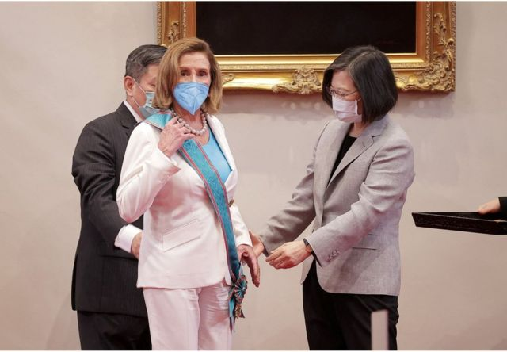
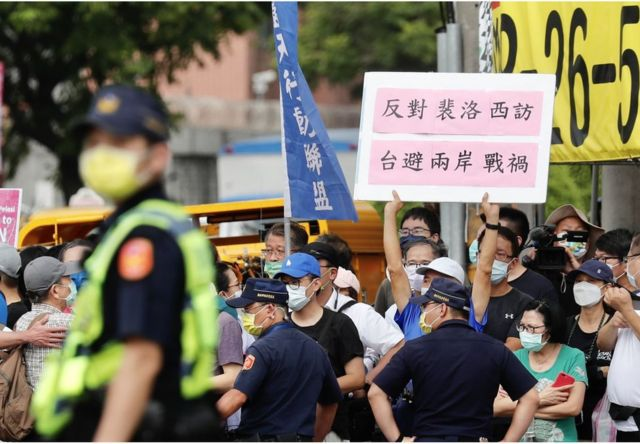

# 佩洛西访台观察：两岸情势升温 台湾人为何不紧张？

#  佩洛西访台观察：两岸情势升温 台湾人为何不紧张？

  * 吕嘉鸿 
  * BBC中文 发自台北 

2022年8月3日

> 图像来源，  Reuters
>
> 图像加注文字，蔡英文向佩洛西颁授“特种大绶卿云勋章”。

**“佩洛西是谁？”这是上周末，在台北与朋友聚餐时，朋友们给我的意外回答。两位住在台北多年的友人都在影视圈工作，也都是网路重度使用者，但她们对这位美国最有权势的女政治家的来访，毫无知悉。**

星期二（8月2日），佩洛西（Nancy Pelosi，台称裴洛西）抵台前几小时，班机将落在台北松山机场，旁边的篮球场有年轻市民打完球便离开，没有人刻意驻足等候佩洛西来到。我也看见有欧洲媒体在路上，问了好几位台北市民，一些年轻的民众说从未听闻过佩洛西的大名。

这些年轻民众对于佩洛西率团访台以及两岸是否将打仗的反应平淡，似乎也反映出与国际舆论的关注与许多台湾人对于佩洛西来访的看法可能有极大的差异。

事实上，此次佩洛西访问团，刻意前来迎接或抗议的两个政治组织：独派的“台湾国”及支持台湾“一国两制”的“统促党”。两个组织分属台湾“统、独”政治的两个极端，组织较小，鲜为人知，在政坛影响力接近零。然而，“统促党”的集结抗议，却广为若干国际媒体使用，配搭台湾社会对佩洛西参访将带来战争的恐惧评论，与一如往常热闹的台北街头有蛮大的差异。

## 

> 图像来源，  EPA
>
> 图像加注文字，8月3日，美国众议院议长佩洛西在台北市景美人权文化公园访问期间，一名抗议者展示"反对佩洛西访问以避两岸战祸"的标语牌。

许多海外台湾人，读了许多文章昨晚纷纷捎来信息，问台湾是否会成为下一个乌克兰。但实情是，台湾民众在昨晚同样出门聚餐，购物或在家开饭追剧，恐慌的情绪并未如一些媒体报导般蔓延。

一些在国外长大工作的台湾友人，也在私人群组中抱怨台湾人关心的新闻都是芝麻小事，对于外媒聚焦紧张的台海情势，并未有太多关注。

在广州读大学，移居台湾开书店的文化人 张洁平亦在脸书不解的问道  ：“其实我真的是来了才明白，全世界想像和理解的台湾（也就是地表最危险的地方），和台湾人生活在其中的台湾，真的完全不是一个地方”。

她认为，也许在台湾，大家都麻木了吧。有一位网友回应她说，如同韩国，在朝鲜（即北韩）导弹的阴影下数十年，面对战争威吓，并不恐惧，而是习惯了。

不过，也许真实的焦虑情绪是显示在市场上。

曾在去年破成交量新高的台湾股市，昨天股市下跌，许多投资人及企业担心股市继续在打仗的阴影下继续下滑。还有，中国的经济制裁是否会继续加码。

被台媒称为台湾经济“护国神山”的台积电公司（TSMC），一向鲜少接受访问，遑论对外发言谈论政治。但周二上午，该公司董事长 刘德音罕见地接受美媒CNN专访  评论战争。

他说：“中国如果入侵台湾，将不会有赢家，大家都会是输家......不要因为我们与中国做生意，就歧视我们。”

有趣的是，佩洛西在今天在台湾立法院，特别提到美国众议院表决通过不久的晶片法案。她称，该法案给予美国与台湾半导体继续合作的空间。也有台媒说，佩洛西周三早上已经与台积电高层视讯会议。

担惊受怕的人还有另一位在台北避难的乌克兰女士唐雅（Tanya）。她在台湾知名网路频道“不要闹”说，她现在真的是十分害怕北京对台开战，因为俄罗斯入侵家乡，离家万里的她还得在亚洲面对另一场战争。

> 图像来源，  Reuters
>
> 图像加注文字，8月3日，美国众议院议长佩洛西离开台北立法会时挥手致意。

无论如何，此次佩洛西率团访台，台湾民众的“佛系”平淡回应令许多媒体不解。台湾文化评论者颜择雅说，佩洛西的台湾行“台湾一般人并没很关注，我认为这是健康的”。她说，台美关系一定会持续加温，台海也会继续紧张，但“台湾这边已习惯了”。

而且，佩洛西一离开，中国解放军已经宣布开启连续三天的“绕台”军事演练，并加码禁止许多台湾农产品进口，作为惩罚，许多民众的生计受到打击也是事实。未来，美中台三角的下一场角力会怎样呈现，估计还是国际焦点。

“阿共仔（闽南语，指中共）跟美国，两人都要做大（当大哥），那怎么办？”“我们一定要走出去”。星期三（8月3日）早晨，在台北的一家超商中，我与准备去运动的两位老妇对话令人莞尔一笑，听似轻松，却有着深意。

