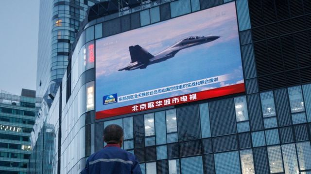
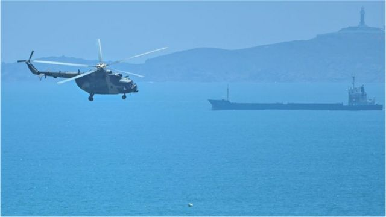
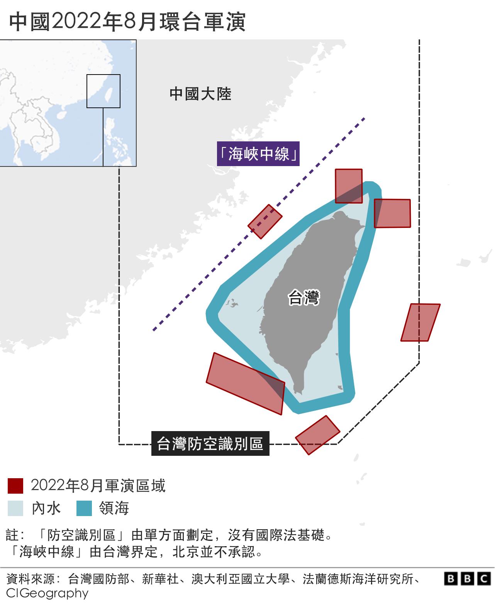

# 佩洛西访台后，中国环绕台湾展开实弹军事演习

#  佩洛西访台：中国环绕台湾展开实弹军事演习

2022年8月4日

**美国众议院议长佩洛西（Nancy Pelosi，裴洛西）访问台湾后一天，中国人民解放军在环绕台湾岛的六个海域进行实弹军事演习。**

中国官方声称的“重要军事演训行动”于当地时间周四（8月4日）中午12时（格林尼治标准时间4时）开始，范围部分处于台湾岛周边12海里之内。

至下午1时，中国官方消息称，解放军东部战区在“台湾海峡实施远程火力实弹射击训练”，对特定区域进行“精确打击”，并“取得预期效果”。

这是中国大陆在台湾海域前所未有的行动，亦是至今针对这个被北京视为中国分割省份的岛屿规模最大的一次军演。

台湾方面指，中国大陆是试图改变台海两岸现状。

台湾国防部当天傍晚称，中共向台湾北部、南部及东部周边海域发射共计11枚东风系列导弹，台湾军方启动相关防御系统，并强化备战准备。

此次军事演习被视为中国大陆对佩洛西争议性访台的回应——美国众议院议长在北京反复警告以及白宫声称不支持之下，于当地时间周二晚间抵达台北，逗留19个小时并先后会见台湾立法院副院长蔡其昌和总统蔡英文。

除军演外，北京还在佩洛西抵台后宣布一系列中止对台贸易的措施，并在大陆境内以从事“台独”分裂活动为由拘捕一名男子。

> 图像来源，  Reuters
>
> 图像加注文字，中国的台海军演于周四中午开始

##  中国军演第一天概要回顾：

截至台北时间晚上8时：

  * 中国向台湾东北和西南沿海海域发射多枚“东风”弹道导弹 
  * 中国外交部长称佩洛西访台是“狂躁、不负责任、极不理性” 
  * 中国国防部新闻发言人说，中国军队“说话是算数的”，解放军此次演习“就是针对美台勾连的严正震慑” 
  * 台湾总统府发言人称，中国持续且刻意升高军事威胁，总统府要求中国“理性克制” 
  * 台湾执政的民进党透过发言人表示，中国大陆此次军演造成区域紧张，且无正当性 
  * 由于商船被迫改道，预计全球航运可能出现延迟、供应链受到干扰 
  * 50多个往返台湾的国际航班被取消 
  * BBC在台北记者说，台北生活一如既往，人们保持平静，但也不乏担心 

> 图像来源，  AFP
>
> 图像加注文字，佩洛西访问台湾后，中国在台海进行大规模军事演习（图为演习举行前，中国军用直升机飞过平潭岛，这是中国大陆离台湾最近的地点之一）

##  首日军演备受关注

周四中午，中国官方媒体统一发布消息，解放军的“重要军事演训行动”于8月4日12时至7日12时进行，警告“有关船只和飞行器不要进入有关海域和空域”。

军演划定的禁区在台湾岛的东部、北部和南部分别进入了台湾当局声称的12海里范围内。

台湾军方在周四下午表示，解放军下午1时56分起向台湾东北部和西南部海域发射多枚东风系列导弹。

解放军东部战区则表示，其火箭军部队以常规导弹突击台湾东部外海预定区域，“全部精准命中目标”，并于下午宣布实弹发射训练任务“圆满完成”，解除相关海空域管控。

中国国防大学教授孟祥青在中国官方电视台上介绍此次军演的模拟战略，表示这是前所未有最接近台湾岛的演训区域，对台湾形成“包围之势”，为“有利于我们统一的战略格局”创造条件。

台湾在周三开始已经要求船只改变航道，并正在与日本及菲律宾商讨替代性的航空航道。桃园机场有数十个航班取消。

台北的国防部在较早前的周三称，解放军此次军演范围“形同海空封锁台湾”。

在佩洛西于周二抵达台湾当晚，已有消息指解放军飞机曾飞越“台湾海峡中线”——这一直是中国大陆与台湾之间的非正式边界，尽管北京方面从未承认。

周四早上，台湾当局声称在周三午夜有一架中国大陆无人机飞过金门岛上空，台湾军方发射信号弹驱离。

与此同时，台湾政府还表示，多个政府部门网站受到黑客攻击。

美国国家安全顾问沙利文（Jake Sullivan）表示，中国大陆的军演是不负责任，警告这可能令事态失控。

##  分析：一次彩排？

**BBC安全事务记者贾德纳（Frank Gardner）**

今天的弹道导弹发射，加上在台湾海岸附近进行的强悍的军事演习，是迄今为止最明显的提醒，即中国准备在必要时使用武力，以在 2049 年（中共建立政权100周年）之前对台湾拥有主权。

它甚至可以被视为未来有效控制该岛的彩排。北京认为台湾是自己的一个省，要以显示武力说服它放弃独立的梦想并接受北京的统治，而不需要流一滴血。

中国不想入侵台湾——这要付出鲜血、财富和全球声誉的代价——但它想表明，如果台湾不和平屈服，它有准备这样做。

美国海军强大的第 7 舰队就在附近已不再具有以往的威慑力。

中国对高超音速导弹进行了大量投资，例如东风导弹，其中一些导弹旨在将航空母舰送入海底。

台湾最近一直在加强自己的防御，在其最高的山脉安装最先进的导弹探测系统，并将其最先进的战斗机隐藏在东海岸的地下掩体中。目前的紧张可能会消退，但不会是最后一次。

##  分析：前所未有的军演

**BBC记者傅东飞（** **Rupert Wingfield-Hayes** **）发自台湾**

在环岛划定六大禁区，从周四起进行持续四天军演是一道令人不安的宣言。北京在1996年做过同样的事，那是上一次的所谓“台海危机”。但是当时的禁区全部在台湾领海之外。

这一次，六个禁区当中有三个进入了台湾的12英里范围。这是前所未有的。台湾的国防部已经声称此举违反了联合国公约，并指它形同海空封锁台湾。

如果中国将船舰和飞机开入这些区域，这将形同于入侵台湾的版图。这使得风险大为增加，

美国海军正在密切监察着这一切，而美军里根号航母战斗群已经开至菲律宾海附近。

##  各方反应

中国大陆针对台湾的最大规模军演备受各方关注，台湾民进党透过发言人指责中国大陆的“威吓行动”不受国际认可，在国际繁忙航路上军演，是“毫无国际责任感的单边行径”。

台湾媒体引述民进党发言人谢佩芬表示，佩洛西访台是一次在民主国家之间“受到高度关注与肯定”的事，而中国大陆以访问行程为“借口”进行军演“毫无正当性”。

“中共的以军演做为回应的诸多激烈反应，不只让人遗憾，更与民主潮流相背离，”台媒引述谢佩芬。

她还表示“中共推升局势的回应恐导致区域更加紧张和不稳定”。

在台湾倾向于两岸统一路线的反对党国民党的主席朱立伦则呼吁各方节制，同时重申国民党“坚决反对”任何破坏区域和平和破坏民主自由的行为。

他呼吁“用对话取代对抗”，同时批评民进党利用意识形态和两岸紧张情势获取政治利益和掩盖“施政不力”。

日本已对中国此次军演表示关注，指军演范围触及到了日本的专属经济区——这些区域的边界在日本与邻国之间存有争议，北京声称对区域内部分岛屿拥有主权。

对此，中国外交部发言人华春莹表示，北京并不接受“所谓的”日本专属经济区。

东南亚国家外长则警告，指台湾的紧张情势可能引发地区公开冲突。

东南亚国家联盟（ASEAN）发表声明，呼吁最大限度的克制，敦促不要作出挑衅行为，同时指最近的事态进展可能导致大国之间的误判、严重对抗和无法预计的后果。

作为众议院议长，佩洛西是25年来访台的最高级别美国官员，而此前中国一直警告佩洛西不要访台。

中国外交部长王毅指责洛佩西访台是“彻头彻尾的闹剧”，强调“犯我中华者必将受到惩处”。

佩洛西在她的亚洲访问行程中加入台湾之行。她离台后发表声明指，中国不能阻止世界领导人或任何人访台和向台湾繁荣的民主制度致敬，同时重申美国将继续致力于合作。

之后，佩洛西前往韩国，并与韩国国会议长金振杓会面，预计将会讨论地区安全、经济合作及气候变化问题等。

与中共政权建交以来，美国一直表示奉行“一个中国”政策，但同时与台湾保持着“活跃的非官方”关系，包括对台出售武器，以帮助台湾自卫。

