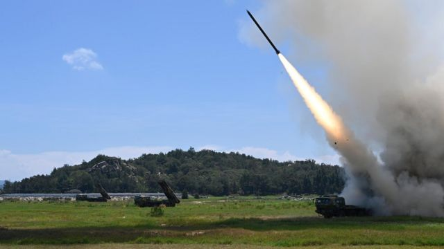
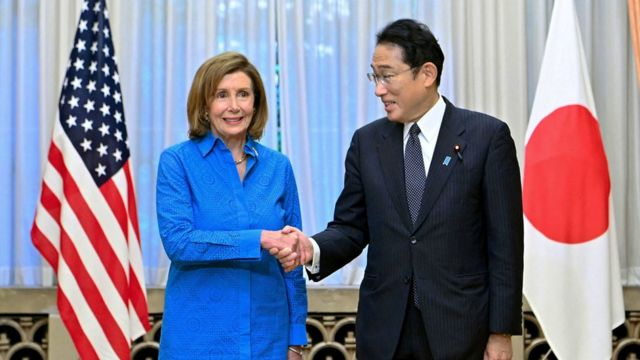

# 白宫批评中国环台湾军演“不负责任”

#  佩洛西访台：美国白宫批评中国环台湾军演“不负责任” 日本不满导弹落入专属经济区

2022年8月5日

> 图像来源，  Xinhua
>
> 图像加注文字，台湾国防部称，中国大陆军方在首天演练发射了11枚东风导弹。

**美国白宫国家安全委员会发言人约翰‧柯比（John Kirby）批评中国军方环绕台湾举行实弹射击演练“非常具侵略性”，“不负责任”。**

柯比称，中方是利用 众议院议长佩洛西（Nancy Pelosi；裴洛西、波洛西）访问台湾  为借口，升级其挑衅行动。佩洛西星期五（8月5日）在东京重申，此次亚洲之旅无意改变地区现状，但美国不会允许中国孤立台湾。
 中国大陆从星期四起连续三天演练  ，并称是“维护国家主权和领土完整的必要和正当举措”。日本方面称，中国解放军星期四（4日）发射的11枚东风导弹中，五枚落入日本专属经济区。首相岸田文雄称，日方已要求中方马上停止演习。

台湾行政院院长苏贞昌形容中国大陆军演是“恶邻在旁边耀武扬威”，并称“台湾不会在压力下屈服”。
 苏贞昌星期五说  ：“我们呼吁中国把心力用来照顾人民，才是最最重要。”

台湾总统蔡英文星期四晚透过社交媒体发表录影讲话，呼吁国际社会支持台湾，共同遏止中国大陆“片面、不理性的军事行动”。

由美国、英国、日本、法国、德国、意大利和加拿大组成的七国集团（G7）连同欧盟发表外长声明，关切中国的“胁迫行动”。中国国务委员兼外长王毅指责该声明“颠倒黑白、混淆是非”。

正在在柬埔寨金边出席东南亚国家联盟（ASEAN）系列会议的王毅星期四晚说：“我们不能让丛林法则重新来主导我们的国与国的关系。我相信，这个所谓的’声明’只是废纸一张，绝对不会得到国际社会的支持和响应。”

中国外交部表示，副外长邓励星期四“奉命紧急召见”有关欧洲国家和欧盟驻华使节和日本驻华大使垂秀夫，就G7声明“提出严正交涉”。其中，邓励指责日本“伙同七国集团和欧盟发表涉台错误声明，颠倒黑白、倒打一耙”。

据路透社报道，王毅星期四晚突然离开东盟会议官方晚宴，未知是否对东盟与G7发表声明批评中国军演表达不满。此外，王毅也拒绝与出席同一会议的美国国务卿布林肯（Antony Blinken）会晤，又在最后关头取消会晤日本外务大臣林芳正。

东盟的声明呼吁各方保持最大限度的克制，敦促不要作出挑衅行为，同时指最近的事态进展可能导致大国之间的误判、严重对抗和无法预计的后果。

##  台湾视角：“我们给共产党吓唬了70年”

**BBC记者傅东飞（Rupert Wingfield-Hayes）台湾报道**

> 图像来源，  EPA

在碧砂渔港，渔民坐在港口边修补渔网。一位满怀愤怨的船长喊道：“政客打架，总是我们这些小人物遭殃。”

“但我们又能怎样？现在出海太危险了。”

另一位刚回到港口的正在绑紧缆绳。他说：“我今早出港，然后海巡队叫无线电喊我们马上回来。”

BBC所接触到的人多半不相信中国准备武力攻台。一位在码头边垂钓的先生说：“他们就是一帮流氓。”

“那些共产党说得很大，但不会真做。我们给他们吓唬了70年了。”
 点击阅读全文（英文） 

## 

##  日本加入谴责

> 图像来源，  Kyodo / Reuters
>
> 图像加注文字，岸田文雄（右）与佩洛西（左）在东京举行早餐会晤。

佩洛西星期三（3日）离开台北后转到韩国，星期四晚抵达日本。她在星期五早上与岸田文雄共进早餐。

岸田文雄其后对记者说，中国是次军演对地区和平稳定造成严重影响，他向佩洛西表示，日方已要求中方马上停止军演。

岸田文雄说：“我们确认，日美将继续密切合作，共同维护台海和平稳定。”

在此之前，日本外务事务次官森健良表示，日本政府通过外交渠道，就解放军五枚导弹落入日本专属经济区内，向中方提出强烈抗议。

日本防卫省录得中国在首天演练中发射了九枚导弹，比台湾国防部纪录少两枚，其中至少一枚飞越台湾本岛上空。台湾国防部称，导弹主要飞行路径位于大气层外，对飞越的广阔地面区域并无危害，因此并未击落陆方导弹，也未向台湾岛内发布防空警报。

##  佩洛西：我想看到台湾和平

佩洛西会晤岸田文雄后召开记者会，会上多次重申，她希望看到台湾和平，现状得以维持。

这是佩洛西离开台北后首次评论台湾之行。

佩洛西说：“他们（中国）也许能尝试阻止台湾访问其他地方，参加其他活动，但他们不可能透过阻止我们到那里去来孤立台湾。”

“我们之前已经有好些高层级访问——春季时有跨党派参议员去过，持续访问——我们不会让他们孤立台湾，我们的旅行计划轮不到他们来制定。”

佩洛西又否认坚持访问台湾是为了个人政绩。

“这论点很荒谬。这不是为了我，而是为了台湾。这是为了说出’让我们赞美台湾’。”

佩洛西称，中国“也许以我们这次访问为借口”，在演习中发射导弹。她的说法与白宫国安发言人柯比如出一辙。

柯比星期四说：“北京的挑衅行径既是个显著的升级，也是其长期以来企图改变现状的尝试。”

“北京选择了反应过度，选择以一张的访问为借口，增加在台湾海峡周边的军事挑衅活动。”

柯比还称，为了避免局势进一步升级，美国空军推迟了民兵III型（Minuteman III）洲际弹道导弹的试射活动。

##  王毅“拂袖而去”

王毅连日来多次发表批评佩洛西访问台湾的言论。他星期四在金边的东盟系列会议上形容，佩洛西访台是“狂躁、不负责任、极不理性的行径”。

路透社报道称，王毅星期四晚来到东盟系列会议晚宴会场，但不久就离开。据其记者所见，柬埔寨当局本已早有安排，在凹形餐桌的坐席安排上，把王毅与美国国务卿布林肯隔开12个坐席，日本外相林芳正也与王毅相隔了三个坐席。

布林肯在会议上说：“我们反对任何试图改变现状的单边行动，尤其是使用武力。我们与世界各国相信，升级对任何人均无益处，且有可能导致意外后果。对东盟成员国如是，对中国亦然。”

澳大利亚外长黄英贤（Penny Wong）也将参加是次东盟会议。她对法新社说：“各方应考虑他们能如何促进缓和当前紧张局势。本地区担忧的风险之一是错误计算。”

