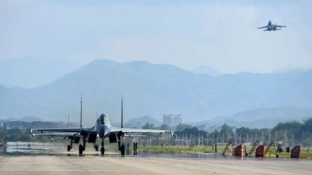
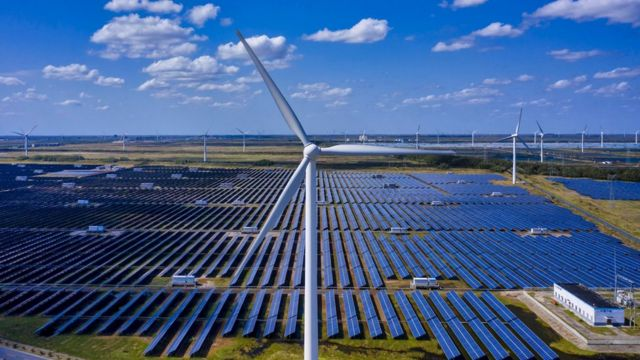
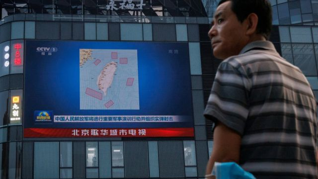

# 中国宣布停止气候变化等对美合作　两国关系新低点？

#  台海危机：中美关系新低点？北京宣布停止气候变化等多项合作

2022年8月6日

> 图像来源，  PLA Eastern Theatre Command / Reuters
>
> 图像加注文字，北京围绕台湾举行军事演练引起国际关注，中国外长王毅称“中方理所当然要做出坚决回应”。

**中国针对美国国会众议院议长佩洛西（Nancy Pelosi；裴洛西、波洛西）率领代表团访问台湾公布进一步报复措施，宣布停止与美国在几个关键领域的合作，包括气候变化、军事交流和打击国际犯罪。**

中国认为这次访问是对其对台湾主权的挑战，因此还同时宣布 制裁佩洛西及其家人  。外长王毅再次批评佩洛西“严重侵犯中国主权”，“严重危害台海和平稳定”。

正在菲律宾访问的美国国务卿布林肯（Antony Blinken）批评北京此举不负责任，“惩罚全世界”，并称华盛顿“决意负责任地行事”，避免造成危机，又将保持一切沟通渠道开放，避免造成错误算计。

台湾重申兩岸互不隶属，中国从未统治台湾，“中国政府才是改变台海现状、破坏台海和平的根源”。
 台湾外交部周六（8月6日）发表声明说  ：“美国国会议员访台行之有年……美联邦众院议长访台也有前例，我国政府接待来访的政府官员及国会议员是民主国家常态。”

“中国政府却颠倒是非，妄称裴洛西议长访台‘侵犯中国主权、破坏台海和平稳定’，以‘妳不能跟他好’的极幼稚的说法，作为发动危险军事演训的借口，这些作为和主张，严重悖离文明社会的文明法则，造成区域情势紧张升高，已引发国际社会高度关切。”

“中国单方面制造危机，就是严重挑衅、制造危机的一方，是再清楚简单不过的事实。”

##  中断交流

中国外交部周五（5日）宣布，美国和中国国防官员之间的交流将被取消，而在遣返非法移民、气候变化和调查国际犯罪方面的合作将被暂停。

近年来，这两个大国在应对气候变化上保持着友好的外交关系。在去年的格拉斯哥气候峰会上，中国表示要与美国“紧急”合作以减少温室气体排放。

中美两国还在打击芬太尼等非法毒品贸易的努力中找到了罕见的共同点。
 中国外交部在一份声明中说  ，做出停止合作的决定是因为佩洛西“无视中国的强烈反对和严肃交涉”而访问台湾。

佩洛西是25年来访问台湾的最高级别的美国政治家。中国外交部指责她进行了“恶劣的挑衅行径”。

中国外交部发言人华春莹周五在推特上发布消息，批评美国的外交政策，将其与警察杀害弗洛伊德相提并论，这位手无寸铁的美国黑人在2020年的死亡引发了全球反种族主义的抗议活动。

她写道：“我们不能允许美国把自己当作‘世界警察’，把其他国家当作它可以随意欺负和扼杀的乔治·弗洛伊德。”

在柬埔寨金边出席东南亚国家联盟（ASEAN）系列会议的外长王毅周五也说：“我们将坚定维护中国的主权和领土完整，坚决遏阻美国‘以台制华’的图谋，坚决粉碎台湾当局"倚美谋独"的幻想。”
 王毅还说  ：“如果不干涉内政原则被无视、被抛弃，这个世界将重回丛林法则，美国将更加肆无忌惮地以所谓实力地位对待欺负其它国家，尤其是广大中小国家。我们不能允许这种事情发生，各国也应团结起来，不允许这种事情发生，不允许人类文明进程倒退。”

> 图像来源，  EPA
>
> 图像加注文字，2021年11月联合国第26届气候变化大会将近尾声之际，中美两国曾宣布同意在未来十年加强气候合作，出乎外界预料。

美国国务卿布林肯周五在马尼拉回应说：“暂停气候合作并非惩罚美国，这惩罚的是全世界，尤其是发展中国家。”

“我们不应把全球关注议题劫持成人质。”

布林肯还针对解放军实弹演练说：“这种极端的、不相称的和升级的军事反应是没有理由的。”

同日在华盛顿的新闻发布会上，白宫新闻秘书卡琳·让—皮埃尔（Karine Jean-Pierre）说，佩洛西“完全有权”去台湾，并说中国的新举措是 “根本不负责任的”。

她说，“我们将继续努力与北京保持开放的沟通渠道，同时捍卫我们的利益和价值观。”

##  分析：中美关系的新低点

**BBC驻华盛顿记者** **；** **前驻北京记者沙磊** **（** **John Sudworth** **）**

> 图像来源，  Reuters

没有什么其他事件能更清楚地表明国际政治格局正在发生的变化，有多么大的、多么快。北京的声明标志着我们这个时代的决定性战略关系的一个新低点。

就在几年前，人们的共识是，一个成熟的超级大国应该与一个新兴大国建立强有力的贸易和投资关系，意识形态上的分歧将随之消失。

然而，中国虽然已经成为世界工厂，深深地融入了全球供应链，但它在国内却变得愈加专制，在国外则愈加坚定自信。

例如，1997年时任美国众议院议长纽特·金里奇（Newt Gingrich）的台湾之行，几乎没有遭到反对。

而佩洛西的访问则遭到了导弹的问候——直接飞过一个民主政权和2400万人民的头顶——顺便说一句，中国越是专制，台湾对与中国统一愿景就越没胃口。

而现在，任何担心中国的易制毒化学品的美国公民也将感受到这些地缘政治巨变的影响。中国的易制毒化学品被卖到墨西哥，然后变成芬太尼（fentanyl），致使成千上万的美国人死亡。

中国声明暂停了缉毒合作。

中国关于气候变化的“人类共同的未来”的呼吁同样被搁置，现在这似乎必须以中国对台湾的主权得到承认为前提条件。

佩洛西可能给了中国一个借口。但这是一个早已开始的转变。价值观之争再次走到舞台中心，而且对现有全球秩序的深刻挑战只增不减。

## 

虽然美国没有正式承认台湾，但与其保持着强有力的联系，其中包括对台出售自卫武器。

佩洛西周五在日本进行本次亚洲之行的最后一站访问，她表示，中国“不会通过阻止我们去那里旅行而孤立台湾”。

台湾外交部长吴钊燮 在接受BBC专访时  为佩洛西访台辩护，他说这次访问将“提升台湾的形象......让国际社会了解台湾是一个民主国家”。

他还谴责了中国为回应佩洛西访问而于周四（3日）在该岛周围开始的大规模军事演习。

北京目前正在该岛周围的空中和海上举行军事演习，预计这些演习将持续到周日（7日）。

100多架战机和10艘军舰参加了实弹演习，其中不少显然已跨越台湾海峡中线——中国大陆和台湾之间的非正式缓冲区。

据中国官方媒体报道，至少有一枚弹道导弹直接飞过台湾岛。

日本防卫省录得中国在首天演练所发射的飞弹中，至少一枚飞越台湾本岛上空。台湾国防部称，导弹主要飞行路径位于大气层外，对飞越的广阔地面区域并无危害，因此并未击落陆方导弹，也未向台湾岛内发布防空警报。

台湾外交部谴责陆方演习是“高度挑衅行为”。

白宫召见了中国驻华盛顿大使，谴责中国的升级行为是“不负责任的”。

在一份声明中，白宫国家安全委员会战略通信协调员柯比（John Kirby）说，白宫已明确表示，美国“对北京选择的行动做好准备。我们不会寻求也不希望出现危机”。

##  台海两岸基本情况

  **为什么中国和台湾的关系** **欠佳** **？** 中国将这个自我统治的岛屿视为其领土的一部分，并坚持认为它应该与大陆统一，必要时可使用武力。 

  **台湾是如何管** **治** **的？** 该岛有自己的宪法，民主选举的领导人，以及约30万现役军人的武装部队。 

  **谁承认台湾？** 只有少数国家承认台湾。大多数国家承认北京的中国政府。美国与台湾没有官方关系，但有一项法律要求美国向该岛提供自卫的手段。 

