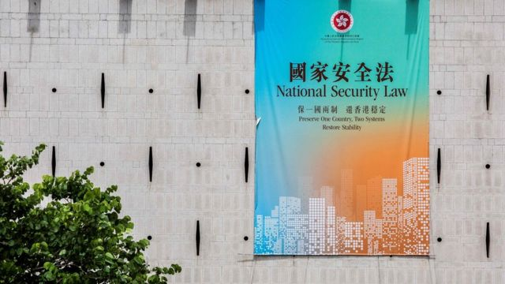
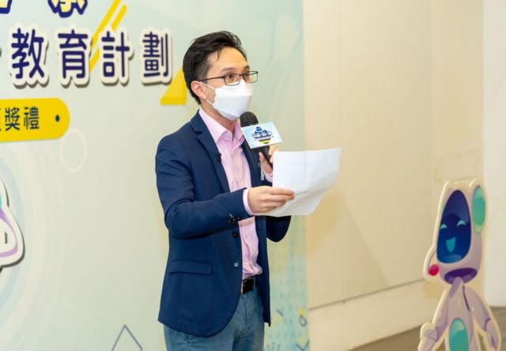

# 香港国安法下爆发“移民潮” 三名教师离开与留下的选择

#  香港国安法下爆发“移民潮” 三名教师离开与留下的选择

  * 黄颖 
  * BBC中文特约撰稿人 

2022年8月17日

**近年移民潮席卷香港不同界别，教育界也遭受冲击，爆发离职潮。根据香港教育局5月份的统计数字，反映本学年公营及直资中小学教师流失人数达4050人，较上学年急升7成，创近年新高，数据亦显示本学年新聘教师人数增加33%至3790人，推算平均每14名教师便有1人是新教师。**

香港《国安法》于2020年6月30日实施后，香港不少老师目睹政治及教育环境的急速变化，深受压力，忧虑触犯“红线”，有人认为继续在香港任教不仅“违背自己的专业与良知”，也可能惹上官非，自我审查及寒蝉效应令他们意兴阑珊；与此同时, 英国为英国国民（海外) 护照（俗称BNO）的港人提供移英计划，促使不少教师选择辞职移民。

##  《国安法》的担忧与教师选择辞职

香港荃湾一所中学，下课铃声一响，黄宁（化名）没有像平日留下批改作业及整理课后活动，而是匆匆地驱车回家。这天晚上，昔日任教的学生要与她饯别。还有几天，她便要结束17年的教学生涯。秋天她便离开，移民英国。

由学校到新界的家，车程大约需时45分钟。这一条路，她一走就走了17年。从大学毕业后，她就在这所中学任教，春风化雨，桃李满门。

> 图像来源，  ISAAC LAWRENCE/Getty Images

> 图像来源，  BBC News Chinese
>
> 图像加注文字，黄宁（中间）在港度过了17年的教学生涯。秋天她便离开，移民英国。图为这天晚上，昔日的学生准备与她饯别。

“我主要是教通识的，每一届平均有二百个学生，捏指一算，17年敎过差不多三、四千学生。很快我要离开了，很不舍” 。黄宁一边开车，一边伤感地说。她坦言非常热爱当老师，17年教学过程非常快乐。 “教学相长，是学生完满了我，成就了今天的我。”

香港教育局于2009年推行通识教育，旨在加深学生对自身、社会国家的理解，培养多角度思考能力，是高中必修科目。

2014年9月下旬香港爆发“雨伞运动”（又称“占中行动”，指香港民主派支持者为了争取一个没有筛选机制的普选制度，揭开为期79天的“占领中环”运动）; 2019 年反对《逃犯条例》修订运动（亦称“反送中”或“反修例”运动）爆发， 有政界人士与中国官媒追溯青年人参与社会运动的源头，建制派批评部分教师煽动学生上街参与运动，剑指在香港推行了10年的通识教育。

根据香港教育局回复立法会的文件，过去三年（2019年1月至2021年12月）共接获344宗与2019年“反修例”事件有关、教师被指涉违反专业操守的投诉，共有6名教师因而被“钉牌”（即取消教师注册），其中3人因被判处监禁而被取消教师注册。

外界认为这个批判性思考教学生闹政府、闹人，“老师成为代罪羔羊”，那一刻，“全城通识老师都在问自己是否做错了，这是一道重创”，黄宁对BBC中文说。

2021年年初已移民英国的吴爱华（化名）老师，移民前在香港中学教了30年的英文与通识科。他对BBC中文表示，2019年“反送中运动”后，社会对整个教育体系、通识科的指责可谓排山倒海，矛头指向政府当日为何成立通识科，令到学生对事情政治化，他们亦指责政府、学校把关不严，令到一些有潜在政治野心的老师在课堂上宣扬其政治理念，并鼓动学生去破坏社会及做违法的事情。

“作为一名通识老师，感到这个指控很不公平，也很不实在。”当时他已预料到，再继续教授这一科将会没有前途，终有一天通识科将会被取缔。

##  留任教师：“这些从来不是一个红线”

> 图像来源，  Muk Ka-chun
>
> 图像加注文字，穆家骏每年都会带同学往内地交流考察。这是2018年到广东清远去体验生活的资料照片。

在香港国安法实施后，不少老师担心触犯“红线”，深感压力。

穆家骏在著名的左派中学培侨中学任教八年，主要教中国历史及通识科。穆家骏认为，“这些从来不是一个红线”。他认为要公允地对国家发展、认识社会问题，“除非你希望透过这些问题去引发对国家的憎恨，对身份认同负面的消息，我认为这是超越了课程应有的。”

针对有老师因为教材上的问题而被“钉牌”，穆家骏认为，那些被“钉牌”的老师，第一人数极少，反映教育界绝大多数的老师都是没有问题的；第二是“钉牌”的个案当中，那位教师被指乱教“鸦片战争”内容（据悉该教师对学生称英国对中国发起“鸦片战争”是要“消灭鸦片”），穆家骏认为他没有尽老师应有的责任传授正确的知识，被“钉牌”理所当然。

另外有老师被指因教材偏颇被“钉牌”（敎育局指对方涉及在校园内宣扬“港独”讯息，裁定为“严重专业失德”，将其除牌），穆家骏认为老师把这个课程作为宣泄自己政治意图的平台，并非教师该教的。

针对通识科的争议，穆家骏认为，学科包含很多时事的话题，然而环顾世界的普及教育，很少科目会给学生讲授未成定论的题目，教育原本就是建制的一部份。他问道：“是否我们应该把未盖棺定论的事情，刻意放在教科书里面，去教我们的下一代？”与此同时，由于事件仍然在发展中，教材未能认证，很多时候会把媒体的报道当作教材，教师是否有专业能力去审核教材是否符合要求，成为又一个争议点。

作为新时代或网络时代的老师，穆家骏认为责任更加重大。以前老师是学生接收信息的主要来源，但是现在不仅有电视媒体、报刊，更多的信息来自网络世界。当学生接收更多信息的时候，老师怎样作好一个引导者的角色，让学生分辨网络上真假消息或是非黑白的能力，是现在老师更加重要的工作。

##  寒蝉效应和教师的自我审查

> 图像来源，  BBC News Chinese
>
> 图像加注文字，黄宁认为：“教学相长，是学生完满了我，成就了今天的我。”

即将加入移民人潮的黄宁认为，外界很多时候借着老师的“一言半语”、“一丁点教材内容”抽出来指责，“断章取义”；香港教育局甚至接受不具名的匿名投诉，只要有一个被投诉案件，本身保守的教育界已闹得杯弓蛇影 ，老师如惊弓之鸟，“这俨如一个非常严重的寒蝉效应！”黄宁叹道。可怕的是，老师也会开始搞自我审查，老师与老师之间也建构了不信任，当教育局接受不具名的匿名投诉时，可谓腹背受敌。

香港《国安法》施行之后，吴爱华观察到作为一名老师，先别说通识科，自己在一些敏感的话题上也要先作自我审查。他挣扎着，如果自己选择继续留下教书，一定要保障自己不会因说话而惹上官非，否则不仅可能丢掉工作，甚至可能面对《国安法》的指控而入狱。然而，不能如实说出心底话，说一些违背良心的谎话，他很不情愿，特别是在学生的成长过程当中，灌输他们一种“原来老师也在修饰其讲话”的概念。

> 图像来源，  AFP

另一方面，从女儿的身上看到一种现实：《国安法》实施后，在另一所学校念初中的女儿，有一天下课回家并告诉父亲，老师以微软幻灯片软件PowerPoint讲解《国安法》与内地的关系，可能题材较敏感，老师没讲解内容，只要求她们自己看十多页的内容。从这个他校老师的另一个侧面可以看出， 其他老师在避开一些敏感的课题时，又不想这么直白的时候，选择用一些擦边球的方式去处理，以免误踩“红线”，被投诉甚至被举报而受处分。

2021年2月，香港教育局公布“国家安全教育”课程指引，为中小学订立教学界线，教师需要重新掌握如何教学。有不少教师忧误踩“红线”，为求自保，只会依书直说，不引导讨论，教学生背诵内容。而通识科遭大幅度改革为“公民及社会发展科”。

黄宁因为即将离开而不用敎新的“公民及社会发展”课程，但老师对待新课程依书直说的作法，使她感到很受“侮辱”，自问拿数万元高薪，在香港社会备受尊重，现在却教学生只管死记硬背。回望当初，10年改革就是要让学生有独立的思考能力、辨别思考真伪。黄宁深感不忿：“我接受不了， 那种侮辱的感觉太强了。”

《国安法》落实之后，黄宁身边的朋友一个个的离开，“很多前辈退的退、走的走”。去年黄宁仍乐观地坚持留下。然而，她后来发现：当另一边强大的压力加诸时，不再是一个人的力量可以抵挡，“我有很大感受，要不我受伤，我怕自己要适应环境而被扭曲，我选择停下来，休息一下，我选择frozen（指停滞不前）” 。黄宁说：“我需要疗伤，重新检视自己，思考往后日子是否回到教育上再努力。”

最初决定离开时，黄宁感到很内疚及自责，认为自己很畏缩，然而，当与旧生倾谈，发觉他们有面对社会的方法，他们摸索得到他们生存的空间，“那一刻便释怀了很多”。

##  为儿女教育移民与选择留下的教师

> 图像来源，  Muk Ka-chun
>
> 图像加注文字，穆家骏认为，怎样作好一个引导者的角色，让学生分辨网络上真假消息或是非黑白的能力，是现在老师更加重要的工作。

黄宁指出，不只通识课老师，也有任教其他语文或数理科目的老师选择离开他们的工作岗位，寻找更自由的世界，移民更重要的原因是他们既是老师又是家长，为了自己的儿女教育而离开。吴爱华便是其中一位。2021年1月份，他与太太及女儿移民英国，现居于伯明翰北部。

在彼邦的吴爱华对BBC中文表示，抵英国一年半，认识了很多到英国的香港家庭，大部份都是因为子女的缘故而选移民。初抵英国，吴爱华由仓务员做起，当积累了一些工作经验后， 在一间政府中学里面觅得教学助理（Teaching Assistant）工作。那是一间专收难民学生的学校，他从中看到英国人的多元及包容核心价值，充份落实到他们的课堂里，让学生学习互相接纳及尊重。

这边厢当有人陆续离开，那边厢却有老师选择留下。

穆家骏选择留下。他强调，这么多年来自己从来没有考虑过移民。他曾在英国读书，在当地生活过一年多的时间，觉得中国人有一句话——“人离乡贱，物离乡贵”，这说得很对。“去到人家的地方，可能会遭受歧视，始终不及生活在自己的地方轻松愉快。”

与此同时， 穆家骏认为自己是一个中国人，作为一名老师，应该教好自己的下一代，这是一种责任。 “一个老师的身份角色，不只是教书教知识，更重要是教做人。”

> 图像来源，  BBC News Chinese
>
> 图像加注文字，香港维多利亚港。

吴爱华告诉BBC中文，据他了解，其所任教的中学，这三年间老师辞职的有20多名，大部份已移民或准备移民。

资深的中学教师卢老师对BBC中文表示，由于不少学校的老师移民，香港教育界亦同时出现横向流动现象，腾出的空缺，像音乐椅换位补上；卢老师认为，移民的有不少是有丰富敎育经验的老师，而新入职的年资尚浅，未能承传敎育经验，令教学质素受到影响，最受影响的自然是学生们；另外，照顾学生成长如训导辅导的工作、学校行政工作等，新的前线老师也缺乏经验。

香港立法会议员、资深教育工作者邓飞接受BBC中文访问时说，教师移民潮对学校的影响只是短期的，他并不感到悲观，强调如果香港教育局愿意开放更多师资培训的学额，让希望入行做老师的能够得到足够培训，教师的供应自然会多起来；而越早开放越能解决问题。

