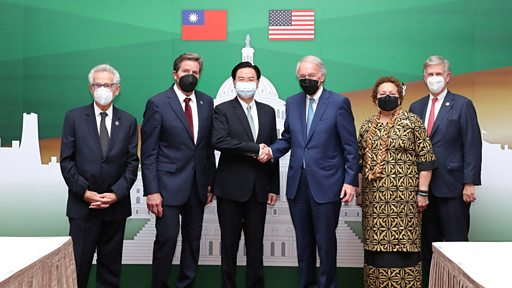

# 美国再有国会议员访问台湾，中国宣布制裁“台独顽固分子”

#  台海危机：美国再有国会议员访问台湾，中国宣布制裁“台独顽固分子”

**台海危机：美国再有国会议员访问台湾，中国宣布制裁“台独顽固分子”**

**周一（8月15日），中国解放军在台湾周边举行了新的军事演习，以回应一个五人美国国会代表团对台湾的新访问。**

周二，北京宣布制裁一批“台独顽固分子”，制裁内容包括禁止其本人及家属进入中国大陆和香港、澳门特别行政区，限制其关联机构与大陆组织及个人合作。

台湾行政院长苏贞昌、外交部长吴钊燮、立法院长游锡堃以及台北驻美代表萧美琴等人均在制裁名单上。

美国参议院外交委员会亚太小组主席埃德·马基（Ed Markey）率领跨党派国会代表团抵达台湾后在推特发文说，此行是要重申美国对台支持，鼓励台湾海峡的稳定及和平。

美国众议长佩洛西8月早些时候访问台湾激怒北京，中国解放军在台湾周边展开了有史以来规模最大的军事演习。

