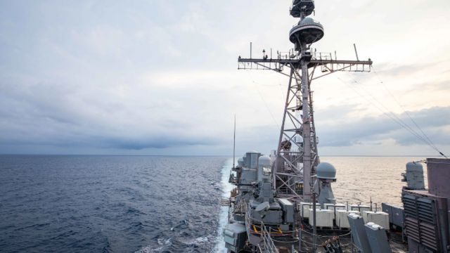

# 美国军舰穿越台湾海峡 中国称“做好挫败挑衅准备”

#  美国军舰穿越台湾海峡 中国称“做好挫败挑衅准备”

> 图像来源，  US 7th Fleet
>
> 图像加注文字，美国海军表示，"安提坦"号（USS Antietam）和"切斯劳维尔"号（USS Chancellorsville）巡洋舰穿越了台湾海峡。

**美国海军表示，两艘美国军舰穿越了台湾海峡。**

这是自本月初美国众议院议长佩洛西（Nancy Pelosi）访问台湾导致紧张局势加剧后，美国方面第一次采取这样的行动。

中国外交部发言人赵立坚周一（8月29日）回应称，美国军舰打着“航行自由”的幌子，炫耀武力，不是对“自由开放”的承诺，而是“谋求横行自由的挑衅，是对地区和平稳定的蓄意破坏”。

##  军舰穿越

美国海军周日在一份声明中称，其“安提坦”号（USS Antietam）和“切斯劳维尔”号（USS Chancellorsville）巡洋舰穿越了台湾海峡。

声明指出，穿越海峡表明美国对自由开放印度太平洋地区的承诺。美国军队能在国际法允许的任何地方飞行、航行及行动。

美国国家安全委员会发言人柯比（John Kirby）对CNN表达了同样的立场，称行动与美国“一个中国”政策和寻求“自由开放的印太”非常一致。

柯比还说，这次行动在很久之前就计划了。

台湾国防部周日也确认了这一消息，称美国两艘巡洋舰，经台湾海峡由北向南行驶。

台湾国防部称，通过台湾海峡南驶期间，其军队全程掌握周边海、空域相关动态，状况正常。

中国也注意到了美军的这次行动，并表示保持高度戒备状态。

中国东部战区新闻发言人施毅表示，8月28日，美国两艘巡洋舰“过航台湾海峡并公开炒作，中国人民解放军东部战区对美舰过航行动全程跟监警戒，一切动向尽在掌握”。

“战区部队保持高度戒备，随时做好挫败任何挑衅准备。”声明指。

中国外交部发言人赵立坚周一表示，中国“再次敦促美方停止虚化、掏空、歪曲‘一个中国’原则”，恪守尊重他国主权和领土完整，不干涉内政的国际关系基本准则，切实遵守“一个中国”原则和中美三个联合公报规定，不要做台海和平稳定的麻烦制造者。

> 图像来源，  Getty Images
>
> 图像加注文字，台湾金门

中国官媒《环球时报》前总编胡锡进则评论说，美方试图以此举安抚台当局和地区盟友，告诉他们美国不会在大陆的军事压力下后退，但他认为，美军舰过台湾海峡已经不可能对大陆产生任何威慑，对台当局的壮胆作用也越来越小。

“它对大陆产生的实际影响就是，我们被不断提醒，美国是很不友好和阻碍中国统一的力量，我们需放弃幻想。”胡锡进称。

另外周日台湾国防部还表示，截至下午5时，在台湾附近发现了23架中国飞机和8艘中国船只。

##  无人机掠过

台湾陆军金门防卫指挥部周日也表示，烈屿地区发现不明飞行器短暂掠过上空，经比对研析应为民用无人机。部队射击信号弹警示，并保持监控及高度警戒。

此前，中国社交媒体微博流传一段疑似无人机靠近金门官兵的影片。

台湾陆军金门防卫指挥部称，中国再三以无人机等飞航实体轻率挑衅，破坏区域安全稳定，更对其国防飞航安全造成重大威胁，之后台湾将采取包括驱离在内等必要反制措施确保国家安全。

