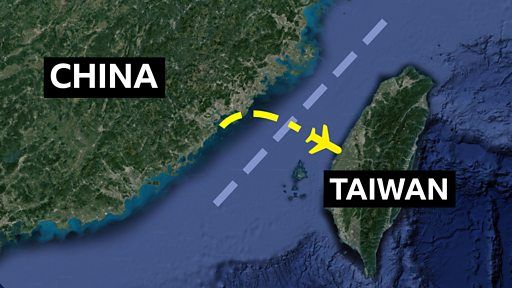

# 台海危机：两岸各执一词的“海峡中线”是什么？

#  台海危机：两岸各执一词的“海峡中线”是什么？

**台海危机：两岸各执一词的“海峡中线”是什么？**

台海局势持续紧张，继美国众议院议长佩洛西（Nancy Pelosi，裴洛西）访问台湾后，美国军舰近日（8月28日）首次穿越台湾海峡；中国东部战区回应称，中国军方“保持高度戒备，随时做好挫败任何挑衅准备”。

中国8月展开大规模环台军演，战机多次飞越“海峡中线”，并称不存在所谓中线。台湾则担忧，这一行为破坏了台海稳定，或将永远打破“海峡中线”的历史默契。

到底什么是“海峡中线”？它对两岸政治格局有什么意义？BBC带你还原历史脉络，解读“海峡中线”的前世今生。

制作：关美清 & 斯影

动画：阿尔文·苏普里亚迪（Arvin Supriyadi ）& 阿格尼亚·阿兹基亚（Aghnia Adzkia）

##  相关报道：

