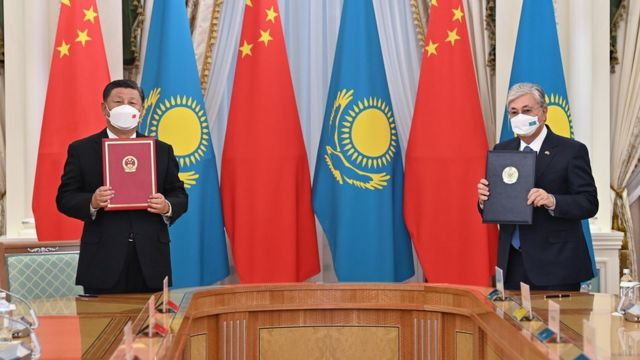
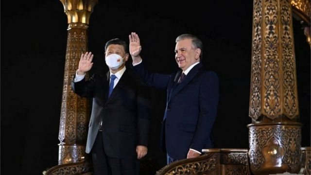
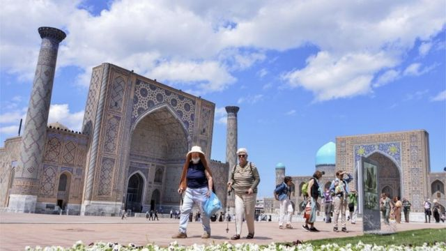
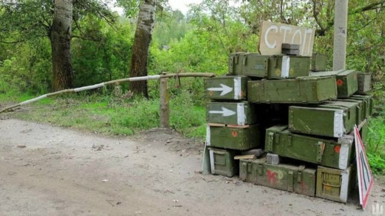
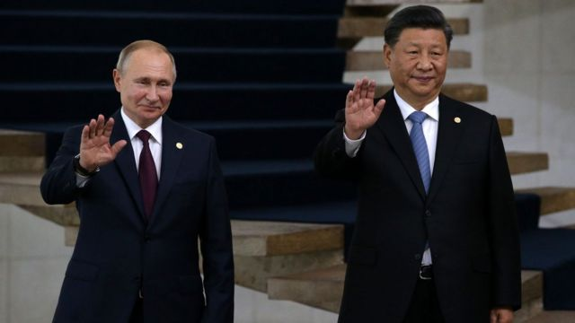

# 习近平访中亚 中国和国际媒体上的各种声音

#  习近平访中亚 中国和国际媒体上的各种声音

最近更新： 1 小时前

> 图像来源，  Getty Images
>
> 图像加注文字，习近平（左）与哈萨克斯坦总统托卡耶夫

**在中共二十大召开前夕，中国领导人习近平9月14日至16日出访中亚两国并参加上海合作组织元首理事会会议。这是在2020年新冠疫情爆发近三年来习近平首次出访，中国媒体和国际媒体对此次访问非常关注。**

中国媒体主要关注习近平在访问的两国媒体上发表的署名文章，文章强调与中亚的经济合作。国际媒体着眼于习近平与普京的会面，探讨当前国际局势下中国和俄罗斯关系的走向。

以下是BBC中文对最近一段时间各方报道与评论的整理汇总。

> 图像来源，  Reuters
>
> 图像加注文字，习近平9月14日晚抵达上合组织峰会举办地，乌兹别克斯坦的撒马尔罕。在和乌兹别克斯坦总统米尔济约耶夫会面时，习近平佩戴口罩。

##  经济合作

出访前，习近平在哈萨克斯坦和乌兹别克斯坦媒体发表署名文章。

在发表于哈萨克斯坦媒体的文章中，习近平称，今年是中哈建交30周年，这30年来，中哈关系实现了从睦邻友好到战略伙伴关系、再到永久全面战略伙伴关系的持续推进。

> 图像来源，  EPA
>
> 图像加注文字，乌克兰战争如火如荼之际，习近平可能在乌兹别克斯坦的撒马尔罕会晤普京。

习近平称，这30年中国一直是哈萨克斯坦最主要贸易伙伴和投资伙伴，两国已成功搭建涵盖公路、铁路、航空、油气管道的全方位、立体化联通网络，未来将继续打造高标准的优质项目。

习近平在乌兹别克斯坦媒体上发表的文章中称，中国是乌兹别克斯坦第一大贸易伙伴和主要投资来源国，双方共建“一带一路”合作成果丰硕，双方还积极开展新能源、农业、金融、现代通信等领域合作。

中国官方媒体央视新闻则引述俄罗斯、伊朗等国人士称，上海合作组织展现出强大生命力，中国在其中发挥着重要的建设性作用。哈萨克斯坦和乌兹别克斯坦各界人士期待习近平主席访问进一步深化双边务实合作。

《北京青年报》旗下公众号“政知见”透露了习近平访问中亚第一大国哈萨克斯坦的更多细节，据透露，哈萨克斯坦总统托卡耶夫在机场用中文对习近平表示了问候，他早年曾在北京语言大学学习，会说中文；在9月14日举行的欢迎晚宴上，哈萨克斯坦演员表演了中文歌曲《映山红》；两国宣布在西安和阿克托别互设总领事馆。

日本经济新闻认为，习近平访问哈萨克斯坦具有象征意义。这是习近平上任初期在2013年发起“一带一路”项目的地方。他访问的目的似乎是在疫情打乱后传递“一切照旧”的信号，目的还包括帮助巩固北京在该地区的影响力。

> 图像来源，  Reuters
>
> 图像加注文字，上合组织各国元首齐聚中亚之际，乌克兰正在全力反攻夺回被占领土。图为俄军从哈尔科夫前线迅速撤退时留在路边的设备。

报道引述美国智库外交政策研究所研究员赫斯（Maximilian Hess）称，这次访问“将为习提供一个机会，显示中国的外交政策不受新冠病毒的影响，并显示北京现在是中亚的主要参与者”。

##  “对抗美国”

国际媒体更为关注习近平与俄罗斯领导人普京的会面。

路透社报道称，此次习近平出访在中共二十大召开前夕，这显示他对自己获得第三次任期很有信心。

该报道分析称，这次会晤将给习一个机会强调他的影响力，而普京可以展示俄罗斯对亚洲的企图；当西方因乌克兰战争寻求惩罚俄罗斯时， 两位领导人都可以表示他们对美国的反对。

报道引述新南威尔士大学政治与国际关系高级讲师科罗廖夫（Alexander Korolev）表示，此次访问“显示中国不仅愿意与俄罗斯一切照旧，甚至愿意明确表示支持，并加速形成更强大的中俄联盟”。

“即使面临严重的声誉损失和成为二次经济制裁目标的风险，中国政府也不愿与俄罗斯保持距离。” 科罗廖夫说。

《纽约时报》认为，俄罗斯总统普京和中国最高领导人习近平本周的峰会，是两位专制领导人联手反对他们眼中美国霸权的一次力量展示。同时也是双方都处于疲软的时刻：俄罗斯在乌克兰遭受损失，而中国正经历经济放缓。

> 图像来源，  Getty Images
>
> 图像加注文字，有分析称，中俄两国正处在一个敏感时期：俄罗斯在乌克兰遭受损失，而中国正经历经济放缓。

《纽约时报》指出，莫斯科需要北京，但北京仍然保持谨慎。

“它希望在与美国日益激烈的竞争中展现实力，不能让它在威权联盟中的重要伙伴面临耻辱性的失败。但是，向俄罗斯提供大量的额外帮助，无论是经济上还是军事上，都有可能触犯西方的制裁并危及中国经济。”报道称。

美国之音则认为，习近平和普京的会晤克被视为“弃儿抱团取暖”。

“曾几何时，习近平还在自豪地向世界表示，中俄友谊无上限，中俄合作无禁区。可一场俄乌战争让习近平和普京遭遇了始料未及的困境。俄罗斯因这场战争遭遇了西方的全面制裁，成为国际社会千夫所指的弃儿。中国也因拒绝谴责侵略者而饱受国际社会的指责，陷入空前孤立。”

该报道称，“两人这次的会面被媒体视为互有需要、各取所需的抱团取暖动作，同时也表明了习近平将北京与莫斯科之间的准盟友关系视为对抗美国的一个重要工具。”

